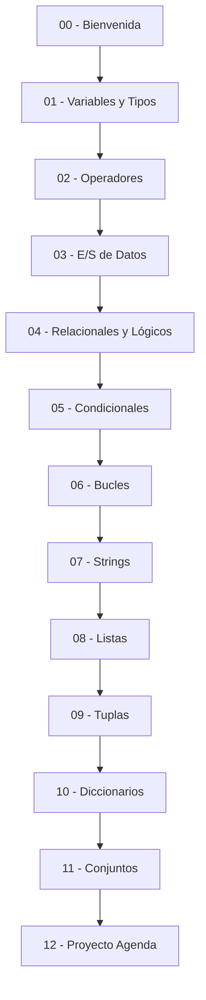

# 🐍 00 - Bienvenida al Curso de Python Básico

¡Bienvenido al módulo **01 - Python Básico** del Curso Python Completo! Este curso está diseñado para construir una base sólida en Python, el lenguaje predominante en Machine Learning, Inteligencia Artificial y Backend moderno. Dominar estos fundamentos no es opcional: frameworks como TensorFlow, PyTorch, FastAPI y Django se apoyan directamente en estas estructuras.


## 1. Por qué este curso importa para ML/AI Engineering y Backend

Python se ha convertido en el estándar de facto en ciencia de datos e IA por su legibilidad, ecosistema de librerías (NumPy, pandas, scikit-learn) y su capacidad de prototipado rápido. En Backend, frameworks como FastAPI y Django aprovechan la tipificación dinámica y las estructuras de datos built-in para construir APIs de alto rendimiento. Sin comprender a fondo variables, tipos de datos, estructuras de control y colecciones, es imposible escalar código de producción o depurar pipelines de datos eficientemente.


## 2. Índice del Módulo

| # | Nota | Descripción |
|---|------|-------------|
| 00 | [[00 - Bienvenida]] | Índice, glosario y objetivos. |
| 01 | [[01 - Variables y Tipos de Datos]] | Variables como referencias, tipos built-in, mutabilidad, garbage collection. |
| 02 | [[02 - Operadores Aritmeticos y Asignacion]] | Aritméticos, asignación, precedencia, comparación de floats. |
| 03 | [[03 - Entrada y Salida de Datos]] | print, input, f-strings, argumentos de línea de comandos. |
| 04 | [[04 - Operadores Relacionales y Logicos]] | == vs is, lógicos, cortocircuito, walrus operator. |
| 05 | [[05 - Condicionales]] | if/elif/else, match/case, ternario, guard clauses. |
| 06 | [[06 - Bucles For y While]] | for, while, enumerate, zip, nested loops. |
| 07 | [[07 - Strings y Metodos de Cadenas]] | Indexing, slicing, métodos, Unicode, parsing. |
| 08 | [[08 - Listas]] | Arrays dinámicos, list comprehension, aliasing, copias. |
| 09 | [[09 - Tuplas]] | Inmutabilidad, unpacking, namedtuple, rendimiento. |
| 10 | [[10 - Diccionarios]] | Hash tables, claves hashables, dict comprehension, merging. |
| 11 | [[11 - Conjuntos]] | Unicidad, operaciones matemáticas, membership testing O(1). |
| 12 | [[12 - Caso Practico - Agenda de Contactos]] | Proyecto integrador: agenda con CRUD, búsqueda y persistencia. |


## 3. Glosario de Términos Fundamentales

| Término | Definición |
|---------|------------|
| **Variable** | Nombre que referencia a un objeto en memoria. No es una "caja". |
| **Tipo de dato** | Clase del objeto que determina qué operaciones puede realizar. |
| **Operador** | Símbolo que realiza una operación sobre operandos (+, and, ==). |
| **Condicional** | Estructura que ejecuta código según el valor de verdad de una expresión. |
| **Bucle** | Estructura que repite un bloque de código mientras se cumpla una condición. |
| **String** | Secuencia inmutable de caracteres Unicode. |
| **Lista** | Colección ordenada y mutable de elementos. |
| **Tupla** | Colección ordenada e inmutable de elementos. |
| **Diccionario** | Colección de pares clave-valor basada en hash table. |
| **Conjunto** | Colección no ordenada de elementos únicos (hash table sin valores). |
| **Mutabilidad** | Capacidad de un objeto para cambiar su valor interno sin cambiar su identidad. |
| **Inmutabilidad** | Propiedad de un objeto cuyo estado no puede modificarse tras su creación. |
| **Hashable** | Objeto que tiene un hash inmutable y puede usarse como clave de diccionario. |
| **Iterable** | Objeto capaz de devolver sus elementos uno a uno (implementa __iter__). |


## 4. Objetivos de Aprendizaje

Al finalizar este módulo serás capaz de:

1. Explicar por qué las variables en Python son referencias y no cajas de memoria.
2. Seleccionar el tipo de dato y estructura de control adecuados para cada problema.
3. Manipular strings, listas, tuplas, diccionarios y conjuntos con fluidez.
4. Leer y escribir datos desde la consola y archivos de texto.
5. Diseñar un programa interactivo de consola aplicando todos los conceptos.


## 5. Mapa de Ruta Visual




## 6. Cómo usar estas notas

Cada nota sigue una estructura consistente: teoría profunda, tablas comparativas, casos reales, advertencias, tips y un script de compresión final. Te recomendamos ejecutar todos los bloques de código en tu propio entorno para internalizar los conceptos.


## 7. Recursos Adicionales

- [Python Official Documentation - Built-in Types](https://docs.python.org/3/library/stdtypes.html)
- Wikimedia Commons - Python Logo: https://upload.wikimedia.org/wikipedia/commons/c/c3/Python-logo-notext.svg


## 8. Resumen en Código

```python
# 📦 Código de compresión: Bienvenida
# Este script imprime el índice y verifica que puedas ejecutar Python 3.10+

import sys

print("🐍 Curso Python Básico - Módulo 01")
print(f"Versión de Python detectada: {sys.version}")

modulos = [
    "01 - Variables y Tipos de Datos",
    "02 - Operadores Aritmeticos y Asignacion",
    "03 - Entrada y Salida de Datos",
    "04 - Operadores Relacionales y Logicos",
    "05 - Condicionales",
    "06 - Bucles For y While",
    "07 - Strings y Metodos de Cadenas",
    "08 - Listas",
    "09 - Tuplas",
    "10 - Diccionarios",
    "11 - Conjuntos",
    "12 - Caso Practico - Agenda de Contactos",
]

for i, modulo in enumerate(modulos, start=1):
    print(f"  {i:02d}. {modulo}")

# Verificaciones mínimas del entorno
assert sys.version_info >= (3, 10), "Se recomienda Python 3.10+ para match/case"
print("✅ Entorno compatible. ¡Empecemos!")
```
