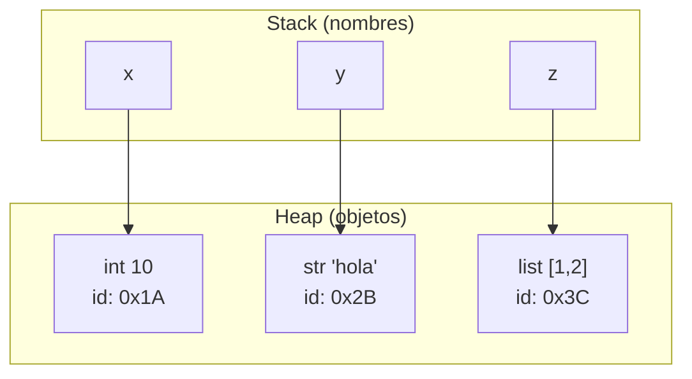

# 📦 01 - Variables y Tipos de Datos

Python es un lenguaje de tipado dinámico, pero esto no significa que carezca de tipos. Comprender qué ocurre en memoria cuando escribes `x = 5` es fundamental para depurar errores de aliasing en pipelines de datos y para optimizar el consumo de memoria en servidores Backend.


## 1. La Variable como Referencia, no como Caja

En lenguajes como C, una variable es una caja que contiene un valor. En Python, una variable es una **referencia** (un nombre) que apunta a un objeto en el heap. Este modelo simplifica la gestión de memoria pero introduce comportamientos sutiles cuando dos variables apuntan al mismo objeto mutable.

```python
a = [1, 2, 3]
b = a
b.append(4)
print(a)  # [1, 2, 3, 4] — 'a' y 'b' referencian el mismo objeto
```

⚠️ **Advertencia:** Asignar una lista a otra variable no crea una copia. Ambas referencias comparten el mismo objeto en memoria.


## 2. Tipos Built-in Fundamentales

| Tipo | Descripción | Mutable | Ejemplo |
|------|-------------|---------|---------|
| `int` | Enteros de precisión arbitraria | No | `42` |
| `float` | Números de coma flotante (IEEE 754) | No | `3.14` |
| `complex` | Números complejos | No | `3+4j` |
| `bool` | Booleano (subclase de int) | No | `True` |
| `str` | Cadena Unicode inmutable | No | `"hola"` |
| `NoneType` | Valor nulo singular | No | `None` |

💡 **Tip:** `bool` es subclase de `int` en CPython. `True == 1` y `False == 0`, aunque su representación interna es distinta.


## 3. Introspección: `type()`, `id()` e `isinstance()`

- `type(obj)` devuelve la clase exacta del objeto.
- `id(obj)` devuelve la dirección de memoria (identidad).
- `isinstance(obj, Clase)` verifica si el objeto es instancia de una clase o tupla de clases. Preferido sobre `type()` para herencia.

```python
x = 10
print(type(x))          # <class 'int'>
print(id(x))            # 140735... (dirección en memoria)
print(isinstance(x, (int, float)))  # True
```

Caso real: En un pipeline de ML, usamos `isinstance(datos, (list, tuple))` para aceptar secuencias sin importar su tipo concreto, permitiendo polimorfismo.


## 4. Casting y Coerción de Tipos

El casting explícito convierte un objeto de un tipo a otro llamando a su constructor.

```python
print(int(3.9))      # 3 — trunca hacia cero
print(float("2.5"))  # 2.5
print(str(100))      # "100"
print(bool(0))       # False (0, "", [], None evalúan a False)
```

⚠️ **Advertencia:** `int(3.9)` no redondea; trunca. Usa `round(3.9)` si necesitas redondeo matemático.

| Función | De | A | Comportamiento clave |
|---------|----|---|----------------------|
| `int(x)` | str/float/bool | int | Trunca decimales; lanza ValueError si str inválido |
| `float(x)` | str/int/bool | float | Puede perder precisión en enteros grandes |
| `str(x)` | cualquier objeto | str | Llama a `__str__` o `__repr__` |
| `bool(x)` | cualquier objeto | bool | Solo `0`, `None`, secuencias vacías y contenedores vacíos son `False` |


## 5. Mutabilidad vs Inmutabilidad

La mutabilidad determina si el estado interno de un objeto puede cambiar después de su creación.

```mermaid
graph LR
    subgraph "Mutable"
        A["Lista [1,2]"]
        A -->|append(3)| A2["Lista [1,2,3]"]
        style A fill:#ffcccc
        style A2 fill:#ffcccc
    end
    subgraph "Inmutable"
        B["Tupla (1,2)"]
        B -->|no cambia| B
        style B fill:#ccffcc
    end
```

| Aspecto | Mutable (list, dict, set) | Inmutable (int, str, tuple) |
|---------|---------------------------|-----------------------------|
| Modificación | In-place (mismo id) | Crea nuevo objeto (nuevo id) |
| Seguridad | Riesgo de efectos colaterales | Seguro como clave de dict |
| Rendimiento | Puede ser más eficiente para cambios grandes | Mejor para concurrencia y hashing |

Caso real: En un servidor Backend con FastAPI, pasar diccionarios mutables entre funciones sin copiar puede provocar que un middleware modifique accidentalmente la respuesta antes de enviarse al cliente.


## 6. Hashability y su Relación con la Inmutabilidad

Un objeto es **hashable** si tiene un hash que no cambia durante su vida y puede compararse con otros objetos. En CPython, esto equivale a implementar `__hash__` y `__eq__`. Todos los objetos inmutables built-in son hashables; los mutables no lo son porque su contenido —y por tanto su hash— podría cambiar, rompiendo las estructuras basadas en tablas hash.

```python
# Esto funciona
clave_ok = (1, "a", 3.14)
d = {clave_ok: "valor"}

# Esto falla
clave_mala = ([1, 2], "a")
# d2 = {clave_mala: "valor"}  # TypeError: unhashable type: 'list'
```

💡 **Tip:** Una tupla solo es hashable si todos sus elementos son hashables. La inmutabilidad superficial no garantiza hashability.


## 7. Garbage Collection y Reference Counting

CPython gestiona memoria principalmente mediante **reference counting**: cada objeto lleva un contador de cuántas referencias lo apuntan. Cuando llega a cero, la memoria se libera inmediatamente. Existe también un recolector de ciclos para referencias circulares.

```python
import sys

a = [1, 2, 3]
print(sys.getrefcount(a) - 1)  # 1 (getrefcount incrementa temporalmente en 1)

b = a
print(sys.getrefcount(a) - 1)  # 2
```

⚠️ **Advertencia:** `sys.getrefcount()` devuelve siempre un valor mayor que el real porque la propia llamada crea una referencia temporal.


## 8. Interning de Strings y Enteros Pequeños

CPython optimiza memoria mediante interning: reutiliza objetos inmutables frecuentes.

```python
a = 5
b = 5
print(a is b)  # True — enteros entre -5 y 256 están pre-cargados

x = 1000
y = 1000
print(x is y)  # Puede ser False (depende de la implementación)

s1 = "hola"
s2 = "hola"
print(s1 is s2)  # True — strings literales idénticos suelen internarse
```

| Rango/Condición | Interning garantizado | Notas |
|-----------------|----------------------|-------|
| Enteros | -5 a 256 | Cache interno de CPython |
| Strings literales idénticos | Sí (en mismo módulo) | Ahorra memoria en código fuente |
| Strings dinámicos | No (a menos que `sys.intern()`) | `a+b` no se interna automáticamente |

Caso real: En un sistema de procesamiento de logs con millones de strings repetidos (nombres de nivel: "INFO", "ERROR"), usar `sys.intern()` reduce drásticamente el consumo de memoria.


## 9. Diagrama de Memoria Simplificado




## 10. Resumen en Código

```python
# 📦 Código de compresión: Variables y Tipos de Datos
# Cubre: tipos built-in, id/type/isinstance, casting, mutabilidad, hashability

import sys

# 1. Variables como referencias
a = [1, 2, 3]
b = a
print(f"Mismo objeto? {a is b}")  # True

# 2. Tipos built-in y casting
datos = {
    "entero": int(3.14),
    "flotante": float("2.718"),
    "cadena": str(42),
    "booleano": bool(""),
}
print(datos)

# 3. Introspección
x = 256
print(f"type={type(x).__name__}, id={id(x)}, isinstance_int={isinstance(x, int)}")

# 4. Mutabilidad vs inmutabilidad
s = "hola"
s2 = s.upper()
print(f"id(s)={id(s)}, id(s2)={id(s2)} — str es inmutable")

lst = [1, 2]
lst.append(3)
print(f"id(lst) tras append sigue siendo {id(lst)} — list es mutable")

# 5. Hashability
print(f"hash((1, 'a')) = {hash((1, 'a'))}")
try:
    hash([1, 2])
except TypeError as e:
    print(f"Error esperado: {e}")

# 6. Interning
m, n = 100, 100
print(f"100 is 100? {m is n}")  # implementation-dependent
print(f"5 is 5? {(5 is 5)}")    # True (cache)

# 7. Reference counting
obj = {"clave": "valor"}
print(f"Referencias aproximadas: {sys.getrefcount(obj) - 1}")
```
