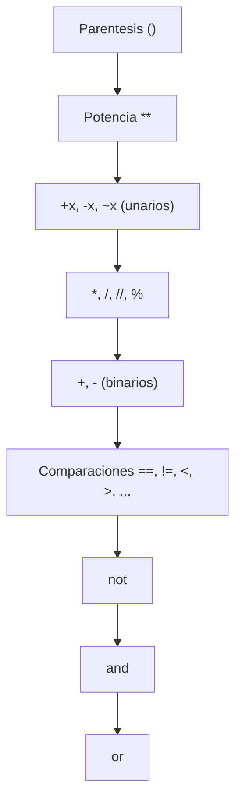

# ➕ 02 - Operadores Aritméticos y Asignación

Los operadores aritméticos y de asignación son la base del procesamiento numérico. En ML/AI, dominan el preprocesamiento de datos, el cálculo de métricas y la implementación de algoritmos desde cero. En Backend, controlan paginación, rate limiting y cálculos financieros donde la precisión importa.


## 1. Operadores Aritméticos

| Operador | Nombre | Ejemplo | Resultado | Tipo de resultado |
|----------|--------|---------|-----------|-------------------|
| `+` | Suma | `3 + 2` | `5` | `int` |
| `-` | Resta | `5 - 3` | `2` | `int` |
| `*` | Multiplicación | `4 * 3` | `12` | `int` |
| `/` | División | `7 / 2` | `3.5` | `float` (siempre) |
| `//` | División entera | `7 // 2` | `3` | `int` o `float` |
| `%` | Módulo (resto) | `7 % 2` | `1` | depende de operandos |
| `**` | Potencia | `2 ** 3` | `8` | `int` o `float` |

💡 **Tip:** La división `/` en Python 3 siempre devuelve `float`, incluso si el resultado es entero. Si necesitas un entero, usa `//` (consciente del truncamiento).


## 2. División Entera vs Flotante

La división entera `//` trunca hacia menos infinito (floor division), no hacia cero.

```python
print(7 // 2)    # 3
print(-7 // 2)   # -4  (¡no -3!)
print(7.0 // 2)  # 3.0 (float si algún operando es float)
```

⚠️ **Advertencia:** `int(a / b)` y `a // b` no son equivalentes cuando hay números negativos. El primero trunca hacia cero; el segundo, hacia `-inf`.

Caso real: En un sistema de paginación Backend, calcular el número de páginas totales requiere `//` para no exceder el índice, pero con índices negativos en slicing se debe tener cuidado con el comportamiento de floor division.


## 3. Módulo: Aplicaciones Prácticas

El operador `%` calcula el resto de la división entera. Su utilidad va más allá de la aritmética básica.

```python
# Paridad
print(10 % 2 == 0)  # True → par

# Ciclos y wrap-around
indice = 13
print(indice % 5)   # 3 → posición dentro de un ciclo de 5 elementos

# Hash simple (no criptográfico)
print(hash("clave") % 8)  # bucket en una tabla hash de tamaño 8
```

| Aplicación | Uso típico |
|------------|-----------|
| Paridad | `n % 2` determina si es par o impar |
| Ciclos | `i % N` reinicia el índice en buffers circulares |
| Hashing | `hash(key) % size` distribuye en buckets |
| Formato de tiempo | `segundos % 60` para extraer segundos de un timestamp |

Caso real: En un buffer circular de streaming de audio, el índice de escritura se calcula con `idx % buffer_size` para sobrescribir datos antiguos de forma eficiente sin reasignar memoria.


## 4. Potencia y Raíces

`a ** b` eleva `a` a la potencia `b`. También puede usarse para raíces con exponentes fraccionarios.

```python
print(2 ** 10)      # 1024
print(16 ** 0.5)    # 4.0 (raíz cuadrada)
print(27 ** (1/3))  # 3.0 (raíz cúbica)
```

💡 **Tip:** Para raíces cuadradas complejas o logaritmos, prefiere `math.sqrt()` o `math.log()` por claridad y manejo de dominios.


## 5. Operadores de Asignación

| Operador | Equivalente | Ejemplo |
|----------|-------------|---------|
| `=` | Asignación simple | `x = 5` |
| `+=` | Suma y asigna | `x += 3` → `x = x + 3` |
| `-=` | Resta y asigna | `x -= 2` |
| `*=` | Multiplica y asigna | `x *= 4` |
| `/=` | Divide y asigna | `x /= 2` |
| `//=` | División entera y asigna | `x //= 2` |
| `%=` | Módulo y asigna | `x %= 3` |
| `**=` | Potencia y asigna | `x **= 2` |

⚠️ **Advertencia:** `x += [3]` sobre una lista muta la lista in-place (mismo id). `x = x + [3]` crea una nueva lista (nuevo id). Este comportamiento varía según el tipo.


## 6. Asignación Múltiple y Swap sin Temporal

Python permite asignar múltiples variables simultáneamente usando desempaquetado de tuplas.

```python
a, b, c = 1, 2, 3

# Intercambio sin variable temporal
a, b = b, a
print(a, b)  # 2 1
```

El swap funciona porque el lado derecho se evalúa completamente primero (se crea una tupla temporal), y luego se desempaqueta en las variables del lado izquierdo. Es atómico en CPython a nivel bytecode, lo que lo hace seguro en muchos contextos concurrentes.

Caso real: En algoritmos de ordenación in-place como QuickSort, el swap sin variable temporal reduce la presión sobre la pila de llamadas y mejora la localidad de caché.


## 7. Precedencia de Operadores

Python sigue reglas de precedencia similares a las matemáticas, pero los paréntesis siempre prevalecen.



| Precedencia (alta → baja) | Operadores |
|---------------------------|------------|
| 1 | `()` |
| 2 | `**` |
| 3 | `+x`, `-x`, `~x` |
| 4 | `*`, `@`, `/`, `//`, `%` |
| 5 | `+`, `-` |
| 6 | `==`, `!=`, `<`, `>`, `<=`, `>=`, `is`, `in` |
| 7 | `not` |
| 8 | `and` |
| 9 | `or` |

💡 **Tip:** Nunca confíes en recordar toda la precedencia. Usa paréntesis para hacer explícita la intención, especialmente cuando mezclas operadores lógicos y aritméticos.


## 8. Comparación de Flotantes y Epsilon

Los números de punto flotante no pueden representar muchos valores decimales exactamente. Comparar con `==` es peligroso.

```python
a = 0.1 + 0.2
print(a == 0.3)        # False
print(a)               # 0.30000000000000004

# Forma correcta: usar tolerancia relativa/absoluta
def es_cercano(x, y, eps=1e-9):
    return abs(x - y) < eps

print(es_cercano(a, 0.3))  # True

# Alternativa con math.isclose (Python 3.5+)
import math
print(math.isclose(a, 0.3, rel_tol=1e-9))
```

⚠️ **Advertencia:** En aplicaciones financieras Backend, usa `decimal.Decimal` en lugar de `float` para evitar errores de redondeo acumulativos en transacciones.

Caso real: Al entrenar una red neuronal, comparar la pérdida (loss) entre épocas con `==` puede fallar silenciosamente. Se usa `math.isclose(loss, previous_loss, rel_tol=1e-5)` para detectar convergencia.


## 9. Resumen en Código

```python
# 📦 Código de compresión: Operadores Aritméticos y Asignación
import math

# Aritmética básica
print("División:", 7 / 2)        # 3.5
print("División entera:", 7 // 2)  # 3
print("Módulo:", 7 % 2)          # 1
print("Potencia:", 2 ** 10)      # 1024

# Swap sin temporal
a, b = 10, 20
a, b = b, a
print(f"Swap: a={a}, b={b}")

# Asignación múltiple y compuesta
x = 5
x += 3
x *= 2
print(f"x tras += y *=: {x}")  # 16

# Paridad y ciclos
for i in range(10):
    tipo = "par" if i % 2 == 0 else "impar"
    pos_ciclo = i % 4
    print(f"{i}: {tipo}, pos_ciclo={pos_ciclo}")

# Comparación segura de floats
suma = 0.1 + 0.2
print(f"0.1+0.2 == 0.3 ? {suma == 0.3}")
print(f"isclose ? {math.isclose(suma, 0.3)}")

# Precedencia explícita
resultado = (2 + 3) * 4 ** 2 / (10 - 2)
print(f"Precedencia con paréntesis: {resultado}")
```
