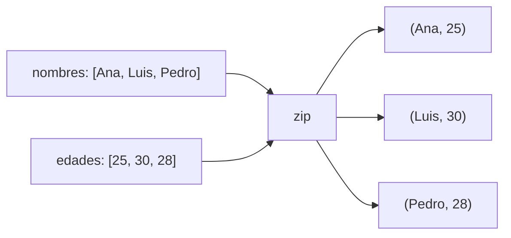

# 🔄 06 - Bucles For y While

Los bucles son el motor de la iteración. En ML/AI, recorren batches de entrenamiento, epochs y features. En Backend, procesan streams de datos, resultados de bases de datos y tareas en colas. Python ofrece abstracciones de alto nivel como `enumerate`, `zip` y el `else` de bucles que, aunque poco usado, resuelve problemas elegantemente.


## 1. El Bucle `for` en Python

A diferencia de C, el `for` de Python itera directamente sobre cualquier **iterable** (listas, strings, rangos, archivos, generadores). No requiere índices manuales.

```python
for letra in "Python":
    print(letra)

for i in range(5):
    print(i)  # 0, 1, 2, 3, 4
```

💡 **Tip:** Si encuentras `for i in range(len(lista))`, probablemente necesites `for elemento in lista` o `enumerate()` si el índice importa.


## 2. El Bucle `while`

Ejecuta mientras la condición sea verdadera. Es útil cuando el número de iteraciones no se conoce de antemano.

```python
intentos = 3
while intentos > 0:
    print(f"Intentos restantes: {intentos}")
    intentos -= 1
```

⚠️ **Advertencia:** Un `while` con condición siempre verdadera y sin `break` produce un bucle infinito. En scripts de producción, añade timeouts o contadores máximos de seguridad.


## 3. `break`, `continue` y el Misterioso `else`

- `break`: Termina el bucle inmediatamente.
- `continue`: Salta a la siguiente iteración.
- `else`: Se ejecuta **solo si el bucle no fue interrumpido por `break`**.

```python
# Buscar primer número divisible por 7 en un rango
for n in range(2, 6):
    if n % 7 == 0:
        print(f"Encontrado: {n}")
        break
else:
    print("No se encontró ninguno")  # Se ejecuta porque no hubo break
```

| Escenario | ¿Se ejecuta `else`? |
|-----------|---------------------|
| Bucle completa todas las iteraciones | ✅ Sí |
| Bucle termina por `break` | ❌ No |
| Bucle no entra (condición inicial falsa) | ✅ Sí |

Caso real: En un escáner de puertos Backend, un `for` con `else` permite distinguir si se encontró un puerto abierto (`break`) o si se agotó la lista sin éxito (`else` ejecuta "ningún puerto abierto").


## 4. `range(start, stop, step)`

`range` genera secuencias de enteros de forma perezosa (lazy), sin crear toda la lista en memoria.

```python
print(list(range(5)))       # [0, 1, 2, 3, 4]
print(list(range(2, 8)))    # [2, 3, 4, 5, 6, 7]
print(list(range(10, 0, -2)))  # [10, 8, 6, 4, 2]
```

| Parámetro | Significado | Default |
|-----------|-------------|---------|
| `start` | Primer valor | `0` |
| `stop` | Límite exclusivo | Obligatorio |
| `step` | Incremento | `1` |

💡 **Tip:** `range(10)` consume O(1) de memoria porque devuelve un objeto range, no una lista. Solo se materializan los valores bajo demanda.


## 5. Iteración con Índices: `enumerate()`

`enumerate(iterable, start=0)` devuelve pares `(índice, valor)`.

```python
frutas = ["manzana", "pera", "uva"]
for idx, fruta in enumerate(frutas, start=1):
    print(f"{idx}. {fruta}")
```

Caso real: Al procesar un archivo CSV línea por línea, `enumerate` permite reportar el número de línea exacto cuando se detecta un valor malformado, facilitando la depuración del dataset.


## 6. Iterar Múltiples Colecciones con `zip()`

`zip(*iterables)` agrega elementos posición por posición, deteniéndose en la colección más corta.

```python
nombres = ["Ana", "Luis", "Pedro"]
edades = [25, 30, 28]

for nombre, edad in zip(nombres, edades):
    print(f"{nombre} tiene {edad} años")
```



⚠️ **Advertencia:** Si las colecciones tienen longitudes distintas, `zip` trunca silenciosamente. En Python 3.10+, usa `zip(..., strict=True)` para lanzar `ValueError` si difieren.


## 7. Bucles Anidados y Complejidad

Un bucle dentro de otro produce complejidad O(n²), cuidado con datasets grandes.

```python
# O(n²) — comparar todos los pares
valores = [1, 2, 3]
for i in valores:
    for j in valores:
        print(f"{i} x {j} = {i * j}")
```

| Estructura | Complejidad temporal | Complejidad espacial |
|------------|---------------------|----------------------|
| Bucle simple | O(n) | O(1) |
| Bucles anidados (mismos datos) | O(n²) | O(1) |
| `zip` de dos listas | O(min(n, m)) | O(1) (lazy) |

Caso real: En un algoritmo de fuerza bruta para encontrar duplicados en una lista, dos bucles anidados son O(n²). Para millones de registros, un `set` reduce esto a O(n).


## 8. Patrones Comunes de Iteración

```python
# Sumar acumulativamente
acumulado = 0
for x in range(1, 6):
    acumulado += x
print(acumulado)  # 15

# Filtrar en el bucle
for n in range(20):
    if n % 2 == 0:
        continue
    if n > 10:
        break
    print(n)  # 1, 3, 5, 7, 9

# Construir lista
pares = []
for n in range(10):
    if n % 2 == 0:
        pares.append(n)
print(pares)
```


## 9. Resumen en Código

```python
# 📦 Código de compresión: Bucles For y While

# 1. for sobre iterable
for letra in "abc":
    print(letra)

# 2. while controlado
contador = 0
while contador < 3:
    print(f"while: {contador}")
    contador += 1

# 3. for/else
for n in range(2, 10):
    if n > 5:
        print("Break!")
        break
else:
    print("Sin break — else ejecutado")

# 4. enumerate
items = ["a", "b", "c"]
for i, v in enumerate(items, 1):
    print(f"{i}: {v}")

# 5. zip
claves = ["x", "y", "z"]
vals = [10, 20, 30]
for k, v in zip(claves, vals):
    print(f"{k}={v}")

# 6. range con paso
print(list(range(10, 0, -2)))

# 7. Patrón acumulador
suma = 0
for n in range(1, 101):
    suma += n
print(f"Suma 1..100 = {suma}")
```
