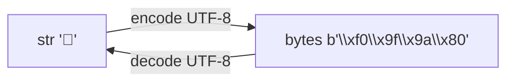

# 🔤 07 - Strings y Métodos de Cadenas

Las cadenas son secuencias inmutables de caracteres Unicode. En ML/AI, constituyen la materia prima del NLP (tokenización, limpieza, embedding). En Backend, representan payloads JSON, headers HTTP, consultas SQL y logs. Entender su modelo de memoria, métodos y codificación es esencial para evitar errores sutiles en aplicaciones internacionalizadas.


## 1. Strings como Secuencias Inmutables

Un string en Python no puede modificarse después de crearlo. Cualquier "mutación" crea un nuevo objeto.

```python
saludo = "hola"
print(id(saludo))
saludo = saludo + " mundo"  # Nuevo objeto
print(id(saludo))           # Dirección diferente
```

⚠️ **Advertencia:** Concatenar strings en un bucle con `+=` tiene complejidad O(n²) porque cada iteración crea un nuevo string. Usa `str.join()` o `io.StringIO` para concatenaciones masivas.


## 2. Indexing y Slicing

Los strings soportan acceso por índice y rebanado (slicing) con la notación `[inicio:fin:paso]`.

```python
texto = "Python"
print(texto[0])     # P
print(texto[-1])    # n (último)
print(texto[0:4])   # Pyth
print(texto[::2])   # Pto (cada 2 caracteres)
print(texto[::-1])  # nohtyP (reverso)
```

| Slicing | Significado |
|---------|-------------|
| `[a:b]` | Desde `a` (inclusive) hasta `b` (exclusive) |
| `[a:]` | Desde `a` hasta el final |
| `[:b]` | Desde el inicio hasta `b` |
| `[::p]` | Todo el string con paso `p` |
| `[::-1]` | Reverso completo |


## 3. Métodos Esenciales de Cadenas

| Método | Función | Ejemplo |
|--------|---------|---------|
| `upper()` | Mayúsculas | `"py".upper()` → `"PY"` |
| `lower()` | Minúsculas | `"PY".lower()` → `"py"` |
| `strip()` | Elimina espacios (o chars) al inicio/fin | `"  py  ".strip()` → `"py"` |
| `split(sep)` | Divide en lista | `"a,b,c".split(",")` → `["a","b","c"]` |
| `join(iterable)` | Une con separador | `",".join(["a","b"])` → `"a,b"` |
| `replace(old, new)` | Reemplaza subcadenas | `"py".replace("p","P")` → `"Py"` |
| `find(sub)` | Índice de subcadena o -1 | `"Python".find("th")` → `2` |
| `count(sub)` | Ocurrencias | `"banana".count("a")` → `3` |
| `startswith(prefix)` | Prefijo | `"file.txt".startswith("file")` → `True` |
| `endswith(suffix)` | Sufijo | `"file.txt".endswith(".txt")` → `True` |

💡 **Tip:** `split()` sin argumentos divide por cualquier espacio en blanco (espacios, tabs, newlines) y elimina vacíos. Es más robusto que `split(" ")`.


## 4. Formateo Avanzado

```python
nombre = "Ana"
puntaje = 87.4567

# Alineación y padding
print(f"[{nombre:<10}]")   # [Ana       ] (izquierda)
print(f"[{nombre:>10}]")   # [       Ana] (derecha)
print(f"[{nombre:^10}]")   # [   Ana    ] (centrado)

# Números
print(f"{puntaje:.2f}")      # 87.46
print(f"{puntaje:010.2f}")   # 0000087.46
print(f"{1000000:,}")        # 1,000,000
```

Caso real: Un servicio Backend genera reportes CSV alineados para operadores humanos. Usa f-strings con anchos fijos para garantizar que las columnas no se desplacen al abrirse en Excel o herramientas CLI.


## 5. Raw Strings y Multiline Strings

Las raw strings ignoran secuencias de escape, útiles para expresiones regulares y rutas Windows.

```python
ruta = r"C:\nuevo\archivo.txt"  # No interpreta \n como newline
print(ruta)

# Multiline
query = """
SELECT id, nombre
FROM usuarios
WHERE activo = 1
"""
print(query)
```


## 6. Unicode, Code Points y Encode/Decode

Cada carácter en un string de Python es en realidad un punto de código Unicode (code point). La representación en memoria es transparente.

```python
emoji = "🚀"
print(len(emoji))          # 1 (carácter)
print(ord(emoji))          # 128640 (code point decimal)
print(hex(ord(emoji)))     # 0x1f680

# encode a bytes para transmisión
bytes_data = emoji.encode("utf-8")
print(bytes_data)          # b'\xf0\x9f\x9a\x80'
print(len(bytes_data))     # 4 bytes
```



⚠️ **Advertencia:** `len()` sobre un string cuenta caracteres, no bytes. Si envías datos por red, verifica la longitud en bytes para no exceder límites de protocolo (ej. MQTT, UDP).


## 7. Caso Real: Parsing de CSV Simple

```python
csv_linea = "  Ana María,25,  ingeniera  "
partes = [p.strip() for p in csv_linea.split(",")]
nombre, edad_str, profesion = partes
edad = int(edad_str)

print(f"Nombre: {nombre}, Edad: {edad}, Profesión: {profesion}")
```

En producción usarías el módulo `csv` o `pandas`, pero este patrón ilustra el poder de `split`, `strip` y unpacking combinados.


## 8. Resumen en Código

```python
# 📦 Código de compresión: Strings y Métodos de Cadenas
import math

texto = "  Python es Genial  "

# 1. Inmutabilidad + métodos
t2 = texto.strip().lower()
print(t2)  # "python es genial"

# 2. Slicing
print(texto[2:8])      # "Python"
print(texto[::-1])     # reverso

# 3. split/join
palabras = t2.split()
print(palabras)
print("-".join(palabras))

# 4. Búsqueda y reemplazo
print("find 'es':", t2.find("es"))
print("replace:", t2.replace("genial", "poderoso"))

# 5. Formateo avanzado
pi = math.pi
print(f"Pi = {pi:>10.4f}")
print(f"Binario de 42: {42:b}")

# 6. Unicode
emoji = "🐍"
print(f"Emoji: {emoji}, code point: U+{ord(emoji):04X}")

# 7. Parsing simple CSV
linea = "producto,12.50,10"
nombre, precio, cantidad = [x.strip() for x in linea.split(",")]
print(f"Total: {float(precio) * int(cantidad):.2f}")
```
