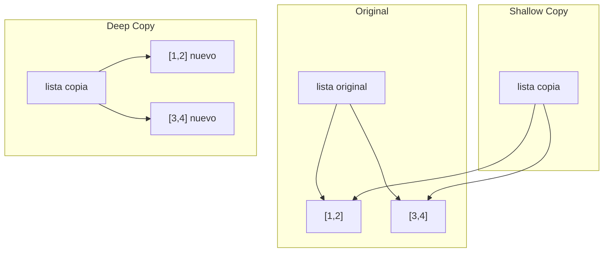

# 📋 08 - Listas

Las listas son la estructura de datos secuencial más versátil de Python. Internamente, son arrays dinámicos de punteros a objetos (no almacenan los valores directamente). Esto permite heterogeneidad pero introduce overhead de memoria. En ML/AI, las listas sirven para almacenar lotes de datos antes de convertirlos a arrays NumPy. En Backend, funcionan como buffers, colas y acumuladores de resultados.


## 1. Listas como Arrays Dinámicos

Una lista en CPython gestiona un array subyacente de punteros. Cuando se llena, se reserva un nuevo bloque mayor (over-allocation) y se copian las referencias. El coste amortizado de `append` es O(1).

```python
nums = [10, 20, 30]
nums.append(40)  # O(1) amortizado
print(nums)      # [10, 20, 30, 40]
```

⚠️ **Advertencia:** Insertar (`insert`) o eliminar (`pop(0)`) al principio de una lista es O(n) porque todos los elementos deben desplazarse. Para colas frecuentes, usa `collections.deque`.


## 2. Indexing y Slicing

Igual que los strings, las listas soportan indexing y slicing, pero al ser mutables, el slicing permite asignación.

```python
items = [0, 1, 2, 3, 4, 5]
print(items[2:5])    # [2, 3, 4]
items[1:3] = [100, 200]  # Reemplaza por asignación
print(items)         # [0, 100, 200, 3, 4, 5]
```

💡 **Tip:** `lista[:]` crea una copia superficial (shallow copy) de toda la lista. Es idiomático y más rápido que `list(lista)` en algunos contextos.


## 3. Métodos de Lista Esenciales

| Método | Complejidad | Descripción |
|--------|-------------|-------------|
| `append(x)` | O(1)* | Añade al final (*amortizado) |
| `extend(iterable)` | O(k) | Añade todos los elementos de iterable |
| `insert(i, x)` | O(n) | Inserta en posición `i` |
| `remove(x)` | O(n) | Elimina primera ocurrencia de valor `x` |
| `pop([i])` | O(1) / O(n) | Elimina y devuelve último (o índice `i`) |
| `sort()` | O(n log n) | Ordena in-place |
| `reverse()` | O(n) | Invierte in-place |
| `index(x)` | O(n) | Índice de primera ocurrencia |
| `count(x)` | O(n) | Número de ocurrencias |
| `copy()` | O(n) | Shallow copy |

```python
nums = [3, 1, 4, 1, 5]
nums.sort()
print(nums)  # [1, 1, 3, 4, 5]
nums.reverse()
print(nums)  # [5, 4, 3, 1, 1]
```


## 4. List Comprehension Básica

Es una forma concisa y eficiente de crear listas. Sintaxis: `[expresión for item in iterable if condición]`.

```python
cuadrados = [x**2 for x in range(10) if x % 2 == 0]
print(cuadrados)  # [0, 4, 16, 36, 64]
```

| Enfoque | Velocidad | Legibilidad |
|---------|-----------|-------------|
| Bucle `for` explícito | Lenta | Media |
| `map()`/`filter()` | Rápida | Baja |
| List comprehension | Rápida | Alta ✅ |

Caso real: Al cargar un dataset CSV, una list comprehension filtra filas inválidas y transforma tipos en una sola pasada: `datos = [float(x) for x in fila if x.strip()]`, reduciendo el tiempo de preprocesamiento.


## 5. Copia Superficial vs Profunda

- **Shallow copy**: Copia la lista, pero los elementos internos se comparten.
- **Deep copy**: Copia la lista y todos los objetos anidados recursivamente.

```python
import copy

original = [[1, 2], [3, 4]]
superficial = original.copy()
profunda = copy.deepcopy(original)

superficial[0][0] = 99
print(original)    # [[99, 2], [3, 4]] — afectado!
print(profunda)    # [[1, 2], [3, 4]] — independiente
```



⚠️ **Advertencia:** `[:]` y `.copy()` son shallow. Si la lista contiene objetos mutables anidados, usa `copy.deepcopy()` para evitar efectos colaterales.


## 6. Aliasing y Efectos Colaterales

Cuando dos variables apuntan a la misma lista, modificar una afecta a la otra.

```python
a = [1, 2, 3]
b = a
b.append(4)
print(a)  # [1, 2, 3, 4]
```

Caso real: En un pipeline de ML, pasar la lista de batches por referencia a una función de augmentación sin copiar provoca que el epoch siguiente reutilice datos ya modificados, corrompiendo el entrenamiento.


## 7. Listas Anidadas y Uso de Memoria

Cada elemento de una lista es un puntero de 8 bytes (en 64 bits). Una lista de un millón de enteros pequeños consume mucho más que un array de C puro.

```python
import sys

lista = [1, 2, 3]
print(sys.getsizeof(lista))  # Overhead de la lista vacía + punteros
```

💡 **Tip:** Para datos numéricos homogéneos grandes, usa `array.array` o `numpy.ndarray`. Las listas de Python son flexibles pero costosas en memoria.


## 8. Caso Real: Buffer de Datos Streaming

```python
class BufferStreaming:
    def __init__(self, capacidad=100):
        self.capacidad = capacidad
        self.buffer = []

    def agregar(self, dato):
        self.buffer.append(dato)
        if len(self.buffer) >= self.capacidad:
            self.procesar()

    def procesar(self):
        print(f"Procesando lote de {len(self.buffer)} elementos")
        self.buffer.clear()

stream = BufferStreaming(capacidad=3)
for i in range(7):
    stream.agregar(i)
```

Este patrón es común en procesamiento de eventos y ETLs donde se acumulan registros antes de insertarlos en bloque a una base de datos.


## 9. Resumen en Código

```python
# 📦 Código de compresión: Listas
import copy

# 1. Creación y métodos
nums = [3, 1, 4, 1, 5]
nums.append(9)
nums.sort()
print(nums)

# 2. List comprehension
cuadrados_pares = [x**2 for x in range(20) if x % 2 == 0]
print(cuadrados_pares)

# 3. Aliasing vs copia
original = [[1, 2], [3, 4]]
superficial = original.copy()
profunda = copy.deepcopy(original)
superficial[0][0] = 99
print(f"Original tras shallow mod: {original}")
print(f"Deep copy intacta: {profunda}")

# 4. Slicing y asignación
letras = ["a", "b", "c", "d"]
letras[1:3] = ["X", "Y", "Z"]
print(letras)

# 5. Memoria
import sys
print(f"Tamaño lista vacía: {sys.getsizeof([])} bytes")

# 6. Buffer streaming simple
buffer = []
for i in range(10):
    buffer.append(i)
    if len(buffer) == 4:
        print(f"Lote: {buffer}")
        buffer.clear()
```
