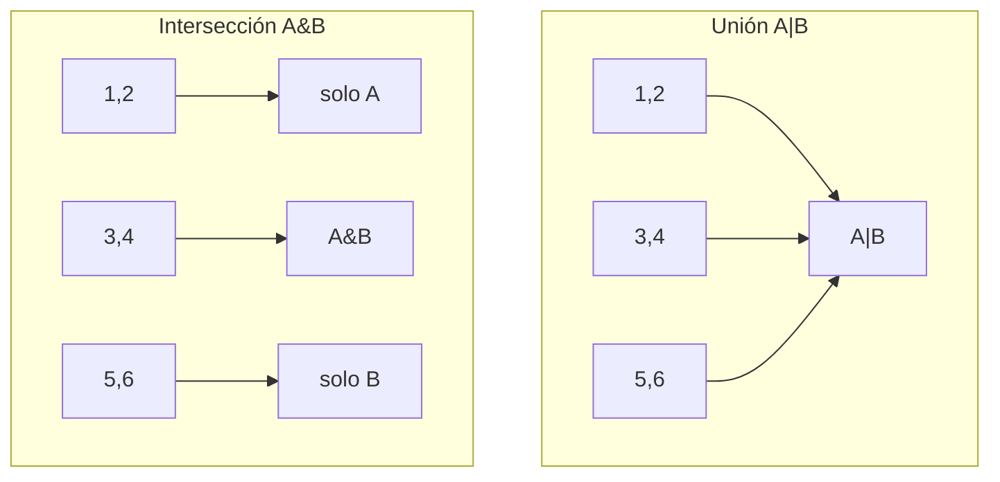

# 🧮 11 - Conjuntos

Los conjuntos (`set`) son colecciones no ordenadas de elementos únicos, implementadas sobre tablas hash (como los diccionarios, pero sin valores asociados). Su superpoder es la pertenencia (membership testing) en O(1) promedio. En ML/AI, los sets detectan clases duplicadas en datasets y calculan overlap entre vocabularios. En Backend, filtran permisos únicos, comparan tags y eliminan registros repetidos de forma eficiente.


## 1. Sets como Hash Tables sin Valores

Un `set` almacena únicamente claves hashables en una tabla hash. No hay valores asociados, no hay orden garantizado (aunque la iteración sigue el orden de inserción desde Python 3.7+ en CPython, al igual que los dicts).

```python
unicos = {3, 1, 4, 1, 5, 9, 2, 6}
print(unicos)  # {1, 2, 3, 4, 5, 6, 9} — duplicados eliminados
```

⚠️ **Advertencia:** Al igual que los dicts, solo elementos hashables pueden pertenecer a un set. No puedes tener un set de listas.


## 2. Unicidad Automática

La propiedad más útil de los sets es la deduplicación automática. Al construir un set a partir de cualquier iterable, se descartan duplicados inmediatamente.

```python
datos = ["sensor_01", "sensor_02", "sensor_01", "sensor_03"]
sensores_unicos = set(datos)
print(sensores_unicos)  # {'sensor_01', 'sensor_02', 'sensor_03'}
```

💡 **Tip:** Convertir una lista a set y comparar longitudes es la forma más rápida de detectar duplicados: `len(lista) != len(set(lista))`.


## 3. Operaciones Matemáticas

Los sets implementan álgebra de conjuntos directamente con operadores.

| Operación | Operador | Método | Descripción |
|-----------|----------|--------|-------------|
| Unión | `\|` | `union()` | Elementos en A o B |
| Intersección | `&` | `intersection()` | Elementos en A y B |
| Diferencia | `-` | `difference()` | Elementos en A pero no en B |
| Diferencia simétrica | `^` | `symmetric_difference()` | Elementos en A o B, pero no en ambos |
| Subconjunto | `<=` | `issubset()` | Todos los elementos de A están en B |
| Superconjunto | `>=` | `issuperset()` | Todos los elementos de B están en A |

```python
A = {1, 2, 3, 4}
B = {3, 4, 5, 6}

print(A | B)   # {1, 2, 3, 4, 5, 6}
print(A & B)   # {3, 4}
print(A - B)   # {1, 2}
print(A ^ B)   # {1, 2, 5, 6}
```



Caso real: Un sistema de recomendación compara el set de películas vistas por el usuario A con el set del usuario B. La intersección genera la base para recomendaciones colaborativas basadas en usuarios similares.


## 4. Métodos Principales

| Método | Función | Error si no existe |
|--------|---------|-------------------|
| `add(x)` | Añade elemento | No aplica |
| `remove(x)` | Elimina elemento | `KeyError` |
| `discard(x)` | Elimina si existe | No lanza error |
| `pop()` | Elimina y devuelve arbitrario | `KeyError` si vacío |
| `clear()` | Vacía el set | No aplica |
| `issubset(other)` | ¿Es subconjunto? | No aplica |
| `issuperset(other)` | ¿Es superconjunto? | No aplica |

```python
s = {1, 2, 3}
s.add(4)
s.discard(99)   # No falla
s.remove(2)     # KeyError si 2 no existiera
```


## 5. Set Comprehension

```python
cuadrados = {x**2 for x in range(10)}
print(cuadrados)

# Filtrar solo impares
impares = {x for x in range(20) if x % 2 != 0}
```


## 6. `frozenset`

Un `frozenset` es un conjunto inmutable. Al ser hashable, puede usarse como clave de diccionario o elemento de otro set.

```python
fs = frozenset([1, 2, 3])
# fs.add(4)  # AttributeError

cache = {frozenset({"a", "b"}): "valor"}
print(cache[frozenset({"b", "a"})])  # "valor" (orden no importa)
```

💡 **Tip:** Usa `frozenset` para representar grupos de tags inmutables que necesitas usar como clave de caché o comparar sin importar el orden.


## 7. Membership Testing O(1)

La operación `x in conjunto` tiene complejidad promedio O(1), frente a O(n) en listas.

```python
import time

 grande = set(range(1_000_000))
 lista = list(range(1_000_000))

# O(1) vs O(n)
print(999_999 in grande)   # Instantáneo
print(999_999 in lista)    # Mucho más lento en listas grandes
```

| Estructura | `x in estructura` | Complejidad |
|------------|-------------------|-------------|
| `list` / `tuple` | Lineal | O(n) |
| `set` / `dict` (keys) | Hash | O(1) promedio |

⚠️ **Advertencia:** El peor caso de un set es O(n) si todos los elementos colisionan en el mismo bucket (ataque hash collision o claves mal diseñadas), aunque CPython mitiga esto con seeding aleatorio por proceso.


## 8. Aplicación: Eliminar Duplicados y Filtrado

```python
# Eliminar duplicados preservando orden (Python 3.7+)
def dedup(iterable):
    seen = set()
    for item in iterable:
        if item not in seen:
            seen.add(item)
            yield item

print(list(dedup([3, 1, 4, 1, 5, 9, 2, 6])))
```

Caso real: Un pipeline de logs recibe millones de IDs de sesión, muchos repetidos. Convertir a set elimina duplicados antes de agregar a la base de datos analítica, reduciendo I/O en órdenes de magnitud.


## 9. Caso Real: Análisis de Usuarios Únicos

```python
usuarios_hoy = {"user_1", "user_2", "user_3", "user_5"}
usuarios_ayer = {"user_2", "user_4", "user_5"}

nuevos = usuarios_hoy - usuarios_ayer
perdidos = usuarios_ayer - usuarios_hoy
activos_ambos = usuarios_hoy & usuarios_ayer
total_unicos = usuarios_hoy | usuarios_ayer

print(f"Nuevos: {nuevos}")
print(f"Perdidos: {perdidos}")
print(f"Retenidos: {activos_ambos}")
print(f"Total únicos: {len(total_unicos)}")
```

Este análisis es fundamental en product analytics para calcular churn, retención y cohortes de usuarios.


## 10. Resumen en Código

```python
# 📦 Código de compresión: Conjuntos

# 1. Creación y unicidad
nums = [1, 2, 2, 3, 3, 3]
unicos = set(nums)
print(f"Únicos: {unicos}")

# 2. Operaciones matemáticas
A = {1, 2, 3, 4}
B = {3, 4, 5, 6}
print(f"Unión: {A | B}")
print(f"Intersección: {A & B}")
print(f"Diferencia: {A - B}")
print(f"Dif. simétrica: {A ^ B}")

# 3. Métodos
s = {10, 20}
s.add(30)
s.discard(99)
print(f"Set: {s}, issubset de {{10,20,30,40}}? {s <= {10,20,30,40}}")

# 4. frozenset
fs = frozenset([1, 2])
print(f"frozenset hashable? {hash(fs) is not None}")

# 5. Membership testing
grande = set(range(100000))
print(f"99999 in set? {99999 in grande}")

# 6. Set comprehension
pares = {x for x in range(20) if x % 2 == 0}
print(pares)
```
