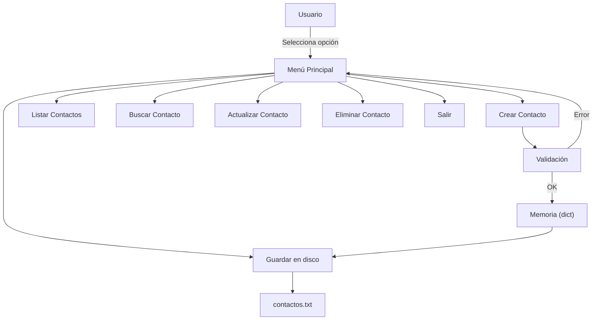

# 🎯 12 - Caso Práctico: Agenda de Contactos

Este proyecto integra todo el conocimiento adquirido en el módulo. Construiremos una aplicación de consola que gestiona contactos usando diccionarios y listas, con validación de datos, búsqueda parcial y persistencia en archivo de texto. En ML/AI, este tipo de CRUDs son la base de sistemas de etiquetado de datos. En Backend, ilustra el manejo de estado, validación de inputs y serialización.


## 1. Requisitos del Proyecto

| ID | Requisito | Conceptos aplicados |
|----|-----------|---------------------|
| R1 | Crear contacto (nombre, teléfono, email) | Diccionarios, input, validación |
| R2 | Listar todos los contactos | Listas, iteración, f-strings |
| R3 | Buscar contacto por nombre parcial | Strings, condicionales, membership |
| R4 | Actualizar contacto existente | Diccionarios, claves, mutabilidad |
| R5 | Eliminar contacto | `pop`, condicionales |
| R6 | Validar formato de email y teléfono | Strings, métodos, truthiness |
| R7 | Persistir en archivo de texto | E/S de archivos, encode/decode |
| R8 | Menú interactivo en consola | Bucles while, condicionales, funciones |


## 2. Arquitectura del Sistema




## 3. Modelo de Datos

Cada contacto se almacena en un diccionario. La agenda completa es un diccionario que mapea el nombre (clave única) al contacto.

```python
# Estructura en memoria
agenda = {
    "Juan Perez": {
        "telefono": "+5491122334455",
        "email": "juan@example.com"
    },
    "Maria Lopez": {
        "telefono": "+5491166778899",
        "email": "maria@example.com"
    }
}
```

⚠️ **Advertencia:** Usar el nombre como clave tiene limitaciones (nombres duplicados). En una aplicación real, usaríamos un ID único (UUID o autoincremental). Para este caso práctico, simplificamos con nombre.


## 4. Componentes Principales

### 4.1 Validación de Datos

```python
def es_email_valido(email):
    return "@" in email and "." in email.split("@")[-1]

def es_telefono_valido(tel):
    return tel.startswith("+") and tel[1:].isdigit()
```

💡 **Tip:** En producción usa expresiones regulares (`re` module) o librerías especializadas como `email-validator`. Aquí mantenemos la lógica simple para enfocarnos en los fundamentos.


### 4.2 CRUD de Contactos

```python
def crear_contacto(agenda, nombre, telefono, email):
    if not nombre.strip():
        return "⚠️ El nombre no puede estar vacío."
    if not es_telefono_valido(telefono):
        return "⚠️ Teléfono inválido. Debe iniciar con + y contener solo dígitos."
    if not es_email_valido(email):
        return "⚠️ Email inválido."

    agenda[nombre] = {"telefono": telefono, "email": email}
    return "✅ Contacto guardado."


def buscar_contacto(agenda, termino):
    termino = termino.lower()
    resultados = []
    for nombre, datos in agenda.items():
        if termino in nombre.lower():
            resultados.append((nombre, datos))
    return resultados
```


### 4.3 Persistencia en Archivo

```python
AGENDA_FILE = "contactos.txt"

def guardar_agenda(agenda):
    with open(AGENDA_FILE, "w", encoding="utf-8") as f:
        for nombre, datos in agenda.items():
            linea = f"{nombre}|{datos['telefono']}|{datos['email']}\n"
            f.write(linea)


def cargar_agenda():
    agenda = {}
    try:
        with open(AGENDA_FILE, "r", encoding="utf-8") as f:
            for linea in f:
                linea = linea.strip()
                if not linea:
                    continue
                partes = linea.split("|")
                if len(partes) == 3:
                    nombre, telefono, email = partes
                    agenda[nombre] = {"telefono": telefono, "email": email}
    except FileNotFoundError:
        pass
    return agenda
```

Caso real: Muchos microservicios Backend leen archivos `.env` o de configuración con este mismo patrón de parseo línea por línea. Entender la codificación UTF-8 y el manejo de excepciones es crítico para evitar corrupción de datos en entornos multilingües.


## 5. Menú Interactivo

```python
def menu():
    agenda = cargar_agenda()
    while True:
        print("\n=== AGENDA DE CONTACTOS ===")
        print("1. Crear contacto")
        print("2. Listar contactos")
        print("3. Buscar contacto")
        print("4. Actualizar contacto")
        print("5. Eliminar contacto")
        print("6. Guardar y salir")

        opcion = input("Selecciona una opción: ").strip()

        if opcion == "1":
            nombre = input("Nombre: ").strip()
            telefono = input("Teléfono (+cod...): ").strip()
            email = input("Email: ").strip()
            print(crear_contacto(agenda, nombre, telefono, email))

        elif opcion == "2":
            if not agenda:
                print("No hay contactos.")
            for nombre, datos in agenda.items():
                print(f"- {nombre}: {datos['telefono']} / {datos['email']}")

        elif opcion == "3":
            termino = input("Buscar: ").strip()
            resultados = buscar_contacto(agenda, termino)
            if not resultados:
                print("Sin resultados.")
            for nombre, datos in resultados:
                print(f"> {nombre}: {datos['telefono']} / {datos['email']}")

        elif opcion == "4":
            nombre = input("Nombre exacto a actualizar: ").strip()
            if nombre not in agenda:
                print("Contacto no encontrado.")
                continue
            telefono = input(f"Nuevo teléfono [{agenda[nombre]['telefono']}]: ").strip()
            email = input(f"Nuevo email [{agenda[nombre]['email']}]: ").strip()
            if telefono:
                agenda[nombre]["telefono"] = telefono
            if email:
                agenda[nombre]["email"] = email
            print("✅ Actualizado.")

        elif opcion == "5":
            nombre = input("Nombre exacto a eliminar: ").strip()
            if agenda.pop(nombre, None):
                print("✅ Eliminado.")
            else:
                print("Contacto no encontrado.")

        elif opcion == "6":
            guardar_agenda(agenda)
            print("💾 Agenda guardada. ¡Hasta luego!")
            break
        else:
            print("⚠️ Opción inválida.")


if __name__ == "__main__":
    menu()
```


## 6. Métricas de Éxito

| Métrica | Criterio de éxito |
|---------|-------------------|
| Funcionalidad | CRUD completo operativo sin errores |
| Validación | Rechaza emails y teléfonos malformados |
| Persistencia | Datos sobreviven entre ejecuciones |
| Búsqueda | Encuentra coincidencias parciales insensibles a mayúsculas |
| UX | Menú claro, mensajes descriptivos, sin crashes por input vacío |


## 7. Posibles Extensiones

- Usar `uuid` como clave primaria en lugar del nombre.
- Exportar a formato JSON o CSV usando los módulos `json` o `csv`.
- Añadir categorías de contacto usando conjuntos (`set`) para tags.
- Implementar autocompletado simple con búsqueda por prefijo.


## 8. Resumen en Código (Proyecto Completo)

```python
# 📦 Código de compresión completo: Agenda de Contactos
# Guarda este script como agenda.py y ejecútalo.

AGENDA_FILE = "contactos.txt"


def es_email_valido(email):
    return "@" in email and "." in email.split("@")[-1]


def es_telefono_valido(tel):
    return tel.startswith("+") and tel[1:].isdigit()


def cargar_agenda():
    agenda = {}
    try:
        with open(AGENDA_FILE, "r", encoding="utf-8") as f:
            for linea in f:
                linea = linea.strip()
                if not linea:
                    continue
                partes = linea.split("|")
                if len(partes) == 3:
                    agenda[partes[0]] = {"telefono": partes[1], "email": partes[2]}
    except FileNotFoundError:
        pass
    return agenda


def guardar_agenda(agenda):
    with open(AGENDA_FILE, "w", encoding="utf-8") as f:
        for nombre, datos in agenda.items():
            f.write(f"{nombre}|{datos['telefono']}|{datos['email']}\n")


def crear_contacto(agenda, nombre, telefono, email):
    if not nombre.strip():
        return "⚠️ El nombre no puede estar vacío."
    if not es_telefono_valido(telefono):
        return "⚠️ Teléfono inválido."
    if not es_email_valido(email):
        return "⚠️ Email inválido."
    agenda[nombre] = {"telefono": telefono, "email": email}
    return "✅ Contacto guardado."


def buscar_contacto(agenda, termino):
    t = termino.lower()
    return [(n, d) for n, d in agenda.items() if t in n.lower()]


def menu():
    agenda = cargar_agenda()
    while True:
        print("\n=== AGENDA DE CONTACTOS ===")
        print("1. Crear  2. Listar  3. Buscar  4. Actualizar  5. Eliminar  6. Guardar y salir")
        op = input("Opción: ").strip()

        if op == "1":
            print(crear_contacto(agenda, input("Nombre: "), input("Tel: "), input("Email: ")))
        elif op == "2":
            for n, d in agenda.items():
                print(f"- {n}: {d['telefono']} / {d['email']}")
        elif op == "3":
            for n, d in buscar_contacto(agenda, input("Buscar: ")):
                print(f"> {n}: {d['telefono']} / {d['email']}")
        elif op == "4":
            nom = input("Nombre exacto: ").strip()
            if nom in agenda:
                nt = input(f"Tel [{agenda[nom]['telefono']}]: ").strip()
                ne = input(f"Email [{agenda[nom]['email']}]: ").strip()
                if nt:
                    agenda[nom]["telefono"] = nt
                if ne:
                    agenda[nom]["email"] = ne
                print("✅ Actualizado.")
            else:
                print("No encontrado.")
        elif op == "5":
            nom = input("Nombre exacto: ").strip()
            print("✅ Eliminado." if agenda.pop(nom, None) else "No encontrado.")
        elif op == "6":
            guardar_agenda(agenda)
            print("💾 Guardado. ¡Adiós!")
            break
        else:
            print("⚠️ Opción inválida.")


if __name__ == "__main__":
    menu()
```


## 9. Enlaces Internos de Referencia

Conceptos aplicados en este proyecto:

- Variables y tipos: [[01 - Variables y Tipos de Datos]]
- Operadores: [[02 - Operadores Aritmeticos y Asignacion]]
- Entrada/Salida: [[03 - Entrada y Salida de Datos]]
- Condicionales: [[05 - Condicionales]]
- Bucles: [[06 - Bucles For y While]]
- Strings: [[07 - Strings y Metodos de Cadenas]]
- Listas y dicts: [[08 - Listas]], [[10 - Diccionarios]]
- Conjuntos: [[11 - Conjuntos]]


## 10. Conclusión del Módulo

Has completado el módulo **01 - Python Básico**. Dominas variables, tipos, operadores, estructuras de control, strings y las cuatro estructuras de datos built-in fundamentales: listas, tuplas, diccionarios y conjuntos. Estos conceptos son los cimientos sobre los que se construyen frameworks de ML como PyTorch (tensores heredan slicing de listas) y backends como FastAPI (dependencias inyectadas como diccionarios). Continúa practicando modificando la agenda: añade validaciones, exporta a JSON, o implementa búsqueda por múltiples campos.
