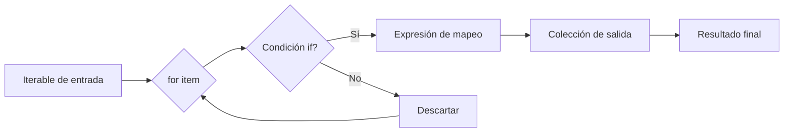

# 🔄 Iteración Avanzada y Comprensiones

En el desarrollo de backends y pipelines de Machine Learning, la iteración eficiente sobre grandes volúmenes de datos no es un lujo: es una necesidad. Las comprensiones y las funciones de iteración avanzada de Python permiten escribir código que es simultáneamente más rápido, más legible y más económico en memoria. Un **ML Engineer** que domina estas técnicas puede preprocesar datasets en segundos en lugar de minutos.

---

## 1. Enumeración controlada con `enumerate()`

La función integrada `enumerate()` convierte un iterable en una secuencia de tuplas `(índice, valor)`. Por defecto, el índice comienza en `0`, pero el parámetro `start` permite desplazarlo.

```python
usuarios = ["Ana", "Luis", "Pedro"]

for idx, nombre in enumerate(usuarios, start=1):
    print(f"{idx}. {nombre}")
```

Caso real: en un pipeline de etiquetado de datos para entrenamiento supervisado, necesitas generar identificadores únicos que comiencen en `1000` para no colisionar con registros legacy. `enumerate(dataset, start=1000)` resuelve esto en una sola línea.

💡 **Tip**: `enumerate()` devuelve un iterador, por lo que es eficiente en memoria incluso con millones de registros.

---

## 2. Empaquetamiento y desempaquetamiento con `zip()`

`zip()` toma múltiples iterables y los agrega elemento a elemento en tuplas. Se detiene en el iterable más corto.

```python
nombres = ["Temp", "Presión", "Humedad"]
valores = [22.5, 1013, 45]
unidades = ["°C", "hPa", "%"]

for nombre, valor, unidad in zip(nombres, valores, unidades):
    print(f"{nombre}: {valor} {unidad}")
```

⚠️ **Advertencia**: si los iterables tienen longitudes desiguales, `zip()` descarta los elementos sobrantes del más largo sin emitir advertencia. En Python 3.10+, usa `zip(..., strict=True)` para forzar la igualdad de longitudes y obtener una excepción si no coinciden.

### 2.1. Desempaquetamiento con `*`

Puedes usar `zip(*matriz)` para transponer una lista de listas:

```python
matriz = [
    [1, 2, 3],
    [4, 5, 6],
    [7, 8, 9]
]

# Transposición
columnas = list(zip(*matriz))
print(columnas)  # [(1, 4, 7), (2, 5, 8), (3, 6, 9)]
```

Caso real: en un sistema backend de normalización de datos, recibes filas de una tabla y necesitas enviarlas a un microservicio que consume columnas. La transposición con `zip(*datos)` evita bucles anidados complejos.

---

## 3. `zip()` con diccionarios

Al aplicar `zip()` sobre diccionarios, se itera sobre sus claves. Para combinar claves y valores, usa los métodos `.keys()`, `.values()` o `.items()`.

```python
sensor_a = {"temp": 22, "hum": 45}
sensor_b = {"temp": 23, "hum": 50}

# Comparar claves comunes
for clave in zip(sensor_a, sensor_b):
    print(clave)

# Comparar valores de claves comunes
for k, (v1, v2) in zip(sensor_a.keys(), zip(sensor_a.values(), sensor_b.values())):
    print(f"{k}: {v1} vs {v2}")
```

---

## 4. Comprensiones de lista anidadas

Una comprensión puede contener otra comprensión dentro, permitiendo iterar sobre estructuras bidimensionales.

```python
matriz = [[1, 2, 3], [4, 5, 6], [7, 8, 9]]

# Aplanar una matriz
plano = [num for fila in matriz for num in fila]
print(plano)  # [1, 2, 3, 4, 5, 6, 7, 8, 9]
```

⚠️ **Advertencia**: el orden de los `for` en una comprensión anidada sigue la estructura de los bucles tradicionales de afuera hacia adentro. El primer `for` es el externo y el segundo el interno.

Caso real: en visión por computadora, una imagen se representa como una lista de listas de píxeles. Para extraer todos los píxeles con intensidad mayor a 128, una comprensión anidada es más rápida y expresiva que bucles explícitos.

---

## 5. Comprensiones de diccionario y conjunto

### 5.1. Dict comprehension

```python
palabras = ["python", "comprension", "datos"]
longitudes = {palabra: len(palabra) for palabra in palabras}
print(longitudes)
```

### 5.2. Set comprehension

```python
from random import randint

muestras = [randint(1, 100) for _ in range(1000)]
unicos_pares = {x for x in muestras if x % 2 == 0}
print(len(unicos_pares))
```

💡 **Tip**: los conjuntos eliminan duplicados automáticamente. Un `set comprehension` es la forma más idiomática de obtener valores únicos filtrados.

---

## 6. Expresiones generadoras

Las expresiones generadoras se parecen a las comprensiones de lista, pero usan paréntesis `()` en lugar de corchetes `[]`. No construyen la lista completa en memoria; producen los valores bajo demanda.

```python
# Generador de cuadrados pares
cuadrados_pares = (x**2 for x in range(1000000) if x % 2 == 0)

# Suma sin cargar todo en memoria
total = sum(cuadrados_pares)
print(total)
```

| Característica | List comprehension | Generator expression |
|----------------|--------------------|----------------------|
| Sintaxis | `[...]` | `(...)` |
| Memoria | Alta (almacena todo) | Baja (lazy evaluation) |
| Iteraciones | Reutilizable | Se agota en una iteración |
| Velocidad de acceso | O(1) por índice | No soporta indexación |

Caso real: un archivo de logs de 10 GB no cabe en RAM. Una expresión generadora permite filtrar líneas de error y contar ocurrencias sin cargar el archivo completo.

---

## 7. Comprensiones con condicionales

### 7.1. Filtro con `if`

```python
# Solo positivos mayores a 10
valores = [-5, 12, 3, 45, 8, 90]
filtrados = [v for v in valores if v > 10]
```

### 7.2. Valor condicional con `if-else`

Cuando necesitas transformar los elementos, no filtrarlos, coloca el `if-else` antes del `for`:

```python
# Clasificación binaria: 1 si > umbral, 0 si no
scores = [0.3, 0.7, 0.5, 0.9]
clase = [1 if s >= 0.5 else 0 for s in scores]
```

⚠️ **Advertencia**: no confundas `[x for x in items if cond]` (filtra) con `[expr_if if cond else expr_else for x in items]` (mapea). La posición del `if` cambia completamente el significado.

---

## 8. Rendimiento: comprensiones vs bucles `for`

Las comprensiones están optimizadas a nivel de bytecode en CPython. En la mayoría de los casos, una comprensión es un 15-30% más rápida que el bucle `for` equivalente.

```python
import timeit

# Bucle tradicional
def con_bucle():
    resultado = []
    for x in range(1000):
        if x % 2 == 0:
            resultado.append(x ** 2)
    return resultado

# Comprensión
def con_comprension():
    return [x ** 2 for x in range(1000) if x % 2 == 0]

print("Bucle:", timeit.timeit(con_bucle, number=10000))
print("Comprensión:", timeit.timeit(con_comprension, number=10000))
```

Caso real: en un backend de alto tráfico, normalizar 50,000 registros JSON por segundo con comprensiones puede reducir la latencia percibida por los usuarios finales.

---

## 9. Diagrama de flujo de comprensiones




---

## 10. Tabla comparativa de técnicas de iteración

| Técnica | Uso ideal | Memoria | Legibilidad |
|---------|-----------|---------|-------------|
| `for` tradicional | Lógica compleja con múltiples pasos | Media | Alta |
| List comprehension | Transformar y filtrar una lista | Media | Muy alta |
| Dict comprehension | Construir mapeos clave-valor | Media | Muy alta |
| Set comprehension | Extraer únicos filtrados | Media | Muy alta |
| Generator expression | Grandes volúmenes, una sola pasada | Baja | Alta |
| `map/filter` | Pipeline funcional simple | Baja | Media |

---

## 11. Código de compresión

```python
# Comprensiones y generadores - Todo en uno

datos = range(20)

# List comp con if-else
clase = ["alto" if x > 10 else "bajo" for x in datos]

# Dict comp
potencias = {x: x**3 for x in datos if x % 2 != 0}

# Generator expression para suma lazy
suma_pares = sum(x**2 for x in datos if x % 2 == 0)

# zip con enumerate
for i, (a, b) in enumerate(zip(datos, clase), 1):
    print(i, a, b)

print(potencias, suma_pares)
```
