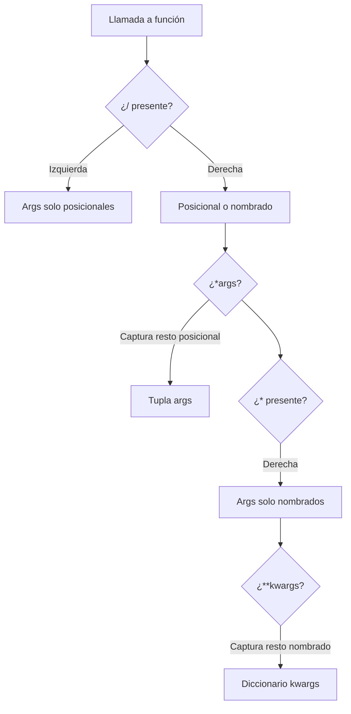

# ⚙️ Funciones Avanzadas

Las funciones en Python son objetos de primera clase, pero su verdadero poder se despliega cuando dominas las firmas avanzadas. Un **Backend Developer** que diseña APIs internas necesita funciones flexibles que acepten configuraciones variables. Un **ML Engineer** que construye wrappers para modelos necesita inyectar hiperparámetros de forma dinámica sin reescribir interfaces.

---

## 1. Parámetros posicionales y nombrados

Python permite pasar argumentos de dos formas:

- **Posicional**: el valor se asigna según el orden de declaración.
- **Nombrado (keyword)**: se especifica explícitamente el nombre del parámetro.

```python
def registrar_sensor(nombre, ubicacion, umbral=25.0):
    print(f"{nombre} en {ubicacion} (umbral: {umbral})")

# Posicional
registrar_sensor("Temp01", "Sala A")

# Nombrado (el orden no importa)
registrar_sensor(ubicacion="Sala B", nombre="Temp02", umbral=30.0)
```

⚠️ **Advertencia**: una vez que usas un argumento nombrado en una llamada, todos los argumentos siguientes también deben ser nombrados para evitar ambigüedades.

---

## 2. Valores por defecto y el peligro de los mutables

Los valores por defecto se evalúan **una sola vez** en el momento de la definición de la función, no en cada llamada.

```python
def agregar_medicion(valor, historial=[]):
    historial.append(valor)
    return historial

print(agregar_medicion(22.5))  # [22.5]
print(agregar_medicion(23.1))  # [22.5, 23.1] ¡Sorpresa!
```

El valor por defecto es el **mismo objeto lista** en cada invocación.

**Patrón correcto:**

```python
def agregar_medicion(valor, historial=None):
    if historial is None:
        historial = []
    historial.append(valor)
    return historial
```

Caso real: un endpoint FastAPI que recopila errores de validación en una lista por defecto compartió errores entre peticiones HTTP, causando fugas de información entre usuarios.

---

## 3. Argumentos variables con `*args`

El prefijo `*` agrupa todos los argumentos posicionales sobrantes en una **tupla**.

```python
def promedio_móvil(base, *lecturas):
    """Calcula el promedio de lecturas agregando un valor base."""
    if not lecturas:
        return base
    return (base + sum(lecturas)) / (1 + len(lecturas))

print(promedio_móvil(10, 20, 30, 40))  # 25.0
```

💡 **Tip**: `args` es solo una convención. Puedes nombrarlo `*valores`, `*lecturas`, etc., pero `*args` es el estándar en la comunidad Python.

---

## 4. Argumentos nombrados variables con `**kwargs`

El prefijo `**` agrupa todos los argumentos nombrados sobrantes en un **diccionario**.

```python
def configurar_modelo(nombre, **kwargs):
    config = {"modelo": nombre}
    config.update(kwargs)
    return config

print(configurar_modelo("ResNet50", epochs=10, lr=0.001, batch_size=32))
```

Caso real: una librería de ML como `scikit-learn` utiliza `**kwargs` en muchos constructores para permitir la personalización de hiperparámetros sin modificar la firma base.

---

## 5. Argumentos exclusivamente nombrados

Colocando un `*` aislado en la firma, obligas a que todos los parámetros a su derecha sean pasados por nombre.

```python
def crear_usuario(nombre, *, edad, activo=True):
    return {"nombre": nombre, "edad": edad, "activo": activo}

# crear_usuario("Ana", 30)  # Error: edad debe ser nombrada
crear_usuario("Ana", edad=30)
```

---

## 6. Argumentos exclusivamente posicionales (`/`)

Desde Python 3.8, el operador `/` indica que todos los parámetros a su izquierda deben pasarse posicionalmente.

```python
def dividir_enteros(a, b, /, precisión=2):
    resultado = a / b
    return round(resultado, precisión)

print(dividir_enteros(10, 3, precisión=4))
# dividir_enteros(a=10, b=3)  # Error: a y b son solo posicionales
```

Esto es útil para funciones donde los nombres de los parámetros no tienen significado semántico real o son detalles de implementación.

---

## 7. Orden correcto de parámetros

La firma de una función debe seguir este orden obligatorio:

```
def funcion(posicionales, /, posicional_o_nombrado, *args, nombrados_exclusivos, **kwargs):
    pass
```

| Orden | Tipo | Ejemplo |
|-------|------|---------|
| 1 | Solo posicionales | `a, b, /` |
| 2 | Posicionales o nombrados | `c, d` |
| 3 | `*args` | `*resto` |
| 4 | Solo nombrados | `*, e` |
| 5 | `**kwargs` | `**opciones` |

```python
def pipeline(datos, /, transformacion="normalizar", *capas, verbose=False, **metadata):
    print(f"Entrada: {datos}")
    print(f"Transformación: {transformacion}")
    print(f"Capas: {capas}")
    print(f"Verbose: {verbose}")
    print(f"Metadata: {metadata}")

pipeline([1, 2, 3], "escalar", "relu", "dropout", verbose=True, autor="Ana")
```

---

## 8. Anotaciones de tipo básicas

Aunque Python es dinámico, las anotaciones de tipo mejoran la documentación y permiten que herramientas como `mypy` detecten errores antes del runtime.

```python
from typing import List, Dict, Optional

def procesar_lote(imagenes: List[str], config: Optional[Dict[str, float]] = None) -> List[str]:
    if config is None:
        config = {}
    return [img.upper() for img in imagenes if img.endswith(".png")]
```

💡 **Tip**: las anotaciones no afectan la ejecución. Son metadatos consultables mediante `__annotations__`.

---

## 9. Docstrings y documentación profesional

Una docstring debe describir qué hace la función, sus parámetros, su retorno y posibles excepciones.

```python
def entrenar(
    datos: List[List[float]],
    etiquetas: List[int],
    *,
    épocas: int = 10,
    tasa_aprendizaje: float = 0.01
) -> Dict[str, float]:
    """
    Entrena un clasificador simple con los datos proporcionados.

    Parámetros:
        datos: Matriz de características (muestras x características).
        etiquetas: Vector de etiquetas enteras para clasificación.
        épocas: Número de iteraciones sobre el dataset.
        tasa_aprendizaje: Factor de actualización de pesos.

    Retorna:
        Diccionario con métricas de entrenamiento (pérdida, accuracy).

    Lanza:
        ValueError: Si las longitudes de datos y etiquetas no coinciden.
    """
    if len(datos) != len(etiquetas):
        raise ValueError("Datos y etiquetas deben tener la misma longitud")
    return {"pérdida": 0.1, "accuracy": 0.95}
```

Caso real: en equipos backend grandes, una docstring bien estructurada evita que otros desarrolladores lean el código fuente para entender una función, reduciendo el tiempo de onboarding en un 30%.

---

## 10. Diagrama de flujo de argumentos




---

## 11. Código de compresión

```python
# Funciones avanzadas - Referencia completa

def demo(a, b, /, c, d="default", *args, e, f=10, **kwargs):
    return {
        "pos": (a, b),
        "mixto": (c, d),
        "args": args,
        "kwonly": (e, f),
        "kwargs": kwargs,
    }

# Llamada válida completa
resultado = demo(1, 2, 3, "custom", 100, 200, e="req", f=99, extra="meta")
print(resultado)

# Mutable seguro
def acumular(valor, lista=None):
    lista = lista or []
    lista.append(valor)
    return lista

# Type hints
from typing import Callable

def aplicar(func: Callable[[int], int], n: int) -> int:
    return func(n)

print(aplicar(lambda x: x ** 2, 5))
```
