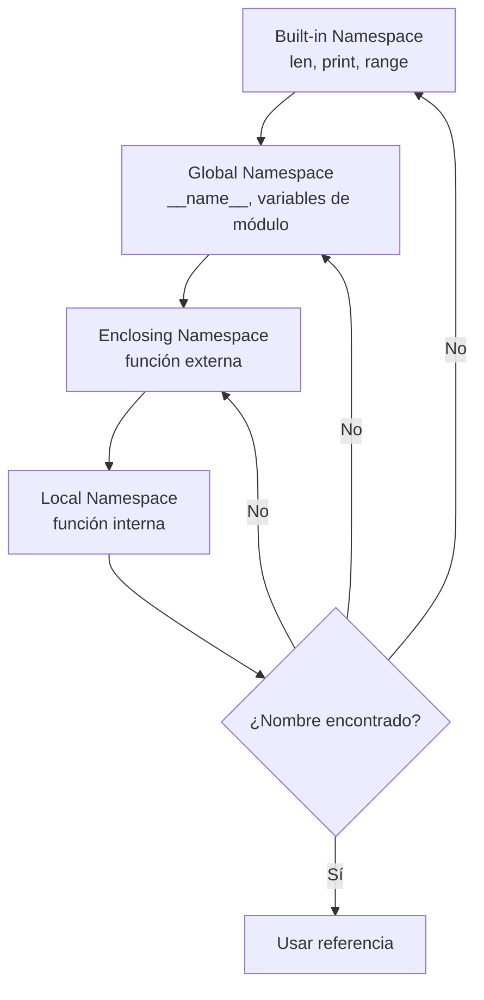

# 🎯 Scope y Namespace

Entender cómo Python busca variables es fundamental para depurar errores silenciosos y escribir código predecible. En **backend**, un namespace mal gestionado puede provocar fugas de estado entre peticiones. En **ML/AI**, los closures y scopes incorrectos son una fuente común de bugs en callbacks de entrenamiento y optimizadores personalizados.

---

## 1. La regla LEGB

Python resuelve los nombres de variables siguiendo una jerarquía estricta conocida como **LEGB**:

| Letra | Ámbito | Descripción |
|-------|--------|-------------|
| **L** | Local | Dentro de la función actual. |
| **E** | Enclosing | En funciones que encierran a la actual (no global). |
| **G** | Global | En el módulo o script principal. |
| **B** | Built-in | Nombres predefinidos de Python (`len`, `print`, etc.). |

```python
x = "global"

def externa():
    x = "enclosing"
    
    def interna():
        x = "local"
        print(x)  # local
    
    interna()
    print(x)  # enclosing

externa()
print(x)  # global
```

⚠️ **Advertencia**: si una función asigna un valor a una variable, Python la trata como **local** para esa función a menos que declares lo contrario. Esto puede causar `UnboundLocalError`.

```python
contador = 0

def incrementar_erroneo():
    contador += 1  # Error: contador es local porque se asigna

# Solución: usar global
def incrementar():
    global contador
    contador += 1
```

---

## 2. Las palabras clave `global` y `nonlocal`

- **`global`**: enlaza una variable al namespace global del módulo.
- **`nonlocal`**: enlaza una variable al namespace de la función más cercana que la encierra (pero no al global).

```python
def contador_factory():
    cuenta = 0
    
    def incrementar():
        nonlocal cuenta
        cuenta += 1
        return cuenta
    
    return incrementar

contador = contador_factory()
print(contador())  # 1
print(contador())  # 2
```

Caso real: en una aplicación backend con autenticación, un closure con `nonlocal` puede mantener el estado de intentos de login fallidos sin exponer la variable a todo el módulo.

---

## 3. Closures: funciones con memoria

Un **closure** es una función que recuerda las variables de su entorno léxico en el momento de su definición, incluso si ese entorno ya no existe en la pila de llamadas.

```python
def multiplicador_por(n):
    def multiplicar(x):
        return x * n
    return multiplicar

doble = multiplicador_por(2)
triple = multiplicador_por(3)

print(doble(5))   # 10
print(triple(5))  # 15
```

Las variables libres (`n` en el ejemplo) se almacenan en el atributo `__closure__` de la función.

```python
print(doble.__closure__[0].cell_contents)  # 2
```

---

## 4. Variables libres y late binding

Un **variable libre** es aquella referenciada en una función pero definida en un scope exterior. Un problema clásico ocurre con `lambda` dentro de bucles:

```python
funciones = []
for i in range(5):
    funciones.append(lambda x: x + i)

print(funciones[0](10))  # 14, no 10
```

Esto sucede porque las lambdas capturan la **referencia** a `i`, no su valor en el momento de la creación. Al momento de ejecutarse, `i` vale `4`.

**Solución con valor por defecto:**

```python
funciones = []
for i in range(5):
    funciones.append(lambda x, i=i: x + i)

print(funciones[0](10))  # 10
```

⚠️ **Advertencia**: este bug de "late binding" es extremadamente común en callbacks de frameworks web (Flask, Django) y en la configuración de capas neuronales dinámicas.

---

## 5. Namespace como diccionario

Internamente, Python implementa los namespaces como diccionarios. Puedes inspeccionarlos con `globals()` y `locals()`.

```python
variable_modulo = 42

def inspeccionar():
    local_a = 1
    local_b = 2
    print("Locales:", locals())

inspeccionar()
print("Globales parciales:", list(globals().keys())[:5])
```

💡 **Tip**: modificar `globals()` o `locals()` directamente es posible pero altamente desaconsejado en código de producción. Úsalo solo para depuración o metaprogramación avanzada.

---

## 6. `__builtins__`

El namespace built-in está siempre disponible y contiene funciones como `len`, `range`, `print`. Puedes acceder a él a través del módulo `builtins`.

```python
import builtins

print("len" in dir(builtins))  # True

# ¡No hagas esto en producción!
# builtins.len = lambda x: 0  # Rompería todo el programa
```

---

## 7. Diagrama del ámbito LEGB




---

## 8. Código de compresión

```python
# Scope y Namespace - Esencia

x = "global"

def externa():
    x = "enclosing"
    def interna():
        nonlocal x
        x = "modificado"
    interna()
    return x

print(externa())  # modificado

# Closure correcto con factory
def potenciador(exp):
    def operar(base):
        return base ** exp
    return operar

cuadrado = potenciador(2)
print(cuadrado(4))  # 16

# Late binding solucionado
creadores = [(lambda v, n=n: v + n) for n in range(3)]
print([f(10) for f in creadores])  # [10, 11, 12]

print("Globales disponibles:", sorted(globals().keys())[:5])
```
