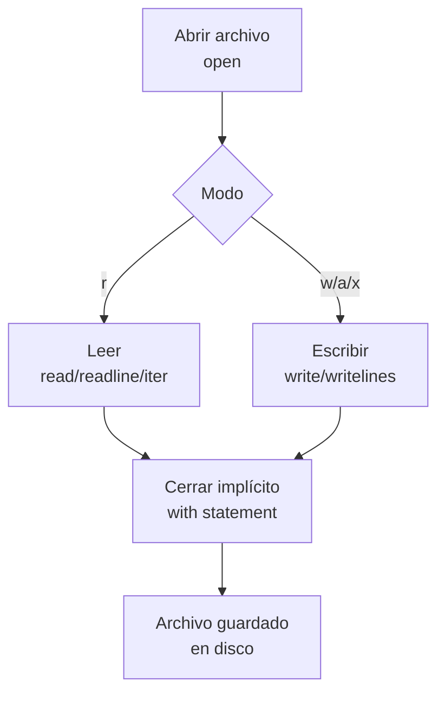

# 📁 Manejo de Archivos

Los sistemas de Machine Learning no viven solo en memoria: modelos entrenados, datasets preprocesados y configuraciones de hiperparámetros deben persistir en disco. En **backend**, el registro de logs, la lectura de plantillas y el almacenamiento de estado de sesiones son operaciones críticas. Dominar el manejo de archivos en Python es, por tanto, una habilidad transversal.

---

## 1. La función `open()` y sus modos

`open(archivo, modo)` es la puerta de entrada al sistema de archivos.

| Modo | Descripción | Si no existe | Si existe |
|------|-------------|--------------|-----------|
| `r` | Lectura texto (default) | Error | Lee desde inicio |
| `w` | Escritura texto | Crea nuevo | **Sobrescribe** |
| `a` | Añadir (append) texto | Crea nuevo | Escribe al final |
| `x` | Creación exclusiva | Crea nuevo | Error |
| `b` | Modo binario (se suma: `rb`, `wb`) | Según base | Según base |
| `t` | Modo texto (default) | Según base | Según base |
| `+` | Lectura y escritura (ej: `r+`) | Según base | Según base |

```python
# Escritura
with open("datos.txt", "w", encoding="utf-8") as f:
    f.write("Línea 1\n")
    f.write("Línea 2\n")

# Lectura
with open("datos.txt", "r", encoding="utf-8") as f:
    contenido = f.read()
    print(contenido)
```

⚠️ **Advertencia**: siempre especifica `encoding="utf-8"`. El encoding por defecto depende del sistema operativo, y en Windows puede ser `cp1252`, lo que provoca errores con caracteres acentuados.

---

## 2. El statement `with` como context manager

El `with` garantiza que el archivo se cierre automáticamente, incluso si ocurre una excepción. Es equivalente a un bloque `try/finally` implícito.

```python
# Sin with (no recomendado)
f = open("datos.txt", "r")
try:
    datos = f.read()
finally:
    f.close()

# Con with (recomendado)
with open("datos.txt", "r", encoding="utf-8") as f:
    datos = f.read()
```

Caso real: en un servidor backend que procesa miles de peticiones concurrentes, olvidar cerrar un archivo puede agotar los descriptores del sistema operativo y bloquear la aplicación.

---

## 3. Métodos de lectura

| Método | Comportamiento | Uso ideal |
|--------|----------------|-----------|
| `read()` | Lee todo el archivo como string | Archivos pequeños |
| `readline()` | Lee una línea hasta `\n` | Procesamiento línea a línea |
| `readlines()` | Lee todo y devuelve lista de líneas | Archivos medianos |
| Iteración directa | Lee línea por línea bajo demanda | Archivos grandes |

```python
# Iteración eficiente (mejor para archivos grandes)
with open("datos.txt", "r", encoding="utf-8") as f:
    for linea in f:
        print(linea.strip())
```

💡 **Tip**: iterar directamente sobre el objeto archivo es el método más eficiente en memoria porque no carga todo el archivo de una vez.

---

## 4. Métodos de escritura

```python
lineas = ["Primera\n", "Segunda\n", "Tercera\n"]

with open("salida.txt", "w", encoding="utf-8") as f:
    f.writelines(lineas)
```

Nota: `writelines()` no añade saltos de línea automáticamente. Debes incluirlos en las cadenas.

---

## 5. Navegación con `seek()` y `tell()`

- `tell()`: devuelve la posición actual del cursor en bytes.
- `seek(offset, whence)`: mueve el cursor a una posición.

```python
with open("datos.txt", "r+") as f:
    f.seek(0, 2)  # Ir al final (whence=2)
    print("Tamaño:", f.tell())
    
    f.seek(0)     # Volver al inicio
    print("Inicio:", f.read(5))
```

| `whence` | Significado |
|----------|-------------|
| 0 | Desde el inicio del archivo (default) |
| 1 | Desde la posición actual |
| 2 | Desde el final del archivo |

---

## 6. Manejo de CSV manual

Aunque existe el módulo `csv`, entender el formato manualmente fortalece tus habilidades.

```python
import csv

# Escritura
with open("datos.csv", "w", newline="", encoding="utf-8") as f:
    escritor = csv.writer(f)
    escritor.writerow(["nombre", "edad", "ciudad"])
    escritor.writerow(["Ana", 30, "Madrid"])
    escritor.writerow(["Luis", 25, "Barcelona"])

# Lectura como diccionarios
with open("datos.csv", "r", encoding="utf-8") as f:
    lector = csv.DictReader(f)
    for fila in lector:
        print(fila["nombre"], fila["edad"])
```

⚠️ **Advertencia**: al escribir CSV en Windows, incluye `newline=""` en `open()` para evitar líneas en blanco adicionales entre cada fila.

---

## 7. JSON básico

JSON es el formato estándar para APIs y configuraciones.

```python
import json

config = {
    "modelo": "transformer",
    "capas": 12,
    "dropout": 0.1,
    "activo": True
}

# Serializar a archivo
with open("config.json", "w", encoding="utf-8") as f:
    json.dump(config, f, indent=2, ensure_ascii=False)

# Deserializar desde archivo
with open("config.json", "r", encoding="utf-8") as f:
    config_cargada = json.load(f)

print(config_cargada["modelo"])
```

Caso real: un servicio de inferencia de ML carga la configuración del modelo desde `config.json` al iniciar, permitiendo cambiar hiperparámetros sin modificar código.

---

## 8. Serialización con `pickle`

`pickle` permite guardar objetos Python completos en binario. Es útil para modelos entrenados o estados intermedios.

```python
import pickle

modelo = {"pesos": [0.1, 0.2, 0.3], "sesgo": 0.5}

with open("modelo.pkl", "wb") as f:
    pickle.dump(modelo, f)

with open("modelo.pkl", "rb") as f:
    modelo_cargado = pickle.load(f)

print(modelo_cargado["pesos"])
```

⚠️ **Advertencia**: **nunca** cargues un archivo pickle de una fuente no confiable. `pickle` puede ejecutar código arbitrario durante la deserialización, lo que representa un grave riesgo de seguridad.

---

## 9. Rutas con `os.path` e introducción a `pathlib`

```python
from pathlib import Path

# pathlib es el enfoque moderno y orientado a objetos
base = Path("C:/Users/Leito/Documents")
archivo = base / "Learning" / "config.json"

print(archivo.exists())
print(archivo.suffix)      # .json
print(archivo.stem)        # config
print(archivo.parent)      # C:\Users\Leito\Documents\Learning
```

💡 **Tip**: `pathlib.Path` es la forma recomendada en código nuevo. `os.path` sigue siendo válido, pero `pathlib` ofrece una API más limpia y multiplataforma.

---

## 10. Diagrama de flujo de operaciones de archivo




---

## 11. Código de compresión

```python
# Manejo de Archivos - Esencia
import json
from pathlib import Path

# Escritura segura
ruta = Path("resumen.txt")
ruta.write_text("Python Intermedio\n", encoding="utf-8")

# Lectura línea a línea
contenido = ruta.read_text(encoding="utf-8")
print(contenido)

# JSON rápido
config = {"curso": "intermedio", "modulo": 5}
Path("config.json").write_text(json.dumps(config, indent=2), encoding="utf-8")

# CSV con módulo csv
import csv
with open("datos.csv", "w", newline="") as f:
    w = csv.writer(f)
    w.writerow(["a", "b"])
    w.writerow([1, 2])

print("Archivos procesados correctamente.")
```
