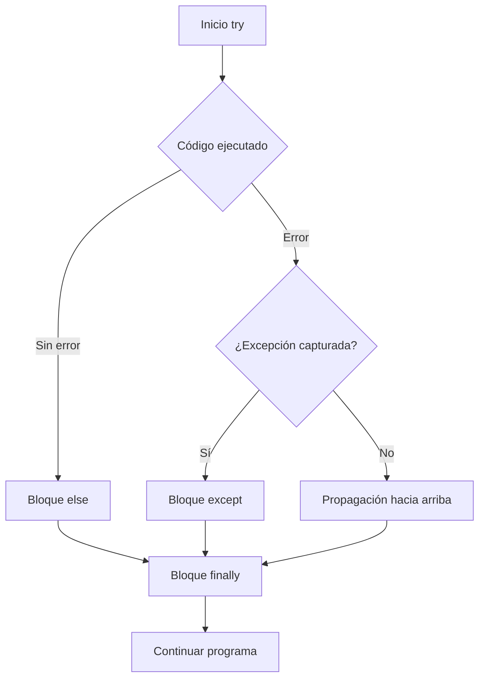

# 🚨 Manejo de Errores y Excepciones

Un sistema de Machine Learning que se detiene por un archivo corrupto en el dataset pierde horas de entrenamiento. Un backend que devuelve `500 Internal Server Error` sin contexto frustra a los clientes. El manejo profesional de errores no consiste en evitar que el programa falle, sino en **fallar de forma controlada, informativa y recuperable**.

---

## 1. Jerarquía de excepciones en Python

Todas las excepciones heredan de `BaseException`, pero en la práctica se captura y lanza `Exception` o sus subclases.

```
BaseException
 ├── SystemExit
 ├── KeyboardInterrupt
 └── Exception
      ├── ArithmeticError
      │    └── ZeroDivisionError
      ├── LookupError
      │    ├── IndexError
      │    └── KeyError
      ├── TypeError
      ├── ValueError
      ├── OSError
      │    └── FileNotFoundError
      └── ...
```

```python
try:
    resultado = 10 / 0
except ZeroDivisionError as e:
    print(f"Error matemático: {e}")
```

Caso real: en un pipeline de ETL para un modelo de recomendación, un `KeyError` al acceder a una columna inexistente en un DataSet debe ser capturado y reportado con el nombre exacto de la columna faltante, no como un error genérico.

---

## 2. El bloque `try/except/else/finally`

Cada cláusula tiene un propósito preciso:

| Cláusula | Propósito |
|----------|-----------|
| `try` | Código que puede lanzar una excepción. |
| `except` | Código que se ejecuta si ocurre la excepción específica. |
| `else` | Código que se ejecuta **solo si no hubo excepción**. |
| `finally` | Código que se ejecuta **siempre**, útil para limpieza. |

```python
def dividir(a, b):
    try:
        resultado = a / b
    except ZeroDivisionError:
        print("No se puede dividir por cero.")
        return None
    except TypeError:
        print("Ambos argumentos deben ser números.")
        return None
    else:
        print("División exitosa.")
        return resultado
    finally:
        print("Operación finalizada.")

print(dividir(10, 2))
```

---

## 3. Captura de múltiples excepciones

Puedes agrupar excepciones en una tupla si el manejo es idéntico:

```python
try:
    valor = int(input("Ingresa un número: "))
    resultado = 100 / valor
except (ValueError, ZeroDivisionError) as e:
    print(f"Entrada inválida o división por cero: {e}")
```

O capturarlas por separado si el manejo difiere:

```python
try:
    with open("config.json") as f:
        datos = json.load(f)
except FileNotFoundError:
    datos = {}  # Usar configuración por defecto
except json.JSONDecodeError:
    print("El archivo de configuración está corrupto.")
    datos = {}
```

---

## 4. Re-lanzamiento y excepciones personalizadas

### 4.1. `raise`

Puedes lanzar excepciones para validar reglas de negocio:

```python
def retirar(saldo, cantidad):
    if cantidad > saldo:
        raise ValueError("Fondos insuficientes")
    return saldo - cantidad
```

### 4.2. Excepciones personalizadas

Hereda de `Exception` para crear errores semánticos propios de tu dominio:

```python
class ValidacionError(Exception):
    """Se lanza cuando los datos no pasan las reglas de validación."""
    pass

class LimiteExcedidoError(ValidacionError):
    def __init__(self, limite, actual):
        self.limite = limite
        self.actual = actual
        super().__init__(f"Límite {limite} excedido. Valor actual: {actual}")

def registrar_puntuacion(puntos):
    if puntos > 100:
        raise LimiteExcedidoError(limite=100, actual=puntos)
    return puntos
```

Caso real: un microservicio backend define `RateLimitExceededError` para que el API Gateway identifique específicamente cuándo debe devolver el código de estado HTTP 429.

---

## 5. `assert` para invariantes internas

`assert` verifica condiciones que **deben ser verdaderas** en condiciones normales. Si falla, lanza `AssertionError`.

```python
def calcular_media(valores):
    assert len(valores) > 0, "La lista no puede estar vacía"
    return sum(valores) / len(valores)
```

⚠️ **Advertencia**: `assert` se elimina cuando Python se ejecuta con la flag de optimización `python -O`. **Nunca** uses `assert` para validar entradas de usuarios o condiciones de seguridad; úsalo solo para detectar bugs internos durante desarrollo.

---

## 6. Buenas prácticas

| ❌ Mal | ✅ Bien |
|--------|---------|
| `except:` (captura todo) | `except Exception as e:` al menos |
| `except Exception: pass` | Loggear siempre antes de continuar |
| Capturar y silenciar errores sin contexto | Añadir información de contexto al mensaje |

```python
# MAL: silencia todo
except Exception:
    pass

# BIEN: captura específica y registra
import logging

logger = logging.getLogger(__name__)

try:
    procesar_datos()
except ValueError as e:
    logger.error("Error al procesar datos de entrada: %s", e)
    raise  # Re-lanza para que el llamador también lo sepa
```

---

## 7. EAFP vs LBYL

Python favorece el estilo **EAFP** (Easier to Ask for Forgiveness than Permission) sobre **LBYL** (Look Before You Leap).

| Estilo | Filosofía | Ejemplo Python |
|--------|-----------|----------------|
| LBYL | Verificar antes de actuar | `if key in dicc: val = dicc[key]` |
| EAFP | Intentar y capturar el error | `try: val = dicc[key] except KeyError: ...` |

```python
# LBYL
if "clave" in config:
    valor = config["clave"]
else:
    valor = "default"

# EAFP (más pitónico)
try:
    valor = config["clave"]
except KeyError:
    valor = "default"
```

💡 **Tip**: en contextos multihilo, EAFP es más seguro porque evita condiciones de carrera entre la verificación y la acción.

---

## 8. Diagrama de flujo try/except




---

## 9. Código de compresión

```python
# Manejo de Errores - Esencia

class ProcesoError(Exception):
    pass

def dividir_seguro(a, b):
    try:
        resultado = a / b
    except ZeroDivisionError:
        raise ProcesoError("División por cero detectada") from None
    except TypeError:
        raise ProcesoError("Tipos incompatibles")
    else:
        return resultado
    finally:
        print("Operación intentada.")

# EAFP
config = {}
try:
    modo = config["modo"]
except KeyError:
    modo = "producción"

print(dividir_seguro(10, 2), modo)
```
