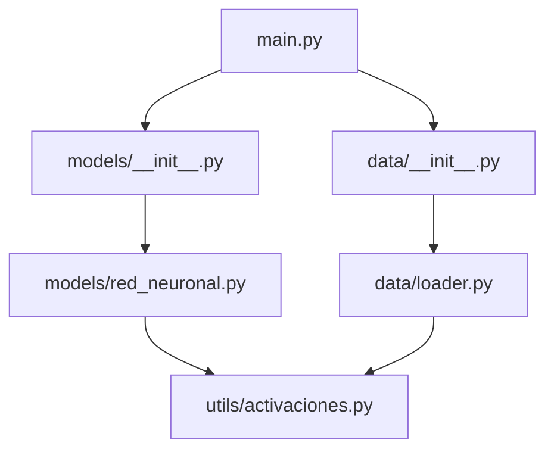

# 📦 Módulos y Paquetes

Un proyecto de Machine Learning contiene decenas de scripts: preprocesamiento, entrenamiento, evaluación, inferencia. Sin una estructura modular, el código se convierte en un monolito imposible de mantener. En **backend**, los paquetes bien organizados permiten compartir lógica entre microservicios, reutilizar utilidades y aislar dependencias mediante entornos virtuales.

---

## 1. Formas de importar

| Sintaxis | Qué importa | Namespace |
|----------|-------------|-----------|
| `import modulo` | Todo el módulo | `modulo.funcion()` |
| `from modulo import funcion` | Solo `funcion` | `funcion()` directamente |
| `from modulo import *` | Todo (si `__all__` lo permite) | Todo directamente |
| `import modulo as m` | Todo con alias | `m.funcion()` |

```python
import math
from datetime import datetime as dt
from collections import defaultdict

print(math.sqrt(16))
print(dt.now())
```

⚠️ **Advertencia**: evita `from modulo import *` en código de producción. Poluciona el namespace actual y dificulta saber de dónde proviene cada nombre.

---

## 2. `__name__ == '__main__'`

Este patrón permite que un archivo funcione tanto como módulo importable como script ejecutable.

```python
# utils.py
def normalizar(valor, maximo):
    return valor / maximo

if __name__ == "__main__":
    # Solo se ejecuta si corres: python utils.py
    print("Tests internos:")
    assert normalizar(50, 100) == 0.5
    print("OK")
```

Caso real: un script de entrenamiento de ML puede contener la lógica de entrenamiento dentro de este bloque, permitiendo que otros notebooks importen solo las funciones de preprocesamiento sin disparar el entrenamiento.

---

## 3. `sys.path` y `PYTHONPATH`

Python busca módulos en las rutas listadas en `sys.path`.

```python
import sys

print(sys.path[:3])
```

Puedes extender la búsqueda mediante la variable de entorno `PYTHONPATH` o modificando `sys.path` en runtime (último recurso).

```python
import sys
from pathlib import Path

# Añadir directorio padre al path
sys.path.insert(0, str(Path(__file__).parent.parent))
```

---

## 4. Estructura de paquetes

Un paquete es un directorio que contiene un archivo `__init__.py`. Este archivo puede estar vacío o inicializar el paquete.

```
mi_proyecto/
├── main.py
├── data/
│   └── __init__.py
│   └── loader.py
├── models/
│   └── __init__.py
│   └── red_neuronal.py
└── utils/
    └── __init__.py
    └── metricas.py
```

```python
# models/__init__.py
from .red_neuronal import RedNeuronal

__all__ = ["RedNeuronal"]
```

💡 **Tip**: desde Python 3.3, los archivos `__init__.py` son técnicamente opcionales (namespace packages), pero incluirlos sigue siendo una best practice para claridad y compatibilidad.

---

## 5. Imports relativos vs absolutos

- **Absoluto**: `from models.red_neuronal import RedNeuronal`
- **Relativo**: `from .red_neuronal import RedNeuronal` (mismo paquete)

```python
# models/red_neuronal.py
from .utils.activaciones import relu  # relativo
from utils.activaciones import relu   # absoluto (si utils está en path)
```

⚠️ **Advertencia**: los imports relativos solo funcionan cuando el paquete es importado, no cuando se ejecuta el archivo directamente como script. Para scripts ejecutables, prefiere imports absolutos.

---

## 6. Imports circulares

Ocurren cuando el módulo A importa B, y B importa A.

**Problema:**
```python
# a.py
from b import funcion_b

def funcion_a():
    return funcion_b()

# b.py
from a import funcion_a

def funcion_b():
    return "hola"
```

**Soluciones:**
1. Refactorizar para eliminar la dependencia circular.
2. Mover el import al interior de la función (import perezoso).
3. Introducir un tercer módulo con las dependencias comunes.

```python
# b.py (solución con import perezoso)
def funcion_b():
    from a import funcion_a
    return funcion_a()
```

---

## 7. Gestión de dependencias con pip

```bash
# Instalar
pip install numpy pandas scikit-learn

# Listar instaladas
pip list

# Congelar dependencias
pip freeze > requirements.txt

# Instalar desde archivo
pip install -r requirements.txt
```

---

## 8. Entornos virtuales (`venv`)

Los entornos virtuales aislan las dependencias de cada proyecto.

```bash
# Crear entorno
python -m venv venv

# Activar (Windows)
venv\Scripts\activate

# Activar (Linux/Mac)
source venv/bin/activate

# Desactivar
deactivate
```

Caso real: un proyecto de ML requiere `numpy==1.21` mientras que el backend usa `numpy==1.24`. Sin entornos virtuales, estas incompatibilidades son imposibles de gestionar en la misma máquina.

---

## 9. Diagrama de estructura de paquetes




---

## 10. Código de compresión

```python
# Módulos y Paquetes - Esencia
import sys
from pathlib import Path

# Inspeccionar path
print("Primeras rutas:", sys.path[:2])

# Patrón __main__
def utilidad():
    return "ok"

if __name__ == "__main__":
    print("Script ejecutado directamente.", utilidad())

# Simulación de import relativo absoluto
# from paquete.submodulo import clase

# Entornos: siempre usa venv y requirements.txt
# pip freeze > requirements.txt
```
