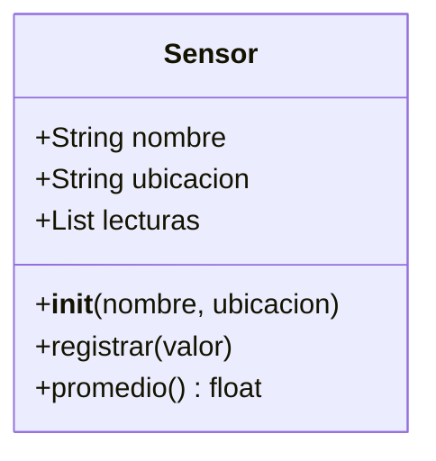

# 🏛️ POO - Clases y Objetos

La Programación Orientada a Objetos (POO) es el paradigma dominante en el desarrollo de software empresarial y científico. Un **ML Engineer** utiliza clases para encapsular datasets, transformaciones y modelos. Un **Backend Developer** modela entidades como usuarios, pedidos y transacciones como objetos que interactúan mediante mensajes. Dominar las clases en Python es el puente entre escribir scripts y construir sistemas.

---

## 1. Clase como blueprint

Una clase es una plantilla que define atributos (datos) y métodos (comportamientos). Un objeto es una instancia concreta de esa clase.

```python
class Sensor:
    """Representa un sensor IoT con lecturas de temperatura."""
    
    def __init__(self, nombre: str, ubicacion: str):
        self.nombre = nombre
        self.ubicacion = ubicacion
        self.lecturas = []
    
    def registrar(self, valor: float):
        self.lecturas.append(valor)
    
    def promedio(self) -> float:
        if not self.lecturas:
            return 0.0
        return sum(self.lecturas) / len(self.lecturas)

# Instanciación
s1 = Sensor("Temp-A1", "Sala de servidores")
s1.registrar(22.5)
s1.registrar(23.0)
print(s1.promedio())
```

---

## 2. Atributos de instancia vs atributos de clase

| Tipo | Definición | Compartido | Acceso |
|------|------------|------------|--------|
| Instancia | `self.atributo` en `__init__` | No | `objeto.atributo` |
| Clase | Dentro del cuerpo de la clase | Sí entre instancias | `Clase.atributo` o `objeto.atributo` |

```python
class Contador:
    total_instancias = 0  # Atributo de clase
    
    def __init__(self):
        Contador.total_instancias += 1
        self.local = 0  # Atributo de instancia

c1 = Contador()
c2 = Contador()
print(Contador.total_instancias)  # 2
print(c1.total_instancias)        # 2 (compartido)
```

⚠️ **Advertencia**: si modificas un atributo de clase mutable (como una lista) mediante una instancia, Python crea una copia local en esa instancia. Sin embargo, si usas un método de la lista como `.append()`, mutas el objeto compartido.

---

## 3. Métodos de instancia y `self`

El primer parámetro de todo método de instancia es `self`, que hace referencia al objeto que invoca el método. Es una convención fuerte de la comunidad.

```python
class Dataset:
    def __init__(self, nombre):
        self.nombre = nombre
        self.filas = []
    
    def agregar_fila(self, fila):
        self.filas.append(fila)
    
    def __len__(self):
        return len(self.filas)

d = Dataset("Ventas")
d.agregar_fila([1, 2, 3])
print(len(d))
```

---

## 4. Representación de objetos: `__str__` y `__repr__`

| Método | Audiencia | Objetivo |
|--------|-----------|----------|
| `__repr__` | Desarrolladores | Ser inequívoco, idealmente `eval(repr(obj)) == obj` |
| `__str__` | Usuarios finales | Ser legible y amigable |

```python
class Punto:
    def __init__(self, x, y):
        self.x = x
        self.y = y
    
    def __repr__(self):
        return f"Punto({self.x}, {self.y})"
    
    def __str__(self):
        return f"({self.x}, {self.y})"

p = Punto(3, 4)
print(repr(p))  # Punto(3, 4)
print(str(p))   # (3, 4)
```

---

## 5. `isinstance()` e `issubclass()`

```python
class Animal:
    pass

class Perro(Animal):
    pass

print(isinstance(Perro(), Animal))  # True
print(issubclass(Perro, Animal))    # True
```

💡 **Tip**: en backend, `isinstance()` es útil para validar tipos de request bodies sin romper el principio de sustitución de Liskov.

---

## 6. Métodos de clase (`@classmethod`)

Un método de clase recibe la clase como primer argumento (`cls`). Son útiles como constructores alternativos.

```python
class Fecha:
    def __init__(self, dia, mes, año):
        self.dia = dia
        self.mes = mes
        self.año = año
    
    @classmethod
    def desde_string(cls, cadena: str):
        dia, mes, año = map(int, cadena.split("-"))
        return cls(dia, mes, año)

f = Fecha.desde_string("15-08-2024")
print(f.mes)
```

Caso real: un modelo de ML puede tener un `from_pretrained(cls, ruta)` que carga pesos y devuelve una instancia lista para inferencia.

---

## 7. Métodos estáticos (`@staticmethod`)

No reciben `self` ni `cls`. Son funciones ordinarias organizadas dentro de la clase por cohesión semántica.

```python
class Conversor:
    @staticmethod
    def celsius_a_fahrenheit(c):
        return c * 9/5 + 32

print(Conversor.celsius_a_fahrenheit(100))
```

---

## 8. `property` básica

Permite acceder a métodos como si fueran atributos, con posibilidad de añadir lógica.

```python
class Rectangulo:
    def __init__(self, ancho, alto):
        self.ancho = ancho
        self.alto = alto
    
    @property
    def area(self):
        return self.ancho * self.alto

r = Rectangulo(5, 3)
print(r.area)  # 15 (sin paréntesis)
```

---

## 9. Diagrama de clase básica




---

## 10. Código de compresión

```python
# POO - Clases y Objetos - Esencia

class Empleado:
    empresa = "TechCorp"
    
    def __init__(self, nombre, salario):
        self.nombre = nombre
        self._salario = salario
    
    @classmethod
    def desde_dict(cls, d):
        return cls(d["nombre"], d["salario"])
    
    @staticmethod
    def calcular_bono(base):
        return base * 0.10
    
    @property
    def salario_anual(self):
        return self._salario * 12
    
    def __repr__(self):
        return f"Empleado({self.nombre!r})"

e = Empleado("Ana", 5000)
print(e, e.salario_anual, Empleado.calcular_bono(1000))
```
