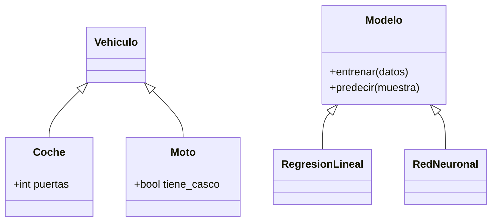

# 🧬 POO - Herencia y Polimorfismo

La herencia permite construir jerarquías de clases donde las hijas reutilizan y especializan el comportamiento de las padres. En **ML/AI**, una clase base `Modelo` puede derivar en `RedNeuronal`, `SVM` y `ÁrbolDeDecisión`, compartiendo la interfaz de entrenamiento y predicción. En **backend**, una clase base `Repositorio` puede especializarse en `RepositorioSQL` y `RepositorioNoSQL`. El polimorfismo garantiza que el código cliente no necesite saber qué implementación concreta está usando.

---

## 1. Herencia simple

Una clase hija hereda atributos y métodos de una clase padre.

```python
class Vehiculo:
    def __init__(self, marca, modelo):
        self.marca = marca
        self.modelo = modelo
    
    def descripcion(self):
        return f"{self.marca} {self.modelo}"

class Coche(Vehiculo):
    def __init__(self, marca, modelo, puertas):
        super().__init__(marca, modelo)
        self.puertas = puertas
    
    def descripcion(self):
        base = super().descripcion()
        return f"{base} ({self.puertas} puertas)"

c = Coche("Toyota", "Corolla", 4)
print(c.descripcion())
```

Caso real: en un framework de ML, `BaseEstimator` de scikit-learn define `fit()` y `predict()`. Todos los modelos heredan de ella, garantizando que cualquier modelo puede usarse en un `Pipeline` o `GridSearchCV`.

---

## 2. Herencia múltiple y el problema del diamante

Python permite heredar de múltiples clases. Si dos padres tienen el mismo método, Python usa el **Method Resolution Order (MRO)**.

```python
class A:
    def saludar(self):
        return "A"

class B(A):
    def saludar(self):
        return "B"

class C(A):
    def saludar(self):
        return "C"

class D(B, C):
    pass

d = D()
print(d.saludar())  # B (por MRO)
print(D.__mro__)    # (<class D>, B, C, A, object)
```

⚠️ **Advertencia**: el problema del diamante ocurre cuando una clase hereda de dos clases que comparten un ancestro común. Python resuelve esto con C3 Linearization, pero el código puede volverse frágil. Prefiere la composición sobre la herencia múltiple profunda.

---

## 3. `super()` y delegación

`super()` devuelve un objeto proxy que delega llamadas de método a la clase padre siguiente en el MRO.

```python
class Rectangulo:
    def __init__(self, ancho, alto):
        self.ancho = ancho
        self.alto = alto
    
    def area(self):
        return self.ancho * self.alto

class Cuadrado(Rectangulo):
    def __init__(self, lado):
        super().__init__(lado, lado)

c = Cuadrado(5)
print(c.area())  # 25
```

💡 **Tip**: en herencia múltiple, `super()` no siempre apunta a la clase padre inmediata, sino a la siguiente en el MRO. Esto permite el patrón de "cooperativa" en herencia múltiple.

---

## 4. Method Resolution Order (MRO)

El MRO define el orden en que Python busca métodos. Puedes consultarlo con `__mro__` o `mro()`.

```python
print(Cuadrado.__mro__)
# (<class '__main__.Cuadrado'>, <class '__main__.Rectangulo'>, <class 'object'>)
```

---

## 5. Polimorfismo y duck typing

Python es dinámicamente tipado. El polimorfismo no requiere herencia explícita; solo requiere que los objetos respondan a los mismos mensajes (**duck typing**).

```python
class Perro:
    def sonido(self):
        return "Guau"

class Gato:
    def sonido(self):
        return "Miau"

class Vaca:
    def sonido(self):
        return "Muu"

def hacer_sonido(animal):
    print(animal.sonido())

for a in [Perro(), Gato(), Vaca()]:
    hacer_sonido(a)
```

Caso real: en backend, cualquier objeto con método `.read()` puede pasarse a una función de parsing, ya sea un archivo en disco, un `StringIO` o una respuesta HTTP.

---

## 6. Abstract Base Classes (ABC)

El módulo `abc` permite definir clases abstractas que obligan a las hijas a implementar ciertos métodos.

```python
from abc import ABC, abstractmethod

class Modelo(ABC):
    @abstractmethod
    def entrenar(self, datos):
        pass
    
    @abstractmethod
    def predecir(self, muestra):
        pass

class RegresionLineal(Modelo):
    def entrenar(self, datos):
        print("Entrenando regresión...")
    
    def predecir(self, muestra):
        return 42.0

# modelo = Modelo()  # Error: no se puede instanciar una ABC
rl = RegresionLineal()
rl.entrenar([])
```

---

## 7. Composición vs Herencia

| Herencia | Composición |
|----------|-------------|
| Es-un | Tiene-un |
| Acoplamiento fuerte | Acoplamiento débil |
| Reutilización de interfaz | Reutilización de funcionalidad |
| Rígida | Flexible |

```python
# Composición: Motor "tiene" un Coche
class Motor:
    def arrancar(self):
        return "Motor encendido"

class Coche:
    def __init__(self):
        self.motor = Motor()
    
    def arrancar(self):
        return self.motor.arrancar()
```

💡 **Tip**: la regla general es "favorece la composición sobre la herencia". La herencia debe usarse cuando la relación es semánticamente un "es-un" y es estable en el tiempo.

---

## 8. Mixins

Un **mixin** es una clase diseñada para ser heredada junto con otras, aportando funcionalidad transversal sin constituir una jerarquía por sí sola.

```python
class JSONSerializableMixin:
    def to_json(self):
        import json
        return json.dumps(self.__dict__)

class LoggableMixin:
    def log(self):
        print(f"[LOG] {self.__class__.__name__}: {self}")

class Usuario(JSONSerializableMixin, LoggableMixin):
    def __init__(self, nombre):
        self.nombre = nombre

u = Usuario("Ana")
u.log()
print(u.to_json())
```

---

## 9. Diagrama de herencia




---

## 10. Código de compresión

```python
# POO - Herencia y Polimorfismo - Esencia
from abc import ABC, abstractmethod

class Figura(ABC):
    @abstractmethod
    def area(self):
        pass

class Rectangulo(Figura):
    def __init__(self, a, b):
        self.a = a
        self.b = b
    def area(self):
        return self.a * self.b

class Cuadrado(Rectangulo):
    def __init__(self, l):
        super().__init__(l, l)

# Polimorfismo
figuras = [Rectangulo(4, 5), Cuadrado(3)]
print([f.area() for f in figuras])

# Mixin
class LogMixin:
    def log(self):
        print(self.__class__.__name__, "activo")

class Servicio(LogMixin):
    pass

Servicio().log()
```
