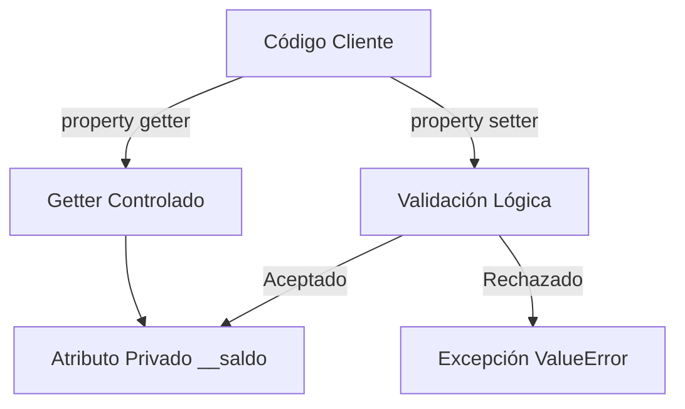

# 🔒 POO - Encapsulamiento y Métodos Especiales

El encapsulamiento es el pilar de la POO que protege la integridad interna de un objeto. En **backend**, un objeto `CuentaBancaria` no debe permitir que su saldo se modifique directamente desde fuera sin validaciones. En **ML/AI**, un modelo no debe exponer sus pesos internos a modificaciones arbitrarias. Los métodos especiales (mágicos) permiten que tus clases se integren de forma idiomática con el lenguaje: puedes sumar objetos, iterarlos, compararlos y formatearlos como si fueran tipos nativos.

---

## 1. Convención de guiones bajos

Python no tiene verdaderos modificadores de acceso `private` o `protected`. Utiliza convenciones basadas en guiones bajos.

| Convención | Significado | Acceso desde fuera |
|------------|-------------|--------------------|
| `atributo` | Público | Sí |
| `_atributo` | Protegido ("internal use") | Sí, pero no recomendado |
| `__atributo` | Privado con name mangling | Solo mediante `_Clase__atributo` |

```python
class Cuenta:
    def __init__(self, titular, saldo):
        self.titular = titular      # público
        self._moneda = "USD"        # protegido
        self.__saldo = saldo        # privado
    
    def mostrar_saldo(self):
        return self.__saldo

c = Cuenta("Ana", 1000)
print(c.titular)       # Ana
print(c._moneda)       # USD (posible, pero desaconsejado)
# print(c.__saldo)     # AttributeError
print(c._Cuenta__saldo)  # 1000 (name mangling, no abuses)
```

⚠️ **Advertencia**: el name mangling (`__atributo` → `_Clase__atributo`) está diseñado para evitar colisiones de nombres en jerarquías de herencia, no para seguridad. Un desarrollador determinado siempre puede acceder.

---

## 2. `property`: getter, setter y deleter

El decorador `@property` convierte un método en un atributo de solo lectura. Puedes definir `@<atributo>.setter` y `@<atributo>.deleter` para controlar escritura y eliminación.

```python
class Temperatura:
    def __init__(self, celsius):
        self._celsius = celsius
    
    @property
    def celsius(self):
        return self._celsius
    
    @celsius.setter
    def celsius(self, valor):
        if valor < -273.15:
            raise ValueError("Por debajo del cero absoluto")
        self._celsius = valor
    
    @property
    def fahrenheit(self):
        return self._celsius * 9/5 + 32

t = Temperatura(25)
print(t.fahrenheit)  # 77.0
t.celsius = 30
# t.celsius = -300  # ValueError
```

Caso real: en un sistema backend, un `property` en la clase `Usuario` puede hashear automáticamente una contraseña al asignarla, evitando que el texto plano se almacene accidentalmente.

---

## 3. Control de acceso a atributos dinámicos

### 3.1. `__getattr__`

Se llama cuando se intenta acceder a un atributo inexistente.

```python
class Configuracion:
    def __init__(self, valores):
        self._valores = valores
    
    def __getattr__(self, nombre):
        return self._valores.get(nombre, f"{nombre} no definido")

cfg = Configuracion({"host": "localhost", "puerto": 8080})
print(cfg.host)    # localhost
print(cfg.timeout) # timeout no definido
```

### 3.2. `__getattribute__`

Se llama para **todos** los accesos a atributos. Es peligroso porque puede causar recursión infinita si no usas `super().__getattribute__`.

```python
class Seguro:
    def __getattribute__(self, nombre):
        if nombre.startswith("_"):
            raise AttributeError("Atributos privados")
        return super().__getattribute__(nombre)
```

### 3.3. `__setattr__`

Intercepta todas las asignaciones de atributos.

```python
class Inmutable:
    def __setattr__(self, nombre, valor):
        if hasattr(self, nombre):
            raise AttributeError("Objeto inmutable")
        super().__setattr__(nombre, valor)

obj = Inmutable()
obj.x = 10
# obj.x = 20  # AttributeError
```

---

## 4. Métodos mágicos de comparación

Permiten usar operadores de comparación entre instancias.

```python
class Punto:
    def __init__(self, x, y):
        self.x = x
        self.y = y
    
    def __eq__(self, otro):
        return self.x == otro.x and self.y == otro.y
    
    def __lt__(self, otro):
        return (self.x, self.y) < (otro.x, otro.y)
    
    def __repr__(self):
        return f"Punto({self.x}, {self.y})"

p1 = Punto(1, 2)
p2 = Punto(1, 3)
print(p1 == p2)  # False
print(p1 < p2)   # True
```

---

## 5. Métodos mágicos de contenedores

| Método | Operador | Descripción |
|--------|----------|-------------|
| `__len__` | `len(obj)` | Tamaño del objeto |
| `__getitem__` | `obj[k]` | Acceso por índice/clave |
| `__setitem__` | `obj[k] = v` | Asignación por índice/clave |
| `__contains__` | `x in obj` | Pertenencia |
| `__iter__` | `for x in obj` | Iteración |
| `__call__` | `obj()` | Llamar al objeto como función |

```python
class MiLista:
    def __init__(self):
        self._items = []
    
    def __len__(self):
        return len(self._items)
    
    def __getitem__(self, index):
        return self._items[index]
    
    def __setitem__(self, index, valor):
        self._items[index] = valor
    
    def __contains__(self, valor):
        return valor in self._items
    
    def __iter__(self):
        return iter(self._items)
    
    def append(self, valor):
        self._items.append(valor)

ml = MiLista()
ml.append(10)
ml.append(20)
print(len(ml))
print(10 in ml)
print(list(ml))
```

Caso real: un framework de deep learning como PyTorch implementa `__call__` en `nn.Module` para permitir `salida = modelo(entrada)`, haciendo que un modelo se comporte como una función.

---

## 6. Introducción a `dataclasses`

El módulo `dataclasses` reduce el boilerplate de clases que principalmente almacenan datos.

```python
from dataclasses import dataclass

@dataclass
class Experimento:
    nombre: str
    accuracy: float
    épocas: int = 10

exp = Experimento("CNN-v1", 0.94)
print(exp)
# Experimento(nombre='CNN-v1', accuracy=0.94, épocas=10)
```

💡 **Tip**: `dataclasses` genera automáticamente `__init__`, `__repr__`, `__eq__` y más. Es ideal para DTOs (Data Transfer Objects) en APIs.

---

## 7. Diagrama de encapsulamiento




---

## 8. Código de compresión

```python
# POO - Encapsulamiento - Esencia
from dataclasses import dataclass

class Vector:
    def __init__(self, x, y):
        self.__x = x
        self.__y = y
    
    @property
    def x(self):
        return self.__x
    
    @x.setter
    def x(self, v):
        self.__x = float(v)
    
    def __add__(self, otro):
        return Vector(self.x + otro.x, self.__y + otro.__y)
    
    def __repr__(self):
        return f"Vector({self.x}, {self.__y})"
    
    def __call__(self):
        return (self.x, self.__y)

v1 = Vector(1, 2)
v2 = Vector(3, 4)
print(v1 + v2)
print(v1())

@dataclass(frozen=True)
class Config:
    lr: float = 0.01
    batch: int = 32

print(Config())
```
