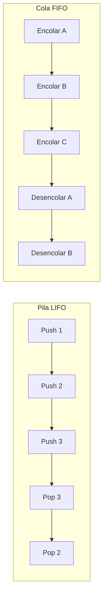

# 🗂️ Estructuras de Datos Propias - Pilas y Colas

Las pilas y colas son estructuras fundamentales en ciencias de la computación. Un **backend** usa colas para gestionar trabajos asíncronos y tareas en background. Un sistema de **ML/AI** utiliza pilas para recorridos en profundidad de grafos computacionales y para la implementación de backpropagation. Implementar estas estructuras desde cero fortalece la comprensión de complejidad algorítmica y orientación a objetos.

---

## 1. Pilas (Stack) - LIFO

Una pila opera bajo el principio **Last In, First Out**: el último elemento en entrar es el primero en salir.

### 1.1. Operaciones principales

| Operación | Método Python (`list`) | Complejidad |
|-----------|------------------------|-------------|
| Push (insertar) | `append(x)` | O(1) amortizado |
| Pop (extraer) | `pop()` | O(1) |
| Peek (ver tope) | `[-1]` | O(1) |
| Verificar vacío | `if not stack` | O(1) |

```python
class Pila:
    def __init__(self):
        self._items = []
    
    def push(self, item):
        self._items.append(item)
    
    def pop(self):
        if self.esta_vacia():
            raise IndexError("Pop de pila vacía")
        return self._items.pop()
    
    def peek(self):
        if self.esta_vacia():
            raise IndexError("Peek de pila vacía")
        return self._items[-1]
    
    def esta_vacia(self):
        return len(self._items) == 0
    
    def __len__(self):
        return len(self._items)
    
    def __repr__(self):
        return f"Pila({self._items})"

p = Pila()
p.push(10)
p.push(20)
print(p.pop())   # 20
print(p.peek())  # 10
```

Caso real: el interprete de Python utiliza una pila interna para gestionar llamadas a funciones (call stack). Cuando llamas a una función, se hace push del frame; cuando retorna, pop.

---

## 2. Colas (Queue) - FIFO

Una cola opera bajo el principio **First In, First Out**: el primer elemento en llegar es el primero en ser atendido.

### 2.1. Problema de las listas para colas

Usar `list.pop(0)` para extraer el primer elemento tiene complejidad **O(n)** porque todos los elementos deben desplazarse.

### 2.2. `collections.deque` - la solución eficiente

`deque` (double-ended queue) ofrece inserción y extracción en ambos extremos en **O(1)**.

```python
from collections import deque

class Cola:
    def __init__(self):
        self._items = deque()
    
    def encolar(self, item):
        self._items.append(item)
    
    def desencolar(self):
        if self.esta_vacia():
            raise IndexError("Desencolar de cola vacía")
        return self._items.popleft()
    
    def frente(self):
        if self.esta_vacia():
            raise IndexError("Frente de cola vacía")
        return self._items[0]
    
    def esta_vacia(self):
        return len(self._items) == 0
    
    def __len__(self):
        return len(self._items)
    
    def __repr__(self):
        return f"Cola({list(self._items)})"

c = Cola()
c.encolar("A")
c.encolar("B")
print(c.desencolar())  # A
print(c.frente())      # B
```

Caso real: un sistema de procesamiento de trabajos en ML (como Celery o RQ) utiliza colas para distribuir tareas de entrenamiento entre múltiples workers.

---

## 3. Comparativa de rendimiento

| Operación | `list` como pila | `list` como cola | `deque` como cola |
|-----------|------------------|------------------|-------------------|
| Insertar al final | O(1) | O(1) | O(1) |
| Extraer del final | O(1) | - | O(1) |
| Insertar al inicio | O(n) | - | O(1) |
| Extraer del inicio | O(n) | O(n) | O(1) |

⚠️ **Advertencia**: nunca uses una lista como cola en producción si esperas más de unos cientos de elementos. El costo O(n) del `pop(0)` degrada drásticamente el rendimiento.

---

## 4. Cola de prioridad básica con `heapq`

Una cola de prioridad devuelve siempre el elemento con mayor (o menor) prioridad, no el que lleva más tiempo esperando.

```python
import heapq

class ColaPrioridad:
    def __init__(self):
        self._heap = []
        self._contador = 0  # Para desempatar
    
    def encolar(self, prioridad, item):
        heapq.heappush(self._heap, (prioridad, self._contador, item))
        self._contador += 1
    
    def desencolar(self):
        if self.esta_vacia():
            raise IndexError("Cola de prioridad vacía")
        return heapq.heappop(self._heap)[2]
    
    def esta_vacia(self):
        return len(self._heap) == 0

cp = ColaPrioridad()
cp.encolar(2, "Tarea B")
cp.encolar(1, "Tarea A")
cp.encolar(3, "Tarea C")
print(cp.desencolar())  # Tarea A
```

Caso real: en un scheduler de un framework de ML, los experimentos con mayor prioridad de recursos GPU deben ejecutarse antes que los de entrenamiento en CPU.

---

## 5. Diagrama de estructuras




---

## 6. Código de compresión

```python
# Estructuras de Datos Propias - Esencia
from collections import deque
import heapq

class Pila:
    def __init__(self): self._items = []
    def push(self, x): self._items.append(x)
    def pop(self): return self._items.pop()
    def __len__(self): return len(self._items)

class Cola:
    def __init__(self): self._items = deque()
    def encolar(self, x): self._items.append(x)
    def desencolar(self): return self._items.popleft()
    def __len__(self): return len(self._items)

class ColaPrioridad:
    def __init__(self): self._heap = []
    def encolar(self, p, x): heapq.heappush(self._heap, (p, x))
    def desencolar(self): return heapq.heappop(self._heap)[1]

# Uso
p = Pila(); p.push(1); p.push(2); print(p.pop())
c = Cola(); c.encolar("a"); c.encolar("b"); print(c.desencolar())
cp = ColaPrioridad(); cp.encolar(2, "B"); cp.encolar(1, "A"); print(cp.desencolar())
```
