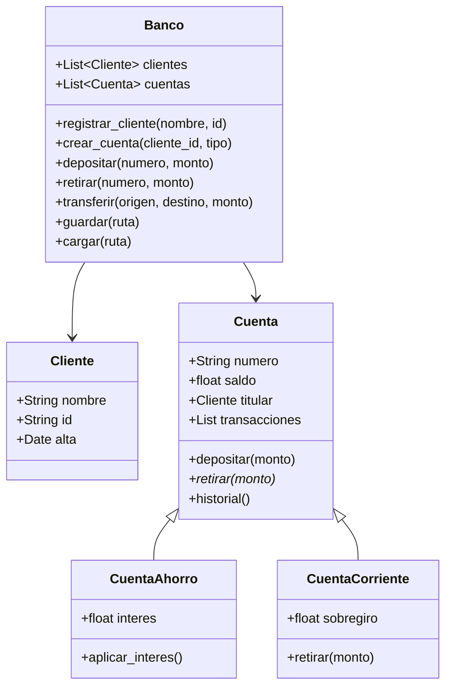
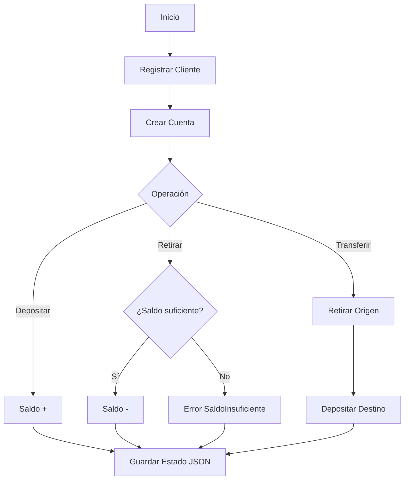

# 🏦 Caso Práctico - Sistema Bancario

Este proyecto integra todos los conceptos del módulo: funciones avanzadas, manejo de errores, programación orientada a objetos (herencia, polimorfismo, encapsulamiento), estructuras de datos propias, módulos y persistencia en archivos. Es un sistema bancario de consola que simula operaciones reales de un banco digital.

Un **Backend Developer** puede extrapolar esta arquitectura a una API REST con FastAPI. Un **ML Engineer** puede adaptar el patrón de repositorio y la serialización JSON para gestionar experimentos y métricas.

---

## 1. Requisitos del sistema

1. **Clientes**: registro con nombre, identificación y fecha de alta.
2. **Cuentas**: soporte para cuentas de ahorro y corriente.
3. **Operaciones**: depositar, retirar y transferir entre cuentas.
4. **Historial**: cada cuenta mantiene un registro de transacciones.
5. **Persistencia**: el estado del banco se guarda y carga desde un archivo JSON.
6. **Validaciones**: no se permiten saldos negativos, montos inválidos ni cuentas inexistentes.

---

## 2. Diseño de clases



---

## 3. Implementación

### 3.1. Excepciones personalizadas

```python
class BancoError(Exception):
    """Error base del sistema bancario."""
    pass

class SaldoInsuficienteError(BancoError):
    pass

class CuentaNoEncontradaError(BancoError):
    pass

class MontoInvalidoError(BancoError):
    pass
```

### 3.2. Cliente

```python
from datetime import datetime
from dataclasses import dataclass, asdict

@dataclass
class Cliente:
    nombre: str
    id: str
    alta: str = None
    
    def __post_init__(self):
        if self.alta is None:
            self.alta = datetime.now().isoformat()
    
    def to_dict(self):
        return asdict(self)
    
    @classmethod
    def from_dict(cls, data):
        return cls(**data)
```

### 3.3. Cuentas (herencia y polimorfismo)

```python
import uuid
from abc import ABC, abstractmethod

class Cuenta(ABC):
    def __init__(self, titular: Cliente, numero: str = None):
        self._titular = titular
        self._numero = numero or str(uuid.uuid4())[:8].upper()
        self._saldo = 0.0
        self._transacciones = []
    
    @property
    def numero(self):
        return self._numero
    
    @property
    def saldo(self):
        return self._saldo
    
    def _registrar(self, tipo: str, monto: float):
        self._transacciones.append({
            "tipo": tipo,
            "monto": monto,
            "fecha": datetime.now().isoformat(),
            "saldo_posterior": self._saldo
        })
    
    def depositar(self, monto: float):
        if monto <= 0:
            raise MontoInvalidoError("El monto debe ser positivo")
        self._saldo += monto
        self._registrar("DEPOSITO", monto)
    
    @abstractmethod
    def retirar(self, monto: float):
        pass
    
    def historial(self):
        return self._transacciones.copy()
    
    def to_dict(self):
        return {
            "tipo": self.__class__.__name__,
            "numero": self._numero,
            "saldo": self._saldo,
            "titular": self._titular.to_dict(),
            "transacciones": self._transacciones,
        }

class CuentaAhorro(Cuenta):
    def __init__(self, titular: Cliente, interes: float = 0.02, **kwargs):
        super().__init__(titular, **kwargs)
        self._interes = interes
    
    def retirar(self, monto: float):
        if monto <= 0:
            raise MontoInvalidoError("El monto debe ser positivo")
        if monto > self._saldo:
            raise SaldoInsuficienteError("Saldo insuficiente en cuenta de ahorro")
        self._saldo -= monto
        self._registrar("RETIRO", monto)
    
    def aplicar_interes(self):
        interes = self._saldo * self._interes
        self._saldo += interes
        self._registrar("INTERES", interes)

class CuentaCorriente(Cuenta):
    def __init__(self, titular: Cliente, sobregiro: float = 500.0, **kwargs):
        super().__init__(titular, **kwargs)
        self._sobregiro = sobregiro
    
    def retirar(self, monto: float):
        if monto <= 0:
            raise MontoInvalidoError("El monto debe ser positivo")
        if monto > self._saldo + self._sobregiro:
            raise SaldoInsuficienteError("Excede límite de sobregiro")
        self._saldo -= monto
        self._registrar("RETIRO", monto)
```

### 3.4. Banco (orquestador)

```python
import json
from pathlib import Path

class Banco:
    def __init__(self, nombre: str):
        self._nombre = nombre
        self._clientes = {}
        self._cuentas = {}
    
    def registrar_cliente(self, nombre: str, id: str):
        if id in self._clientes:
            raise BancoError("Cliente ya registrado")
        cliente = Cliente(nombre=nombre, id=id)
        self._clientes[id] = cliente
        return cliente
    
    def crear_cuenta(self, cliente_id: str, tipo: str = "ahorro"):
        if cliente_id not in self._clientes:
            raise BancoError("Cliente no encontrado")
        cliente = self._clientes[cliente_id]
        if tipo == "ahorro":
            cuenta = CuentaAhorro(titular=cliente)
        elif tipo == "corriente":
            cuenta = CuentaCorriente(titular=cliente)
        else:
            raise BancoError("Tipo de cuenta no soportado")
        self._cuentas[cuenta.numero] = cuenta
        return cuenta
    
    def depositar(self, numero: str, monto: float):
        cuenta = self._buscar_cuenta(numero)
        cuenta.depositar(monto)
    
    def retirar(self, numero: str, monto: float):
        cuenta = self._buscar_cuenta(numero)
        cuenta.retirar(monto)
    
    def transferir(self, origen: str, destino: str, monto: float):
        c_origen = self._buscar_cuenta(origen)
        c_destino = self._buscar_cuenta(destino)
        c_origen.retirar(monto)
        c_destino.depositar(monto)
    
    def _buscar_cuenta(self, numero: str):
        if numero not in self._cuentas:
            raise CuentaNoEncontradaError(f"Cuenta {numero} no existe")
        return self._cuentas[numero]
    
    def guardar(self, ruta: str):
        data = {
            "nombre": self._nombre,
            "clientes": {k: v.to_dict() for k, v in self._clientes.items()},
            "cuentas": {k: v.to_dict() for k, v in self._cuentas.items()},
        }
        Path(ruta).write_text(json.dumps(data, indent=2), encoding="utf-8")
    
    @classmethod
    def cargar(cls, ruta: str):
        raw = json.loads(Path(ruta).read_text(encoding="utf-8"))
        banco = cls(raw["nombre"])
        for cid, cdata in raw["clientes"].items():
            banco._clientes[cid] = Cliente.from_dict(cdata)
        for num, cdata in raw["cuentas"].items():
            titular = banco._clientes[cdata["titular"]["id"]]
            tipo = cdata["tipo"]
            if tipo == "CuentaAhorro":
                cuenta = CuentaAhorro(titular=titular, numero=num)
            else:
                cuenta = CuentaCorriente(titular=titular, numero=num)
            cuenta._saldo = cdata["saldo"]
            cuenta._transacciones = cdata["transacciones"]
            banco._cuentas[num] = cuenta
        return banco
```

---

## 4. Flujo de uso

```python
# Ejecución principal
if __name__ == "__main__":
    banco = Banco("Banco Digital ML")
    
    # Registro
    cliente = banco.registrar_cliente("Ana García", "123456")
    cuenta_ahorro = banco.crear_cuenta("123456", "ahorro")
    cuenta_corriente = banco.crear_cuenta("123456", "corriente")
    
    # Operaciones
    banco.depositar(cuenta_ahorro.numero, 1000.0)
    banco.retirar(cuenta_ahorro.numero, 200.0)
    banco.transferir(cuenta_ahorro.numero, cuenta_corriente.numero, 300.0)
    
    # Persistencia
    banco.guardar("banco_estado.json")
    
    # Recuperación
    banco2 = Banco.cargar("banco_estado.json")
    print(f"Saldo recuperado: {banco2._cuentas[cuenta_ahorro.numero].saldo}")
```

---

## 5. Métricas y buenas prácticas aplicadas

| Concepto | Aplicación en el proyecto |
|----------|---------------------------|
| Herencia | `CuentaAhorro` y `CuentaCorriente` heredan de `Cuenta` |
| Polimorfismo | `retirar()` se comporta diferente según el tipo de cuenta |
| Encapsulamiento | Saldo y transacciones son privados; acceso mediante properties |
| Excepciones | Errores de dominio personalizados (`SaldoInsuficienteError`) |
| Archivos | Persistencia en JSON con `pathlib` |
| Dataclasses | `Cliente` usa `@dataclass` para reducir boilerplate |
| Módulos | Estructura lista para separar en `models.py`, `exceptions.py`, etc. |

---

## 6. Diagrama de flujo del sistema




---

## 7. 🎯 Proyecto Documentado

### Estructura de archivos recomendada

```
sistema_bancario/
├── main.py
├── banco/
│   ├── __init__.py
│   ├── exceptions.py
│   ├── models.py
│   └── services.py
└── data/
    └── banco_estado.json
```

### Instrucciones de ejecución

1. Crear el entorno virtual: `python -m venv venv`
2. Activar: `venv\Scripts\activate`
3. Ejecutar: `python main.py`
4. Verificar estado: revisar `data/banco_estado.json`

### Extensiones propuestas

- Implementar una cola (`deque`) para procesar transferencias asíncronas.
- Añadir un logger que escriba errores en un archivo `.log`.
- Crear un menú interactivo en consola con `input()`.
- Exportar el historial de transacciones a CSV.

---

## 8. 📦 Código de compresión completo

```python
"""
Sistema Bancario - Compresión completa del proyecto.
Copia este bloque en main.py para ejecutar.
"""
from abc import ABC, abstractmethod
from dataclasses import dataclass, asdict
from datetime import datetime
from collections import deque
from pathlib import Path
import json
import uuid

# Excepciones
class BancoError(Exception): pass
class SaldoInsuficienteError(BancoError): pass
class CuentaNoEncontradaError(BancoError): pass
class MontoInvalidoError(BancoError): pass

# Modelos
@dataclass
class Cliente:
    nombre: str
    id: str
    alta: str = None
    def __post_init__(self):
        if self.alta is None:
            self.alta = datetime.now().isoformat()
    def to_dict(self): return asdict(self)
    @classmethod
    def from_dict(cls, d): return cls(**d)

class Cuenta(ABC):
    def __init__(self, titular, numero=None):
        self._titular = titular
        self._numero = numero or str(uuid.uuid4())[:8].upper()
        self._saldo = 0.0
        self._transacciones = []
    @property
    def numero(self): return self._numero
    @property
    def saldo(self): return self._saldo
    def _registrar(self, tipo, monto):
        self._transacciones.append({"tipo": tipo, "monto": monto, "fecha": datetime.now().isoformat(), "saldo_posterior": self._saldo})
    def depositar(self, monto):
        if monto <= 0: raise MontoInvalidoError("Monto positivo requerido")
        self._saldo += monto; self._registrar("DEPOSITO", monto)
    @abstractmethod
    def retirar(self, monto): pass
    def historial(self): return self._transacciones.copy()
    def to_dict(self):
        return {"tipo": self.__class__.__name__, "numero": self._numero, "saldo": self._saldo, "titular": self._titular.to_dict(), "transacciones": self._transacciones}

class CuentaAhorro(Cuenta):
    def __init__(self, titular, interes=0.02, **kwargs):
        super().__init__(titular, **kwargs); self._interes = interes
    def retirar(self, monto):
        if monto <= 0: raise MontoInvalidoError("Monto positivo requerido")
        if monto > self._saldo: raise SaldoInsuficienteError("Sin saldo")
        self._saldo -= monto; self._registrar("RETIRO", monto)
    def aplicar_interes(self):
        i = self._saldo * self._interes; self._saldo += i; self._registrar("INTERES", i)

class CuentaCorriente(Cuenta):
    def __init__(self, titular, sobregiro=500.0, **kwargs):
        super().__init__(titular, **kwargs); self._sobregiro = sobregiro
    def retirar(self, monto):
        if monto <= 0: raise MontoInvalidoError("Monto positivo requerido")
        if monto > self._saldo + self._sobregiro: raise SaldoInsuficienteError("Sobregiro excedido")
        self._saldo -= monto; self._registrar("RETIRO", monto)

class Banco:
    def __init__(self, nombre):
        self._nombre = nombre; self._clientes = {}; self._cuentas = {}
    def registrar_cliente(self, nombre, id):
        if id in self._clientes: raise BancoError("Cliente ya existe")
        c = Cliente(nombre, id); self._clientes[id] = c; return c
    def crear_cuenta(self, cliente_id, tipo="ahorro"):
        if cliente_id not in self._clientes: raise BancoError("Cliente no existe")
        titular = self._clientes[cliente_id]
        cuenta = CuentaAhorro(titular) if tipo == "ahorro" else CuentaCorriente(titular)
        self._cuentas[cuenta.numero] = cuenta; return cuenta
    def _buscar(self, num):
        if num not in self._cuentas: raise CuentaNoEncontradaError(num)
        return self._cuentas[num]
    def depositar(self, num, monto): self._buscar(num).depositar(monto)
    def retirar(self, num, monto): self._buscar(num).retirar(monto)
    def transferir(self, origen, destino, monto):
        o, d = self._buscar(origen), self._buscar(destino)
        o.retirar(monto); d.depositar(monto)
    def guardar(self, ruta):
        data = {"nombre": self._nombre, "clientes": {k:v.to_dict() for k,v in self._clientes.items()}, "cuentas": {k:v.to_dict() for k,v in self._cuentas.items()}}
        Path(ruta).write_text(json.dumps(data, indent=2), encoding="utf-8")
    @classmethod
    def cargar(cls, ruta):
        raw = json.loads(Path(ruta).read_text(encoding="utf-8"))
        b = cls(raw["nombre"])
        for cid, cdata in raw["clientes"].items(): b._clientes[cid] = Cliente.from_dict(cdata)
        for num, cdata in raw["cuentas"].items():
            titular = b._clientes[cdata["titular"]["id"]]
            cls_cuenta = CuentaAhorro if cdata["tipo"] == "CuentaAhorro" else CuentaCorriente
            cuenta = cls_cuenta(titular=titular, numero=num)
            cuenta._saldo = cdata["saldo"]; cuenta._transacciones = cdata["transacciones"]
            b._cuentas[num] = cuenta
        return b

# Ejecución
if __name__ == "__main__":
    b = Banco("Digital")
    c = b.registrar_cliente("Ana", "1")
    ca = b.crear_cuenta("1", "ahorro")
    cc = b.crear_cuenta("1", "corriente")
    b.depositar(ca.numero, 1000)
    b.retirar(ca.numero, 100)
    b.transferir(ca.numero, cc.numero, 200)
    b.guardar("banco.json")
    b2 = Banco.cargar("banco.json")
    print("Saldo ahorro:", b2._cuentas[ca.numero].saldo)
    print("Historial:", b2._cuentas[ca.numero].historial())
```
