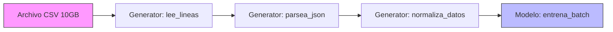

# 🔄 01 - Iteradores y Generadores

La capacidad de procesar datos de forma secuencial y perezosa (lazy) es fundamental en ML/AI Engineering, donde los datasets pueden superar fácilmente la memoria RAM disponible. Los iteradores y generadores son la columna vertebral de pipelines de datos eficientes y servicios de streaming backend.


---

## 1. El Protocolo del Iterador

En Python, un objeto es iterable si implementa el método `__iter__()`, el cual debe devolver un objeto iterador. A su vez, el iterador debe implementar `__next__()` para devolver el siguiente elemento, y lanzar `StopIteration` cuando no hay más elementos.

| Método | Invocación | Responsabilidad |
|--------|------------|-----------------|
| `__iter__` | `iter(obj)` | Devuelve el objeto iterador en sí. |
| `__next__` | `next(obj)` | Devuelve el siguiente elemento o lanza `StopIteration`. |

```python
class Contador:
    """Iterador personalizado que cuenta desde 1 hasta max."""

    def __init__(self, maximo: int):
        self.maximo = maximo
        self.actual = 0

    def __iter__(self):
        return self

    def __next__(self):
        self.actual += 1
        if self.actual > self.maximo:
            raise StopIteration
        return self.actual

# Uso
for num in Contador(5):
    print(num)  # 1 2 3 4 5
```

💡 **Tip:** Cualquier objeto que implemente `__iter__` puede usarse en un bucle `for`, comprensiones de lista, y funciones como `sum()`, `map()`, `filter()`.

⚠️ **Advertencia:** Un iterador se agota después de un solo recorrido. Si necesitas iterar múltiples veces, convierte los datos a una lista o usa `itertools.tee`.

---

## 2. Funciones Generadoras y `yield`

Una función generadora es aquella que contiene al menos una sentencia `yield`. En lugar de devolver un valor y terminar, "pausa" su ejecución, conservando su estado local, y se reanuda en la siguiente llamada a `__next__`.

```python
def contador_generator(maximo: int):
    """Versión generadora del contador. Mucho más concisa."""
    actual = 1
    while actual <= maximo:
        yield actual
        actual += 1

gen = contador_generator(3)
print(next(gen))  # 1
print(next(gen))  # 2
print(next(gen))  # 3
# next(gen) -> StopIteration
```

**Lazy Evaluation:** Los generadores producen valores bajo demanda. Esto contrasta con las listas, que materializan todos los elementos inmediatamente.

Caso real: En un pipeline de ML para entrenar un modelo con millones de imágenes, un generador puede cargar lotes (batches) desde disco uno a uno, manteniendo el uso de memoria constante en lugar de cargar todo el dataset.

---

## 3. `yield from`: Delegación de Generadores

Desde Python 3.3, `yield from` permite delegar la responsabilidad de producir valores a un sub-generador. Es útil para componer pipelines.

```python
def sub_generator(n: int):
    for i in range(n):
        yield i * 2

def main_generator():
    yield "inicio"
    yield from sub_generator(3)
    yield "fin"

print(list(main_generator()))
# ['inicio', 0, 2, 4, 'fin']
```

💡 **Tip:** `yield from` no solo delega la producción de valores, sino también la propagación de `send()`, `throw()` y `close()`.

---

## 4. Generator Expressions vs List Comprehensions

Las expresiones generadoras `(x for x in iterable)` tienen una sintaxis similar a las comprensiones de lista `[x for x in iterable]`, pero con una diferencia crítica: son lazy.

| Característica | List Comprehension | Generator Expression |
|----------------|--------------------|----------------------|
| Sintaxis | `[expr for x in iter]` | `(expr for x in iter)` |
| Memoria | Almacena todos los elementos. | Produce elementos bajo demanda. |
| Acceso por índice | Sí. | No (es un iterador). |
| Reusabilidad | Sí. | No (se agota). |
| Uso típico | Datos pequeños que caben en RAM. | Datos grandes o streams infinitos. |

```python
import sys

numeros = range(100000)
lista = [x * 2 for x in numeros]
gen = (x * 2 for x in numeros)

print(sys.getsizeof(lista))  # ~800KB+
print(sys.getsizeof(gen))    # ~112 bytes
```

Caso real: Un backend que filtra logs de acceso por fecha. Usar una list comprehension cargaría millones de líneas en memoria; una generator expression permite procesarlas línea por línea.

---

## 5. El Módulo `itertools`

`itertools` proporciona un arsenal de iteradores de alto rendimiento, implementados en C. Son esenciales para combinar, filtrar y transformar secuencias sin crear estructuras intermedias.

### 5.1 Iteradores Infinitos

| Función | Descripción |
|---------|-------------|
| `count(start, step)` | Cuenta desde `start` incrementalmente. |
| `cycle(iterable)` | Repite los elementos de un iterable indefinidamente. |
| `repeat(elem, [n])` | Repite un elemento `n` veces (o infinito). |

```python
from itertools import count, islice

# Obtener los primeros 5 números pares infinitos
pares = (x for x in count(0) if x % 2 == 0)
print(list(islice(pares, 5)))  # [0, 2, 4, 6, 8]
```

### 5.2 Iteradores de Combinación y Agrupación

| Función | Descripción |
|---------|-------------|
| `islice(iterable, start, stop, step)` | Slicing lazy sin indexar. |
| `tee(iterable, n)` | Crea `n` iteradores independientes a partir de uno. |
| `chain(*iterables)` | Concatena múltiples iterables. |

```python
from itertools import tee

original = range(5)
it1, it2 = tee(original, 2)

print(list(it1))  # [0, 1, 2, 3, 4]
print(list(it2))  # [0, 1, 2, 3, 4]
```

⚠️ **Advertencia:** `tee` almacena los elementos consumidos en memoria hasta que todos los iteradores derivados los hayan procesado. No usar con iteradores masivos si no es necesario.

---

## 6. Arquitectura: Iteradores en un Pipeline de ML



Cada etapa es un generador que transforma la salida del anterior. La memoria total ocupada en cualquier momento es solo la del batch activo.

```python
# 📦 Código de compresión: Pipeline de procesamiento con generadores
import csv
from typing import Iterator, Dict, Any

def leer_csv(ruta: str) -> Iterator[Dict[str, str]]:
    with open(ruta, newline='', encoding='utf-8') as f:
        reader = csv.DictReader(f)
        yield from reader

def filtrar_activos(rows: Iterator[Dict[str, str]]) -> Iterator[Dict[str, str]]:
    for row in rows:
        if row.get('activo') == 'true':
            yield row

def transformar(rows: Iterator[Dict[str, str]]) -> Iterator[Dict[str, Any]]:
    for row in rows:
        yield {
            'id': int(row['id']),
            'valor': float(row['valor']),
            'categoria': row['categoria'].upper()
        }

# Pipeline
pipeline = transformar(filtrar_activos(leer_csv('datos.csv')))
for item in islice(pipeline, 5):
    print(item)
```
