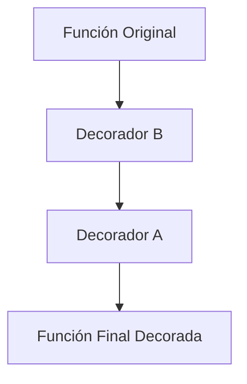

# 🎀 02 - Decoradores

Los decoradores son uno de los patrones más poderosos de Python. Permiten modificar o extender el comportamiento de funciones y clases de forma limpia y reutilizable. En backend, son la base de frameworks como Flask y FastAPI; en ML, se usan para logging, caching de features y retry de servicios externos.


---

## 1. Funciones como Objetos de Primera Clase

En Python, las funciones son objetos de primera clase: pueden asignarse a variables, almacenarse en estructuras de datos y pasarse como argumentos a otras funciones. Esta propiedad es el fundamento de los decoradores.

```python
def saludar(nombre: str) -> str:
    return f"Hola, {nombre}"

# Asignación a variable
mi_func = saludar
print(mi_func("Mundo"))  # Hola, Mundo

# Pasar como argumento
def ejecutar(func, arg):
    return func(arg)

print(ejecutar(saludar, "AI"))  # Hola, AI
```

---

## 2. Closures: El Corazón del Decorador

Un closure es una función interna que recuerda el entorno léxico en el que fue creada, incluso cuando se ejecuta fuera de ese alcance.

```python
def fabrica_multiplicador(factor: int):
    def multiplicar(numero: int) -> int:
        return numero * factor  # 'factor' es recordado del ámbito externo
    return multiplicar

duplicar = fabrica_multiplicador(2)
triplicar = fabrica_multiplicador(3)

print(duplicar(5))   # 10
print(triplicar(5))  # 15
```

💡 **Tip:** Los closures permiten "configurar" funciones antes de usarlas, un principio clave en las fábricas de decoradores.

---

## 3. Sintaxis `@decorador`

Un decorador no es más que una función que recibe otra función, le añade comportamiento, y devuelve una nueva función (generalmente un wrapper).

```python
import functools
import time

def mi_decorador(func):
    @functools.wraps(func)  # Preserva metadatos de la función original
    def wrapper(*args, **kwargs):
        print(f"Llamando a {func.__name__}")
        resultado = func(*args, **kwargs)
        print(f"{func.__name__} finalizó")
        return resultado
    return wrapper

@mi_decorador
def sumar(a: int, b: int) -> int:
    """Devuelve la suma de dos números."""
    return a + b

print(sumar(3, 4))
```

⚠️ **Advertencia:** Si omites `@functools.wraps`, la función decorada perderá su nombre, docstring y anotaciones, dificultando la depuración y la introspección.

---

## 4. Fábrica de Decoradores (Decoradores con Argumentos)

Para pasar argumentos al decorador mismo, necesitas una función de orden superior adicional: una fábrica que devuelve el decorador real.

```python
def repetir(veces: int):
    def decorador(func):
        @functools.wraps(func)
        def wrapper(*args, **kwargs):
            for _ in range(veces):
                resultado = func(*args, **kwargs)
            return resultado
        return wrapper
    return decorador

@repetir(veces=3)
def saludar():
    print("¡Hola!")

saludar()
```

Caso real: Un decorador `@retry(max_attempts=5, delay=2)` para reintentar automáticamente llamadas a una API de modelos de lenguaje (LLM) ante errores de red.

---

## 5. Decoradores Útiles en la Práctica

### 5.1 Timing de Ejecución

```python
def timer(func):
    @functools.wraps(func)
    def wrapper(*args, **kwargs):
        inicio = time.perf_counter()
        resultado = func(*args, **kwargs)
        elapsed = time.perf_counter() - inicio
        print(f"{func.__name__} tardó {elapsed:.4f}s")
        return resultado
    return wrapper
```

### 5.2 Caching con `functools.lru_cache`

Para funciones puras (mismo input -> mismo output) y costosas, el caching evita recálculos innecesarios. Crítico en preprocesamiento de features en ML.

```python
from functools import lru_cache

@lru_cache(maxsize=128)
def fibonacci(n: int) -> int:
    if n < 2:
        return n
    return fibonacci(n - 1) + fibonacci(n - 2)

print(fibonacci(100))  # Instantáneo gracias al cache
```

| Parámetro | Descripción |
|-----------|-------------|
| `maxsize` | Número máximo de entradas en caché. `None` = ilimitado. |
| `typed` | Si es `True`, diferencia entre `3` y `3.0`. |

### 5.3 Retry con Exponencial Backoff

```python
def retry(max_attempts: int = 3, exception: type = Exception):
    def decorador(func):
        @functools.wraps(func)
        def wrapper(*args, **kwargs):
            for attempt in range(1, max_attempts + 1):
                try:
                    return func(*args, **kwargs)
                except exception as e:
                    print(f"Intento {attempt} fallido: {e}")
                    if attempt == max_attempts:
                        raise
                    time.sleep(2 ** attempt)  # Backoff exponencial
        return wrapper
    return decorador

@retry(max_attempts=3, exception=ConnectionError)
def fetch_model_prediction():
    import random
    if random.random() < 0.7:
        raise ConnectionError("Servidor ocupado")
    return "Predicción lista"
```

---

## 6. Decoradores de Clase y Múltiples Decoradores

### 6.1 Decorador de Clase

Se aplica a una clase para modificar sus métodos o atributos.

```python
def singleton(cls):
    """Garantiza una única instancia de la clase."""
    instancias = {}
    def wrapper(*args, **kwargs):
        if cls not in instancias:
            instancias[cls] = cls(*args, **kwargs)
        return instancias[cls]
    return wrapper

@singleton
class Configuracion:
    pass
```

### 6.2 Aplicación Múltiple

Los decoradores se aplican de abajo hacia arriba.

```python
@decorador_a
@decorador_b
def funcion():
    pass

# Es equivalente a: funcion = decorador_a(decorador_b(funcion))
```

💡 **Tip:** El orden de los decoradores importa. Generalmente, `@app.route` (web) va abajo y `@login_required` va arriba.



---

## 7. Rate Limiting Simple

```python
import time

def rate_limit(max_calls: int, period: int):
    def decorador(func):
        llamadas = []
        @functools.wraps(func)
        def wrapper(*args, **kwargs):
            ahora = time.time()
            # Limpiar llamadas antiguas
            llamadas[:] = [t for t in llamadas if ahora - t < period]
            if len(llamadas) >= max_calls:
                raise RuntimeError("Rate limit excedido")
            llamadas.append(ahora)
            return func(*args, **kwargs)
        return wrapper
    return decorador

@rate_limit(max_calls=5, period=60)
def api_endpoint():
    return "Datos"
```

Caso real: Limitar el número de peticiones a un endpoint de inferencia de un modelo de ML para evitar sobrecarga del GPU.

---

```python
# 📦 Código de compresión: Decorador completo con cache y retry
import functools
import time
import random

def robusto(max_retries: int = 3, cache_size: int = 64):
    def decorador(func):
        @functools.lru_cache(maxsize=cache_size)
        @functools.wraps(func)
        def cached(*args, **kwargs):
            # Este nivel solo cachea; la lógica de retry está abajo
            return func(*args, **kwargs)

        @functools.wraps(func)
        def wrapper(*args, **kwargs):
            for i in range(max_retries):
                try:
                    return cached(*args, **kwargs)
                except Exception as e:
                    if i == max_retries - 1:
                        raise
                    time.sleep(0.5 * (i + 1))
        return wrapper
    return decorador

@robusto(max_retries=3, cache_size=32)
def predecir(x: int) -> int:
    if random.random() < 0.3:
        raise ValueError("Fallo aleatorio")
    return x * 2

if __name__ == "__main__":
    print(predecir(5))
    print(predecir(5))  # Desde caché, instantáneo
```
