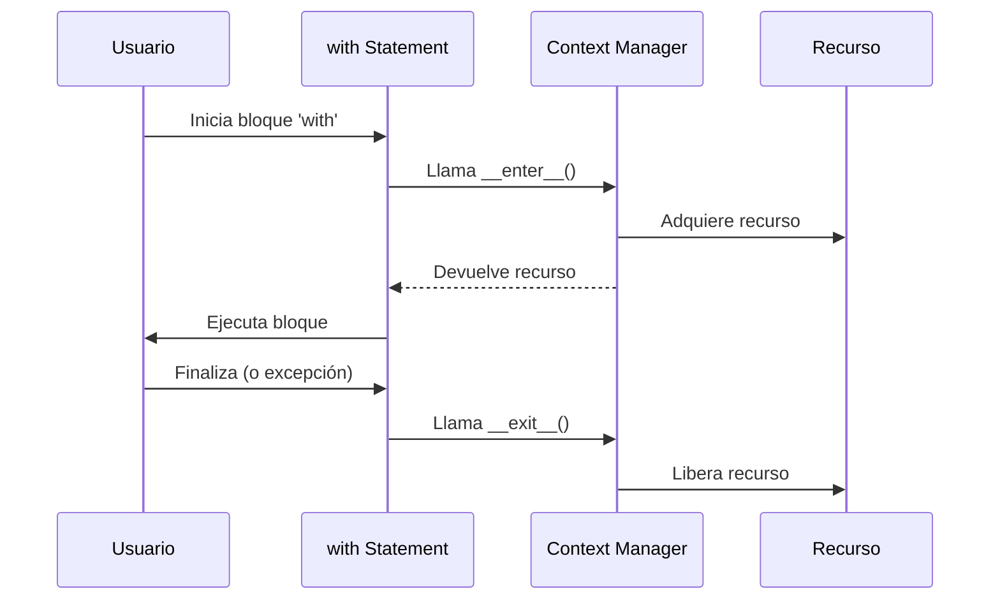

# 🚪 03 - Context Managers

La gestión de recursos es una disciplina crítica en cualquier sistema de software. Ya sea abriendo archivos, adquiriendo locks en hilos o estableciendo conexiones a bases de datos, es vital garantizar que los recursos se liberen correctamente, incluso ante excepciones. Los context managers de Python resuelven este problema de forma elegante y segura.


---

## 1. El Protocolo `__enter__` y `__exit__`

Un context manager es cualquier objeto que implementa los métodos mágicos `__enter__` y `__exit__`. La sentencia `with` se encarga de llamar a `__enter__` al entrar en el bloque y a `__exit__` al salir, garantizando la limpieza.

| Método | Cuándo se llama | Propósito |
|--------|-----------------|-----------|
| `__enter__` | Al inicio del bloque `with`. | Adquirir el recurso. Devuelve el objeto a asignar. |
| `__exit__` | Al finalizar el bloque (normal o por excepción). | Liberar el recurso. Recibe tipo, valor y traceback de la excepción si hubo. |

```python
class ConexionDB:
    """Context manager para simular una conexión a base de datos."""

    def __init__(self, host: str):
        self.host = host
        self.conectado = False

    def __enter__(self):
        print(f"Conectando a {self.host}...")
        self.conectado = True
        return self

    def __exit__(self, exc_type, exc_val, exc_tb):
        self.conectado = False
        print(f"Desconectando de {self.host}.")
        # Si retornamos True, suprimimos la excepción
        return False

    def consultar(self, query: str):
        if not self.conectado:
            raise RuntimeError("No hay conexión activa")
        return f"Resultado de: {query}"

# Uso
with ConexionDB("localhost") as db:
    print(db.consultar("SELECT * FROM modelos"))
```

⚠️ **Advertencia:** Si `__exit__` devuelve `True`, la excepción que ocurrió dentro del bloque `with` se suprime. Úsalo con extrema precaución; en la mayoría de los casos debe devolver `None` o `False`.

---

## 2. `contextlib.contextmanager`: Decorador de Generadores

El módulo `contextlib` ofrece una forma más concisa de crear context managers usando generadores. El código antes y después del `yield` corresponden a `__enter__` y `__exit__`.

```python
from contextlib import contextmanager

@contextmanager
def managed_file(path: str, mode: str):
    f = open(path, mode)
    try:
        yield f  # Lo que se asigna a la variable del 'with'
    finally:
        f.close()

with managed_file("salida.txt", "w") as f:
    f.write("Datos procesados\n")
```

Caso real: En un pipeline de ML, un context manager puede gestionar la vida de una sesión de TensorFlow o PyTorch, asegurando que los recursos del GPU se liberen al finalizar el entrenamiento, incluso si ocurre un `CUDA out of memory`.

---

## 3. Context Managers de la Stdlib

| Context Manager | Descripción |
|-----------------|-------------|
| `open()` | Gestión de archivos (el ejemplo más común). |
| `threading.Lock()` | Adquisición y liberación automática de locks. |
| `sqlite3.connect()` | Gestión de conexiones y commits/rollbacks. |
| `tempfile.TemporaryDirectory()` | Creación y limpieza de directorios temporales. |
| `contextlib.suppress(*exceptions)` | Ejecuta el bloque ignorando excepciones específicas. |
| `contextlib.ExitStack` | Gestiona múltiples context managers dinámicamente. |

### 3.1 `ExitStack`

Cuando no sabes de antemano cuántos context managers necesitas, `ExitStack` es la solución.

```python
from contextlib import ExitStack

files = ["a.txt", "b.txt", "c.txt"]

with ExitStack() as stack:
    handles = [stack.enter_context(open(f)) for f in files]
    # Al salir del 'with', todos los archivos se cierran automáticamente
    contenidos = [h.read() for h in handles]
```

💡 **Tip:** `ExitStack` es especialmente útil para abrir un número variable de archivos de configuración en un servidor backend.

---

## 4. Context Manager Personalizado para Medir Tiempo

```python
import time
from contextlib import contextmanager
from typing import Optional

@contextmanager
def medir_tiempo(operacion: str, logger: Optional[callable] = print):
    inicio = time.perf_counter()
    logger(f"[INICIO] {operacion}")
    try:
        yield
    finally:
        elapsed = time.perf_counter() - inicio
        logger(f"[FIN] {operacion} -> {elapsed:.4f}s")

# Uso en un proceso de ML
with medir_tiempo("Entrenamiento del modelo"):
    time.sleep(1)  # Simula entrenamiento
```

Caso real: En un sistema de recomendación, medir el tiempo de inferencia por usuario permite detectar degradaciones de rendimiento en producción.

---

## 5. Anidamiento y Composición

Los context managers pueden anidarse. Además, desde Python 3.10, la sintaxis `with (A() as a, B() as b):` permite agrupar múltiples managers en una sola línea.

```python
with open("entrada.txt") as fin, open("salida.txt", "w") as fout:
    fout.write(fin.read().upper())
```



---

```python
# 📦 Código de compresión: Context manager para transacciones DB
from contextlib import contextmanager
import sqlite3

@contextmanager
def transaction(db_path: str):
    conn = sqlite3.connect(db_path)
    try:
        yield conn
        conn.commit()
        print("Transacción confirmada (commit).")
    except Exception as e:
        conn.rollback()
        print(f"Transacción revertida (rollback): {e}")
        raise
    finally:
        conn.close()

if __name__ == "__main__":
    with transaction("test.db") as conn:
        conn.execute("CREATE TABLE IF NOT EXISTS logs (id INTEGER PRIMARY KEY, msg TEXT)")
        conn.execute("INSERT INTO logs (msg) VALUES (?)", ("Operación exitosa",))
```
