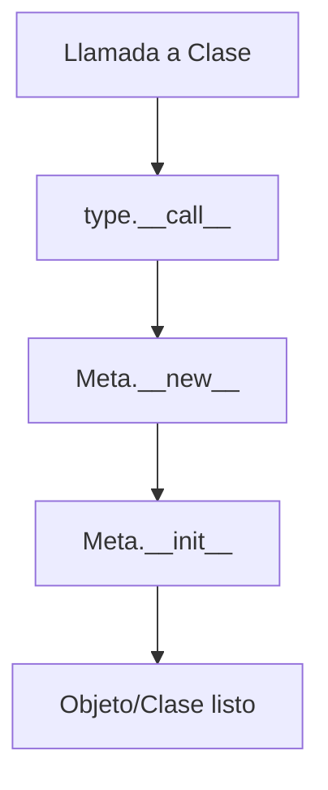

# 🪞 04 - Metaprogramación y Metaclases

La metaprogramación es el arte de escribir código que manipula código. En Python, esto va desde la simple introspección hasta la creación dinámica de clases mediante metaclases. Para un ML Engineer, es crucial para construir frameworks de configuración de modelos; para un Backend Developer, para ORMs y sistemas de plugins.


---

## 1. `type()` como Constructor de Clases

Todo en Python es un objeto, incluidas las clases. La función incorporada `type()` no solo devuelve el tipo de un objeto; cuando se llama con tres argumentos, crea una clase dinámicamente.

```python
# Forma declarativa
class Persona:
    def __init__(self, nombre):
        self.nombre = nombre

# Forma imperativa con type()
PersonaDinamica = type(
    'PersonaDinamica',
    (object,),
    {
        '__init__': lambda self, nombre: setattr(self, 'nombre', nombre),
        'saludar': lambda self: f"Hola, soy {self.nombre}"
    }
)

p = PersonaDinamica("Ana")
print(p.saludar())  # Hola, soy Ana
```

| Argumento de `type()` | Significado |
|-----------------------|-------------|
| `name` | String con el nombre de la clase. |
| `bases` | Tupla de clases base (herencia). |
| `namespace` | Diccionario con los atributos y métodos. |

💡 **Tip:** Las clases creadas con `type()` son indistinguibles de las creadas con `class`. Esto es la base de los ORMs como Django que generan clases de modelo a partir de metadatos.

---

## 2. Metaclases: La Clase de una Clase

Si `type` es la clase de la mayoría de las clases, una metaclase es simplemente una subclase de `type` que personaliza el proceso de creación de clases.

```python
class RegistroMeta(type):
    """Metaclase que registra todas las clases creadas."""
    registro = {}

    def __new__(mcs, name, bases, namespace):
        cls = super().__new__(mcs, name, bases, namespace)
        RegistroMeta.registro[name] = cls
        print(f"[Registro] Clase '{name}' creada.")
        return cls

    def __call__(cls, *args, **kwargs):
        print(f"[Instancia] Creando instancia de {cls.__name__}")
        return super().__call__(*args, **kwargs)

class Plugin(metaclass=RegistroMeta):
    pass

class ModeloML(Plugin):
    pass

print(RegistroMeta.registro)
```

⚠️ **Advertencia:** Las metaclases pueden dificultar la depuración y la composición con otras librerías que también usan metaclases (ej. `abc.ABCMeta`). Úsalas solo cuando sea estrictamente necesario.

### `__new__` vs `__init__`

| Método | Momento | Responsabilidad |
|--------|---------|-----------------|
| `__new__` | Creación del objeto (antes de que exista). | Devuelve la instancia (o la clase, en metaclases). |
| `__init__` | Inicialización del objeto (ya existe). | Configura atributos iniciales. |



---

## 3. Introspección: Conociendo tu Código en Runtime

Python ofrece un rico conjunto de funciones para examinar objetos en tiempo de ejecución.

| Función | Uso |
|---------|-----|
| `dir(obj)` | Lista todos los atributos y métodos de un objeto. |
| `getattr(obj, name)` | Obtiene un atributo por su nombre (string). |
| `hasattr(obj, name)` | Verifica si el objeto posee un atributo. |
| `setattr(obj, name, val)` | Establece un atributo dinámicamente. |
| `vars(obj)` | Devuelve el diccionario `__dict__` del objeto. |

```python
class Modelo:
    capas = 5
    def entrenar(self):
        pass

m = Modelo()
print(hasattr(m, 'capas'))       # True
print(getattr(m, 'capas'))       # 5
setattr(m, 'nombre', 'ResNet')
print(vars(m))                   # {'nombre': 'ResNet'}
```

Caso real: Un framework de ML que carga dinámicamente arquitecturas de red a partir de un archivo de configuración JSON, usando `getattr` para instanciar las clases de capas correspondientes.

---

## 4. Monkey Patching

Monkey patching es la modificación de una clase o módulo en runtime, generalmente para cambiar su comportamiento sin alterar el código fuente original.

```python
class Servicio:
    def conectar(self):
        return "Conectando a producción..."

# Monkey patch para testing
Servicio.conectar = lambda self: "Conectando a staging..."
s = Servicio()
print(s.conectar())  # Conectando a staging...
```

⚠️ **Advertencia:** El monkey patching es poderoso pero peligroso. Puede romper bibliotecas de terceros y generar efectos secundarios inesperados. Prefiere la inyección de dependencias siempre que sea posible.

---

## 5. Descriptores: Control de Acceso a Atributos

Un descriptor es cualquier objeto que define `__get__`, `__set__` o `__delete__`. Son la base de `property`, `classmethod` y `staticmethod`.

```python
class Validador:
    """Descriptor que valida que un valor esté en un rango."""

    def __init__(self, minimo, maximo):
        self.minimo = minimo
        self.maximo = maximo

    def __set_name__(self, owner, name):
        self.name = name
        self.private_name = f"_{name}"

    def __get__(self, obj, objtype=None):
        if obj is None:
            return self
        return getattr(obj, self.private_name, None)

    def __set__(self, obj, value):
        if not (self.minimo <= value <= self.maximo):
            raise ValueError(f"{self.name} debe estar entre {self.minimo} y {self.maximo}")
        setattr(obj, self.private_name, value)

class Config:
    epochs = Validador(1, 1000)
    learning_rate = Validador(0.0, 1.0)

    def __init__(self):
        self.epochs = 10
        self.learning_rate = 0.01

cfg = Config()
cfg.epochs = 500      # OK
# cfg.epochs = 5000  # ValueError
```

💡 **Tip:** Los descriptores permiten implementar validaciones, lazy loading y observabilidad de atributos de forma reutilizable.

---

## 6. `__slots__`: Ahorro de Memoria

Por defecto, Python almacena los atributos de instancia en un diccionario (`__dict__`), lo cual consume mucha memoria. `__slots__` reemplaza este diccionario por un array de tamaño fijo.

| Característica | `__dict__` | `__slots__` |
|----------------|------------|-------------|
| Memoria | Alta (diccionario dinámico). | Baja (array fijo). |
| Atributos dinámicos | Permitidos. | No permitidos (a menos que incluyas `__dict__`). |
| Herencia múltiple | Sin restricciones. | Las clases base no pueden tener slots conflictivos. |

```python
class PuntoSlot:
    __slots__ = ('x', 'y')

    def __init__(self, x, y):
        self.x = x
        self.y = y

p = PuntoSlot(1, 2)
# p.z = 3  # AttributeError
```

Caso real: En un backend que maneja millones de objetos de registro (logs), usar `__slots__` puede reducir drásticamente el uso de memoria y mejorar el rendimiento del GC.

---

```python
# 📦 Código de compresión: Metaclase que registra clases + slots
class RegistryMeta(type):
    registry = {}

    def __new__(mcs, name, bases, namespace, **kwargs):
        cls = super().__new__(mcs, name, bases, namespace)
        RegistryMeta.registry[name] = cls
        return cls

class ModeloBase(metaclass=RegistryMeta):
    __slots__ = ('id', 'nombre')

    def __init__(self, id: int, nombre: str):
        self.id = id
        self.nombre = nombre

class Usuario(ModeloBase):
    __slots__ = ('email',)

    def __init__(self, id: int, nombre: str, email: str):
        super().__init__(id, nombre)
        self.email = email

if __name__ == "__main__":
    u = Usuario(1, "Ana", "ana@example.com")
    print(RegistryMeta.registry)
    print(u.__slots__)
```
