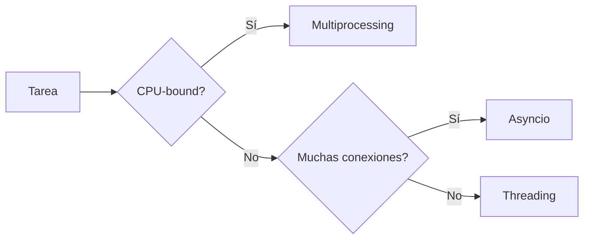

# ⚡ 06 - Concurrencia: Threading y Asyncio

La concurrencia permite que un programa realice múltiples tareas de forma simultánea o aparentemente simultánea. En backend, es esencial para manejar miles de conexiones concurrentes; en ML/AI, para paralelizar el preprocesamiento de datos o la inferencia distribuida.


---

## 1. El Global Interpreter Lock (GIL)

El GIL es un mutex que protege el acceso a objetos de Python, permitiendo que solo un hilo ejecute bytecode de Python a la vez.

| Aspecto | Impacto |
|---------|---------|
| CPU-bound tasks | El GIL impide el paralelismo real con threads. |
| I/O-bound tasks | El GIL se libera durante operaciones de I/O, por lo que los hilos son útiles. |
| Solución para CPU-bound | Usar `multiprocessing` (procesos separados, cada uno con su propio GIL). |

⚠️ **Advertencia:** No asumas que usar `threading` acelerará cálculos matemáticos intensivos en Python puro. Para eso, usa `multiprocessing`, `concurrent.futures.ProcessPoolExecutor`, o librerías como NumPy que liberan el GIL en operaciones C.

---

## 2. Threading

El módulo `threading` permite ejecutar múltiples hilos dentro de un mismo proceso. Es ideal para tareas I/O-bound.

### 2.1 Hilos Básicos

```python
import threading
import time

def tarea(nombre: str, duracion: int):
    print(f"[HILO] {nombre} iniciado")
    time.sleep(duracion)
    print(f"[HILO] {nombre} finalizado")

h1 = threading.Thread(target=tarea, args=("Descarga", 2))
h2 = threading.Thread(target=tarea, args=("Procesamiento", 1))

h1.start()
h2.start()
h1.join()
h2.join()
```

### 2.2 Sincronización: Locks y Semáforos

| Primitiva | Uso |
|-----------|-----|
| `Lock` | Exclusión mutua; un solo hilo a la vez. |
| `RLock` | Lock reentrante (permite adquisiciones anidadas por el mismo hilo). |
| `Semaphore` | Permite hasta N hilos simultáneos. |
| `Queue` | Cola thread-safe para comunicación entre hilos. |

```python
from threading import Lock

counter = 0
lock = Lock()

def incrementar():
    global counter
    for _ in range(100000):
        with lock:
            counter += 1

threads = [threading.Thread(target=incrementar) for _ in range(5)]
for t in threads: t.start()
for t in threads: t.join()
print(counter)  # 500000
```

💡 **Tip:** Prefiere `queue.Queue` sobre listas compartidas para pasar datos entre hilos; maneja internamente la sincronización.

---

## 3. Multiprocessing

Para tareas CPU-bound, `multiprocessing` crea procesos separados, cada uno con su propio intérprete Python y memoria.

```python
from multiprocessing import Process, Pool
import os

def cuadrado(n: int) -> int:
    return n * n

if __name__ == "__main__":
    with Pool(processes=4) as pool:
        resultados = pool.map(cuadrado, range(10))
    print(resultados)
```

| Característica | Threading | Multiprocessing |
|----------------|-----------|-----------------|
| Memoria | Compartida. | Aislada (requiere pickling). |
| Overhead | Bajo. | Alto (creación de proceso). |
| GIL | Compartido. | Uno por proceso. |
| Uso ideal | I/O-bound. | CPU-bound. |

---

## 4. Asyncio: Concurrencia Cooperativa

`asyncio` utiliza un event loop y corrutinas (`async`/`await`) para manejar múltiples tareas I/O-bound en un solo hilo, evitando el overhead de los threads.

### 4.1 Conceptos Fundamentales

| Concepto | Descripción |
|----------|-------------|
| `async def` | Define una corrutina. |
| `await` | Delega el control al event loop mientras espera un future. |
| `asyncio.create_task(coro)` | Encola una corrutina para ejecución concurrente. |
| `asyncio.gather(*aws)` | Ejecuta múltiples awaitables concurrentemente. |

```python
import asyncio

async def fetch_data(url: str, delay: int) -> str:
    print(f"Fetching {url}...")
    await asyncio.sleep(delay)  # Simula I/O no bloqueante
    return f"Data from {url}"

async def main():
    t1 = asyncio.create_task(fetch_data("api/modelos", 2))
    t2 = asyncio.create_task(fetch_data("api/dataset", 1))
    resultados = await asyncio.gather(t1, t2)
    print(resultados)

asyncio.run(main())
```

Caso real: Un servicio de inferencia de ML que recibe 10,000 requests simultáneos. Usar `asyncio` permite manejarlas todas en un solo hilo mientras esperan la respuesta del modelo (I/O) o la GPU.

---

## 5. Comparativa Final



| Modelo | Caso de Uso ML/Backend | Escalabilidad |
|--------|------------------------|---------------|
| **Threading** | Descarga de datasets, escritura de logs. | ~Cientos de hilos. |
| **Multiprocessing** | Preprocesamiento de imágenes, entrenamiento paralelo. | Limitada por número de cores. |
| **Asyncio** | Servidores web (ASGI), APIs de terceros, bases de datos async. | Decenas de miles de conexiones. |

---

```python
# 📦 Código de compresión: Async HTTP Fetcher
import asyncio
from typing import List

class AsyncHttpFetcher:
    """Simula un fetcher async de múltiples endpoints."""

    async def fetch(self, url: str) -> dict:
        await asyncio.sleep(0.5)  # Simula latencia de red
        return {"url": url, "status": 200}

    async def fetch_all(self, urls: List[str]) -> List[dict]:
        tasks = [asyncio.create_task(self.fetch(u)) for u in urls]
        return await asyncio.gather(*tasks)

async def main():
    fetcher = AsyncHttpFetcher()
    urls = [f"https://api.example.com/data/{i}" for i in range(5)]
    resultados = await fetcher.fetch_all(urls)
    for r in resultados:
        print(r)

if __name__ == "__main__":
    asyncio.run(main())
```
