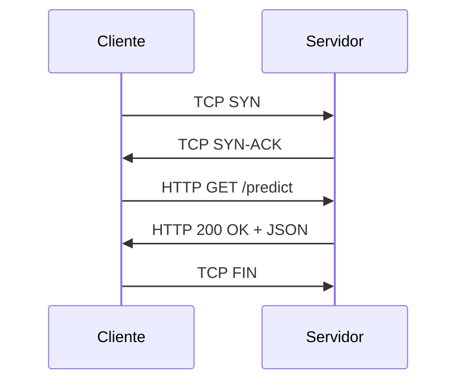

# 🌐 07 - Networking y Sockets

Las aplicaciones modernas raramente operan en aislamiento. Ya sea consumiendo una API de modelos de lenguaje, sirviendo predicciones a clientes o coordinando un clúster de entrenamiento, la comunicación en red es omnipresente. Comprender los sockets y el protocolo HTTP a bajo nivel te dará un control total sobre tus aplicaciones.


---

## 1. Fundamentos de Sockets TCP/IP

Un socket es un extremo de un canal de comunicación. Python proporciona el módulo `socket` para crear conexiones de red a bajo nivel.

| Concepto | Descripción |
|----------|-------------|
| **IP** | Dirección lógica del host en la red. |
| **Puerto** | Número que identifica un servicio específico en el host. |
| **TCP** | Protocolo orientado a conexión, confiable y ordenado. |
| **UDP** | Protocolo sin conexión, rápido pero no confiable. |

```python
import socket

# Crear un socket TCP
s = socket.socket(socket.AF_INET, socket.SOCK_STREAM)
# AF_INET = IPv4, SOCK_STREAM = TCP
```

⚠️ **Advertencia:** Siempre usa `try/finally` o un context manager para cerrar sockets, o configura `SO_REUSEADDR` durante el desarrollo para evitar errores de "Address already in use".

---

## 2. Servidor TCP Básico

Un servidor socket escucha en una dirección y puerto, acepta conexiones entrantes y responde.

```python
import socket

def servidor_simple(host: str = "127.0.0.1", port: int = 8080):
    with socket.socket(socket.AF_INET, socket.SOCK_STREAM) as s:
        s.setsockopt(socket.SOL_SOCKET, socket.SO_REUSEADDR, 1)
        s.bind((host, port))
        s.listen(1)
        print(f"Servidor escuchando en {host}:{port}")

        conn, addr = s.accept()
        with conn:
            print(f"Conexión desde {addr}")
            while True:
                data = conn.recv(1024)
                if not data:
                    break
                conn.sendall(b"Echo: " + data)

if __name__ == "__main__":
    servidor_simple()
```

Caso real: Un sistema de inferencia edge que ejecuta un modelo localmente y expone sus predicciones a través de un socket TCP para dispositivos IoT cercanos.

---

## 3. Cliente TCP Básico

```python
import socket

def cliente_simple(mensaje: str, host: str = "127.0.0.1", port: int = 8080):
    with socket.socket(socket.AF_INET, socket.SOCK_STREAM) as s:
        s.connect((host, port))
        s.sendall(mensaje.encode('utf-8'))
        data = s.recv(1024)
        print(f"Recibido: {data.decode('utf-8')}")

if __name__ == "__main__":
    cliente_simple("Hola Servidor")
```

💡 **Tip:** Para datos estructurados complejos sobre sockets, serializa con `json` o `struct` para definir protocolos binarios ligeros.

---

## 4. HTTP Manual con Sockets

HTTP es un protocolo de texto sobre TCP. Podemos implementar una petición GET básica sin usar `requests`.

```python
import socket

def http_get(host: str, path: str = "/") -> str:
    request = (
        f"GET {path} HTTP/1.1\r\n"
        f"Host: {host}\r\n"
        f"Connection: close\r\n\r\n"
    )
    with socket.socket(socket.AF_INET, socket.SOCK_STREAM) as s:
        s.connect((host, 80))
        s.sendall(request.encode())
        response = b""
        while True:
            chunk = s.recv(4096)
            if not chunk:
                break
            response += chunk
    return response.decode('utf-8', errors='ignore')

# print(http_get("example.com"))
```

⚠️ **Advertencia:** En producción, nunca implementes HTTPS a mano. Usa `ssl` o librerías como `urllib`. La criptografía es compleja y propensa a errores de seguridad.

---

## 5. `urllib` vs `http.client`

| Módulo | Nivel | Uso |
|--------|-------|-----|
| `socket` | Muy bajo. | Protocolos custom, control total. |
| `http.client` | Bajo. | Peticiones HTTP/1.1 sin dependencias externas. |
| `urllib.request` | Medio. | API más amigable para GET/POST simples. |

```python
from urllib import request, parse

# GET simple
data = request.urlopen("https://httpbin.org/get").read()

# POST con datos
params = parse.urlencode({"nombre": "modelo", "version": "1.0"}).encode()
req = request.Request("https://httpbin.org/post", data=params, method="POST")
response = request.urlopen(req)
```

---

## 6. Introducción a REST y JSON over HTTP

REST (Representational State Transfer) es un estilo arquitectónico que usa los verbos HTTP para operar sobre recursos identificados por URLs.

| Verbo HTTP | Operación | Uso en ML/Backend |
|------------|-----------|-------------------|
| GET | Leer recurso. | Obtener estado del modelo. |
| POST | Crear recurso. | Enviar datos para inferencia. |
| PUT | Actualizar recurso completo. | Reemplazar un modelo. |
| DELETE | Eliminar recurso. | Borrar un modelo del registry. |

```python
import json
import socket

def json_response(data: dict) -> bytes:
    body = json.dumps(data).encode()
    headers = (
        "HTTP/1.1 200 OK\r\n"
        "Content-Type: application/json\r\n"
        f"Content-Length: {len(body)}\r\n"
        "Connection: close\r\n\r\n"
    )
    return headers.encode() + body
```

---

## 7. Manejo de URLs con `urllib.parse`

```python
from urllib.parse import urlparse, urlencode, parse_qs

url = "https://api.example.com:8080/v1/predict?model=resnet50"
parsed = urlparse(url)
print(parsed.scheme, parsed.netloc, parsed.path, parsed.query)

query = parse_qs(parsed.query)
print(query)  # {'model': ['resnet50']}
```

Caso real: Un gateway de ML que enruta peticiones a diferentes servicios de inferencia basándose en el path y los query parameters de la URL.



---

```python
# 📦 Código de compresión: Servidor HTTP simple + Cliente
import socket
import json

def run_http_server(host="127.0.0.1", port=9000):
    with socket.socket(socket.AF_INET, socket.SOCK_STREAM) as s:
        s.setsockopt(socket.SOL_SOCKET, socket.SO_REUSEADDR, 1)
        s.bind((host, port))
        s.listen(5)
        print(f"HTTP Server en http://{host}:{port}")
        while True:
            conn, addr = s.accept()
            with conn:
                request = conn.recv(1024).decode()
                if "GET /health" in request:
                    body = json.dumps({"status": "ok"})
                else:
                    body = json.dumps({"message": "Bienvenido al ML Server"})
                response = (
                    "HTTP/1.1 200 OK\r\n"
                    "Content-Type: application/json\r\n"
                    f"Content-Length: {len(body)}\r\n"
                    "Connection: close\r\n\r\n" + body
                )
                conn.sendall(response.encode())

if __name__ == "__main__":
    run_http_server()
```
