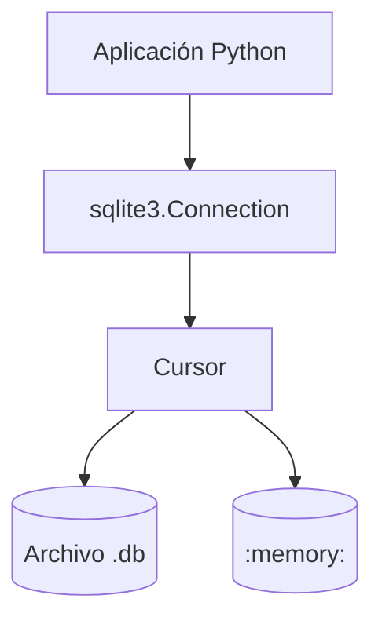

# 🗄️ 08 - Bases de Datos con SQLite

La persistencia de datos es un pilar en cualquier sistema backend. SQLite es un motor de bases de datos SQL autocontenido, sin servidor y de dominio público. Es ideal para prototipado, tests y aplicaciones edge en ML donde no se justifica una base de datos cliente-servidor completa.


---

## 1. El Estándar DB-API 2.0

Python define una interfaz estándar para acceder a bases de datos: PEP 249. Todos los adaptadores (sqlite3, psycopg2, mysql-connector) la implementan.

| Método/Objeto | Descripción |
|---------------|-------------|
| `connect(...)` | Establece conexión con la base de datos. |
| `cursor()` | Crea un cursor para ejecutar sentencias SQL. |
| `execute(sql, params)` | Ejecuta una sentencia SQL. |
| `executemany(sql, seq)` | Ejecuta una sentencia con múltiples conjuntos de parámetros. |
| `fetchone()` | Devuelve la siguiente fila como tupla/dict. |
| `fetchall()` | Devuelve todas las filas restantes. |
| `commit()` | Confirma la transacción actual. |
| `rollback()` | Revierte la transacción actual. |

```python
import sqlite3

# Conexión a archivo (persistente)
conn = sqlite3.connect("mi_proyecto.db")

# Conexión en memoria (volátil, ideal para tests)
conn_mem = sqlite3.connect(":memory:")
```

⚠️ **Advertencia:** Las conexiones a `:memory:` se destruyen al cerrar el objeto `Connection`. Si necesitas compartirla entre threads, usa `uri=True` con `file::memory:?cache=shared`.

---

## 2. Tipos de Datos en SQLite

SQLite utiliza un sistema de tipos dinámico. Los tipos declarados son afinidades que sugieren cómo almacenar el dato.

| Afinidad | Tipos Asociados | Mapeo Python |
|----------|-----------------|--------------|
| `INTEGER` | `INT`, `INTEGER` | `int` |
| `REAL` | `FLOAT`, `DOUBLE` | `float` |
| `TEXT` | `CHAR`, `VARCHAR`, `TEXT` | `str` |
| `BLOB` | `BLOB` | `bytes` |
| `NUMERIC` | `DECIMAL`, `BOOLEAN`, `DATE` | Dependiente del adaptador. |

```python
conn = sqlite3.connect(":memory:")
conn.execute("CREATE TABLE modelos (id INTEGER PRIMARY KEY, nombre TEXT, accuracy REAL)")
conn.execute("INSERT INTO modelos (nombre, accuracy) VALUES (?, ?)", ("ResNet", 0.95))
conn.commit()
```

💡 **Tip:** Activa `conn.row_factory = sqlite3.Row` para acceder a las columnas por nombre en lugar de índice numérico.

---

## 3. Diseño de Esquemas: Claves e Índices

### 3.1 Claves Primarias y Foráneas

```sql
CREATE TABLE experimentos (
    id INTEGER PRIMARY KEY AUTOINCREMENT,
    nombre TEXT NOT NULL,
    fecha TEXT DEFAULT CURRENT_TIMESTAMP
);

CREATE TABLE metricas (
    id INTEGER PRIMARY KEY AUTOINCREMENT,
    experimento_id INTEGER NOT NULL,
    nombre_metrica TEXT,
    valor REAL,
    FOREIGN KEY (experimento_id) REFERENCES experimentos(id)
);
```

⚠️ **Advertencia:** Las foreign keys están desactivadas por defecto en SQLite por compatibilidad heredada. Actívalas con `PRAGMA foreign_keys = ON;`.

### 3.2 Índices

Los índices aceleran las búsquedas a costa de espacio y velocidad de escritura.

```sql
CREATE INDEX idx_metricas_exp ON metricas(experimento_id);
```

Caso real: Una tabla de `predicciones` con millones de filas. Sin un índice sobre `modelo_id` y `timestamp`, una consulta de últimas predicciones requeriría un full table scan.

---

## 4. Consultas Parametrizadas y Prevención de SQL Injection

Nunca, bajo ninguna circunstancia, concatenes strings directamente en SQL. Usa parámetros `?` o `:nombre`.

```python
# ❌ INSEGURO - Vulnerable a SQL Injection
user_input = "1; DROP TABLE modelos; --"
conn.execute(f"SELECT * FROM modelos WHERE id = {user_input}")

# ✅ SEGURO - Parametrizado
conn.execute("SELECT * FROM modelos WHERE id = ?", (user_input,))
conn.execute("SELECT * FROM modelos WHERE id = :id", {"id": user_input})
```

| Método | Seguro | Reutilizable | Legibilidad |
|--------|--------|--------------|-------------|
| F-strings | ❌ No | ❌ No | ⭐⭐⭐ |
| `?` | ✅ Sí | ✅ Sí | ⭐⭐ |
| `:name` | ✅ Sí | ✅ Sí | ⭐⭐⭐ |

---

## 5. Transacciones y Context Managers

SQLite opera en modo autocommit desactivado por defecto (es necesario llamar `commit()` explícitamente). El objeto `Connection` actúa como context manager, gestionando automáticamente commit/rollback.

```python
with sqlite3.connect("proyecto.db") as conn:
    conn.execute("UPDATE modelos SET accuracy = ? WHERE id = ?", (0.96, 1))
    # Si no hay excepciones, hace commit automáticamente al salir del bloque.
    # Si ocurre una excepción, hace rollback.
```

⚠️ **Advertencia:** El context manager de `sqlite3` no cierra la conexión. Ciérrala explícitamente con `conn.close()` o usa un context manager personalizado.

---

## 6. CRUD Completo

```python
import sqlite3
from typing import Optional, List, Dict, Any

class ModeloCRUD:
    def __init__(self, db_path: str = "modelos.db"):
        self.db_path = db_path
        self._init_db()

    def _init_db(self):
        with sqlite3.connect(self.db_path) as conn:
            conn.execute("""
                CREATE TABLE IF NOT EXISTS modelos (
                    id INTEGER PRIMARY KEY AUTOINCREMENT,
                    nombre TEXT UNIQUE NOT NULL,
                    version TEXT,
                    accuracy REAL CHECK(accuracy >= 0 AND accuracy <= 1)
                )
            """)

    def crear(self, nombre: str, version: str, accuracy: float) -> int:
        with sqlite3.connect(self.db_path) as conn:
            cursor = conn.execute(
                "INSERT INTO modelos (nombre, version, accuracy) VALUES (?, ?, ?)",
                (nombre, version, accuracy)
            )
            return cursor.lastrowid

    def leer(self, modelo_id: int) -> Optional[Dict[str, Any]]:
        with sqlite3.connect(self.db_path) as conn:
            conn.row_factory = sqlite3.Row
            cursor = conn.execute("SELECT * FROM modelos WHERE id = ?", (modelo_id,))
            row = cursor.fetchone()
            return dict(row) if row else None

    def listar(self) -> List[Dict[str, Any]]:
        with sqlite3.connect(self.db_path) as conn:
            conn.row_factory = sqlite3.Row
            cursor = conn.execute("SELECT * FROM modelos")
            return [dict(row) for row in cursor.fetchall()]

    def actualizar(self, modelo_id: int, accuracy: float) -> bool:
        with sqlite3.connect(self.db_path) as conn:
            cursor = conn.execute(
                "UPDATE modelos SET accuracy = ? WHERE id = ?",
                (accuracy, modelo_id)
            )
            return cursor.rowcount > 0

    def eliminar(self, modelo_id: int) -> bool:
        with sqlite3.connect(self.db_path) as conn:
            cursor = conn.execute("DELETE FROM modelos WHERE id = ?", (modelo_id,))
            return cursor.rowcount > 0
```

Caso real: Un registry de modelos de ML local donde cada experimento registra su versión y métricas en SQLite para reproducibilidad.



---

```python
# 📦 Código de compresión: Context manager + CRUD completo
import sqlite3
from contextlib import contextmanager

@contextmanager
def get_db(path: str = ":memory:"):
    conn = sqlite3.connect(path)
    conn.row_factory = sqlite3.Row
    try:
        yield conn
        conn.commit()
    except Exception:
        conn.rollback()
        raise
    finally:
        conn.close()

if __name__ == "__main__":
    with get_db("demo.db") as conn:
        conn.execute("CREATE TABLE IF NOT EXISTS logs (id INTEGER PRIMARY KEY, msg TEXT)")
        conn.execute("INSERT INTO logs (msg) VALUES (?)", ("Sistema iniciado",))
        for row in conn.execute("SELECT * FROM logs"):
            print(dict(row))
```
