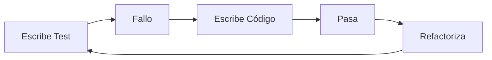

# 🧪 09 - Testing con unittest y pytest

El testing no es opcional en proyectos profesionales de ML/Backend. Un modelo que funciona hoy puede fallar mañana por un cambio en los datos de entrada. Las pruebas automatizadas garantizan la calidad, facilitan la refactorización y documentan el comportamiento esperado del código.


---

## 1. Testing con `unittest`

`unittest` es el framework de testing incluido en la biblioteca estándar, inspirado en JUnit.

### 1.1 Estructura Básica

```python
import unittest
from typing import List

class Calculadora:
    def sumar(self, a: float, b: float) -> float:
        return a + b

    def dividir(self, a: float, b: float) -> float:
        if b == 0:
            raise ValueError("División por cero")
        return a / b

    def media(self, valores: List[float]) -> float:
        if not valores:
            raise ValueError("Lista vacía")
        return sum(valores) / len(valores)

class TestCalculadora(unittest.TestCase):
    def setUp(self):
        """Se ejecuta antes de cada test."""
        self.calc = Calculadora()

    def tearDown(self):
        """Se ejecuta después de cada test."""
        pass

    def test_sumar(self):
        self.assertEqual(self.calc.sumar(2, 3), 5)
        self.assertAlmostEqual(self.calc.sumar(0.1, 0.2), 0.3, places=7)

    def test_dividir_por_cero(self):
        with self.assertRaises(ValueError):
            self.calc.dividir(10, 0)

    def test_media_lista_vacia(self):
        with self.assertRaises(ValueError):
            self.calc.media([])

if __name__ == "__main__":
    unittest.main()
```

| Método de Aserto | Propósito |
|------------------|-----------|
| `assertEqual(a, b)` | `a == b` |
| `assertTrue(x)` | `bool(x) is True` |
| `assertAlmostEqual(a, b)` | Igualdad de floats con tolerancia. |
| `assertRaises(exc)` | Verifica que se lance una excepción. |
| `assertIsNone(x)` | `x is None` |

---

## 2. Testing con `pytest`

`pytest` es un framework de terceros que simplifica enormemente la escritura de tests mediante fixtures, parametrización y una sintaxis más limpia (no requiere clases).

### 2.1 Tests Simples con pytest

```python
# test_calculadora.py (no necesita importar pytest para tests básicos)
from calculadora import Calculadora

def test_sumar():
    calc = Calculadora()
    assert calc.sumar(2, 3) == 5

def test_dividir_por_cero():
    calc = Calculadora()
    with pytest.raises(ValueError, match="División por cero"):
        calc.dividir(10, 0)
```

### 2.2 Fixtures

Las fixtures preparan el entorno de prueba y se comparten entre tests.

```python
import pytest

@pytest.fixture
def calculadora():
    return Calculadora()

@pytest.fixture
def datos_entrenamiento():
    return [0.1, 0.2, 0.3, 0.4, 0.5]

def test_media(calculadora, datos_entrenamiento):
    assert calculadora.media(datos_entrenamiento) == 0.3
```

💡 **Tip:** Las fixtures pueden tener scope (`function`, `class`, `module`, `package`, `session`) para controlar cuánto duran.

### 2.3 Parametrización

Ejecuta el mismo test con diferentes conjuntos de datos.

```python
@pytest.mark.parametrize("a,b,esperado", [
    (2, 3, 5),
    (-1, 1, 0),
    (0, 0, 0),
    (100, 200, 300),
])
def test_sumar_parametrizado(calculadora, a, b, esperado):
    assert calculadora.sumar(a, b) == esperado
```

### 2.4 `conftest.py`

Es un archivo especial donde se definen fixtures compartidas para todo un directorio de tests.

```python
# conftest.py
import pytest

@pytest.fixture(scope="session")
def config_test():
    return {"db": ":memory:", "debug": True}
```

---

## 3. Mocks con `unittest.mock`

Los mocks simulan objetos y comportamientos, esenciales para aislar la unidad bajo test.

```python
from unittest.mock import patch, MagicMock

def test_llamada_api_externa():
    with patch("mimodulo.requests.get") as mock_get:
        mock_get.return_value.status_code = 200
        mock_get.return_value.json.return_value = {"prediction": 0.99}

        resultado = mimodulo.obtener_prediccion("dato")
        assert resultado == 0.99
        mock_get.assert_called_once_with("https://api.example.com/predict", json={"input": "dato"})
```

| Herramienta | Uso |
|-------------|-----|
| `patch(target)` | Reemplaza un objeto durante el test. |
| `MagicMock` | Objeto mock versátil que registra llamadas. |
| `mock.assert_called_with()` | Verifica argumentos de llamada. |

Caso real: En ML, mockear la carga de un modelo pesado para que los tests unitarios se ejecuten en milisegundos en lugar de minutos.

---

## 4. Cobertura de Código con `coverage.py`

```bash
pip install pytest-cov
pytest --cov=mi_modulo --cov-report=html
```

| Métrica | Interpretación |
|---------|----------------|
| Statement Coverage | % de líneas ejecutadas. |
| Branch Coverage | % de ramas condicionales tomadas. |

⚠️ **Advertencia:** Una cobertura del 100% no garantiza la ausencia de bugs, solo que todas las líneas fueron ejecutadas al menos una vez.

---

## 5. TDD Básico (Test-Driven Development)

1.  Escribe un test que falle.
2.  Escribe el código mínimo para que pase.
3.  Refactoriza manteniendo los tests verdes.



---

```python
# 📦 Código de compresión: Clase testeada con unittest
import unittest
from unittest.mock import patch

class ServicioML:
    def predecir(self, x: float) -> float:
        if x < 0:
            raise ValueError("x debe ser >= 0")
        return x * 2

    def obtener_modelo_remoto(self) -> dict:
        import urllib.request
        with urllib.request.urlopen("http://api/modelo") as resp:
            return {"status": resp.status}

class TestServicioML(unittest.TestCase):
    def setUp(self):
        self.svc = ServicioML()

    def test_predecir_positivo(self):
        self.assertEqual(self.svc.predecir(5), 10)

    def test_predecir_negativo(self):
        with self.assertRaises(ValueError):
            self.svc.predecir(-1)

    @patch("urllib.request.urlopen")
    def test_obtener_modelo_remoto(self, mock_urlopen):
        mock_urlopen.return_value.__enter__.return_value.status = 200
        self.assertEqual(self.svc.obtener_modelo_remoto(), {"status": 200})

if __name__ == "__main__":
    unittest.main()
```
