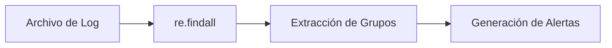

# 🔍 10 - Regex y Procesamiento de Texto

El procesamiento de texto es fundamental en ML (NLP, análisis de logs, parsing de datos no estructurados) y en backend (validación de inputs, sanitización, scraping). Las expresiones regulares (`re`) son la herramienta más potente para localizar, extraer y transformar patrones en cadenas.


---

## 1. El Módulo `re`

Python proporciona el módulo `re` con funciones de alto y bajo nivel.

| Función | Descripción |
|---------|-------------|
| `re.compile(pattern)` | Compila una regex en un objeto reutilizable (más eficiente). |
| `re.match(pattern, string)` | Busca coincidencia solo al **inicio** del string. |
| `re.search(pattern, string)` | Busca la primera coincidencia en **cualquier** posición. |
| `re.findall(pattern, string)` | Devuelve todas las coincidencias en una lista. |
| `re.finditer(pattern, string)` | Devuelve un iterador de objetos `Match`. |
| `re.sub(pattern, repl, string)` | Reemplaza coincidencias. |
| `re.split(pattern, string)` | Divide el string por el patrón. |

```python
import re

texto = "El email es contacto@ejemplo.com y el backup es admin@ejemplo.org"
patron = r"[\w.-]+@[\w.-]+\.\w+"

print(re.findall(patron, texto))
# ['contacto@ejemplo.com', 'admin@ejemplo.org']
```

💡 **Tip:** Si vas a usar una regex más de una vez, compílala con `re.compile()`. Es más eficiente y permite reutilizar la misma expresión.

---

## 2. Metacaracteres Esenciales

| Metacaracter | Significado | Ejemplo |
|--------------|-------------|---------|
| `.` | Cualquier carácter (excepto nueva línea). | `a.b` coincide con "acb", "a1b". |
| `^` | Inicio de la cadena. | `^Hola` coincide si empieza con Hola. |
| `$` | Fin de la cadena. | `mundo$` coincide si termina con mundo. |
| `*` | 0 o más repeticiones. | `ab*` coincide con "a", "ab", "abb". |
| `+` | 1 o más repeticiones. | `ab+` coincide con "ab", "abb", no "a". |
| `?` | 0 o 1 repetición (opcional). | `colou?r` coincide con "color" y "colour". |
| `{n,m}` | Entre n y m repeticiones. | `a{2,4}` coincide con "aa", "aaa", "aaaa". |
| `\d` | Dígito `[0-9]`. | `\d+` coincide con "123". |
| `\w` | Carácter alfanumérico `[a-zA-Z0-9_]`. | `\w+` coincide con "user_1". |
| `\s` | Espacio en blanco. | `\s+` divide palabras. |

```python
patron_fecha = r"\d{2}/\d{2}/\d{4}"
texto = "La fecha límite es 25/12/2024."
print(re.search(patron_fecha, texto).group())  # 25/12/2024
```

⚠️ **Advertencia:** Los backslashes en Python strings requieren escaping o raw strings (`r"..."`). Siempre usa raw strings para patrones regex para evitar sorpresas con `\n`, `\t`, etc.

---

## 3. Grupos y Capturas

Los paréntesis `()` definen grupos de captura, permitiendo extraer subcadenas específicas.

```python
log = "ERROR 2024-05-04 14:30:00 [auth] Login fallido para usuario admin"
patron = r"(\w+) (\d{4}-\d{2}-\d{2}) (\d{2}:\d{2}:\d{2}) \[(\w+)\] (.+)"

match = re.search(patron, log)
if match:
    nivel, fecha, hora, modulo, mensaje = match.groups()
    print(f"[{nivel}] {modulo}: {mensaje}")
```

| Concepto | Sintaxis | Uso |
|----------|----------|-----|
| Grupo capturador | `(patron)` | Extrae el valor. |
| Grupo no capturador | `(?:patron)` | Agrupa sin extraer. |
| Grupo nombrado | `(?P<nombre>patron)` | Accede por nombre. |
| Referencia atrás | `\1` o `(?P=nombre)` | Reusa una captura previa. |

```python
# Grupo nombrado
patron = r"(?P<nivel>\w+) (?P<fecha>\d{4}-\d{2}-\d{2})"
match = re.search(patron, log)
print(match.group("nivel"))  # ERROR
```

---

## 4. Lookahead y Lookbehind

Estos constructos permiten afirmar que un patrón está precedido o seguido por otro, sin incluirlo en la coincidencia.

| Tipo | Sintaxis | Significado |
|------|----------|-------------|
| Positive lookahead | `(?=...)` | Seguido por ... |
| Negative lookahead | `(?!...)` | No seguido por ... |
| Positive lookbehind | `(?<=...)` | Precedido por ... |
| Negative lookbehind | `(?<!...)` | No precedido por ... |

```python
# Extraer precios que terminan en USD
precios = "El producto cuesta 100 USD, el otro 200 EUR."
print(re.findall(r"\d+(?= USD)", precios))  # ['100']

# Extraer números que no están precedidos por '$'
texto = "precio $50 y cantidad 30"
print(re.findall(r"(?<!\$)\b\d+", texto))   # ['30']
```

Caso real: Extraer métricas de un log de entrenamiento de ML donde las líneas tienen el formato `epoch: 5, loss: 0.02, accuracy: 0.98`, pero solo cuando `accuracy` esté presente.

---

## 5. Flags de Compilación

| Flag | Efecto |
|------|--------|
| `re.IGNORECASE` o `re.I` | Coincide sin distinguir mayúsculas/minúsculas. |
| `re.DOTALL` o `re.S` | El punto `.` coincide también con `\n`. |
| `re.MULTILINE` o `re.M` | `^` y `$` coinciden con inicio/fin de cada línea. |
| `re.VERBOSE` o `re.X` | Permite escribir regex multilínea con comentarios. |

```python
patron = re.compile(r"""
    ^\s*                 # Posibles espacios al inicio
    (?P<clave>\w+)       # Clave
    \s*=\s*              # Igual rodeado de espacios
    (?P<valor>.+?)       # Valor
    \s*$                 # Posibles espacios al final
""", re.VERBOSE | re.MULTILINE)
```

---

## 6. Otros Módulos de Procesamiento de Texto

### 6.1 `string.Template`

Para sustituciones simples y seguras.

```python
from string import Template
t = Template("Hola, $nombre. Tu modelo es $modelo.")
print(t.substitute(nombre="Ana", modelo="ResNet50"))
```

### 6.2 `textwrap`

Para formatear y ajustar texto.

```python
import textwrap

texto_largo = "Python es un lenguaje de programación poderoso y fácil de aprender."
print(textwrap.fill(texto_largo, width=30))
```

### 6.3 `difflib`

Para comparar secuencias de texto.

```python
import difflib

diff = difflib.unified_diff("abc", "aXc", lineterm="")
print("\n".join(diff))
```

Caso real: Un sistema backend que parsea logs de error de un servicio de ML para extraer timestamps, niveles de severidad y mensajes, generando alertas cuando detecta patrones críticos.



---

```python
# 📦 Código de compresión: Parser de logs con regex
import re
from typing import Iterator, Dict
from datetime import datetime

def parsear_logs(ruta: str) -> Iterator[Dict[str, str]]:
    patron = re.compile(
        r"^(?P<fecha>\d{4}-\d{2}-\d{2})\s+(?P<hora>\d{2}:\d{2}:\d{2})\s+"
        r"(?P<nivel>\w+)\s+(?P<modulo>\w+)\s+-\s+(?P<mensaje>.+)$"
    )
    with open(ruta, encoding="utf-8") as f:
        for linea in f:
            match = patron.match(linea.strip())
            if match:
                yield match.groupdict()

if __name__ == "__main__":
    # Simulación
    import tempfile, os
    with tempfile.NamedTemporaryFile(mode="w", delete=False, suffix=".log") as tmp:
        tmp.write("2024-05-04 10:00:00 INFO training - Epoch 1/10 completada\n")
        tmp.write("2024-05-04 10:05:00 ERROR api - Conexión perdida\n")
        tmp.flush()
        for entry in parsear_logs(tmp.name):
            print(entry)
        os.unlink(tmp.name)
```
