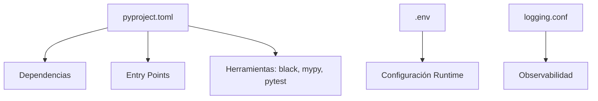

# 📋 11 - Logging y Configuración de Proyectos

Un sistema en producción sin logging es como un avión sin instrumentos: vuela, pero no sabes si está a punto de estrellarse. La observabilidad es fundamental en ML (monitoring de entrenamientos, drift detection) y en backend (tracing de requests, debugging). Además, un proyecto profesional necesita una configuración moderna y reproducible.


---

## 1. El Módulo `logging`

El módulo `logging` de la stdlib proporciona un sistema flexible de registro de eventos basado en jerarquía.

### 1.1 Componentes Fundamentales

| Componente | Rol |
|------------|-----|
| `Logger` | Punto de entrada. Emite mensajes de log. |
| `Handler` | Define dónde se envían los mensajes (consola, archivo, red). |
| `Formatter` | Especifica el formato del mensaje. |
| `Filter` | Filtra mensajes basados en criterios personalizados. |
| `Level` | Severidad del mensaje (DEBUG, INFO, WARNING, ERROR, CRITICAL). |

```python
import logging

# Configuración básica rápida
logging.basicConfig(
    level=logging.INFO,
    format="%(asctime)s [%(levelname)s] %(name)s: %(message)s",
    datefmt="%Y-%m-%d %H:%M:%S"
)

logger = logging.getLogger("mi_app")
logger.info("Servidor iniciado")
logger.warning("Uso de memoria alto: 85%")
```

### 1.2 Jerarquía de Loggers

Los loggers se nombran con puntos (`ml.training.epochs`), heredando handlers y niveles de sus padres.

```python
root = logging.getLogger()          # Nivel: WARNING (default)
ml = logging.getLogger("ml")        # Hereda de root
ml_train = logging.getLogger("ml.training")

ml.setLevel(logging.DEBUG)
ml_train.debug("Batch 1/100 procesado")  # Se emite porque ml_train hereda DEBUG
```

💡 **Tip:** Usa nombres jerárquicos en librerías para permitir a los usuarios finales controlar el nivel de verbosidad por módulo.

---

## 2. Configuración Avanzada con `dictConfig`

Para proyectos grandes, evita `basicConfig` y usa `dictConfig` para separar la configuración del código.

```python
import logging
from logging.config import dictConfig

config = {
    "version": 1,
    "disable_existing_loggers": False,
    "formatters": {
        "default": {
            "format": "%(asctime)s | %(name)s | %(levelname)s | %(message)s"
        },
        "detailed": {
            "format": "%(asctime)s | %(name)s | %(levelname)s | %(funcName)s:%(lineno)d | %(message)s"
        }
    },
    "handlers": {
        "console": {
            "class": "logging.StreamHandler",
            "level": "INFO",
            "formatter": "default"
        },
        "file": {
            "class": "logging.handlers.RotatingFileHandler",
            "level": "DEBUG",
            "formatter": "detailed",
            "filename": "app.log",
            "maxBytes": 1048576,  # 1MB
            "backupCount": 3
        }
    },
    "root": {
        "level": "DEBUG",
        "handlers": ["console", "file"]
    }
}

dictConfig(config)
logger = logging.getLogger(__name__)
```

Caso real: Un servicio de ML que rota logs cada 1MB para evitar llenar el disco en contenedores Docker con almacenamiento efímero.

---

## 3. Rotación de Logs

| Handler | Uso |
|---------|-----|
| `RotatingFileHandler` | Rota por tamaño de archivo. |
| `TimedRotatingFileHandler` | Rota por intervalo de tiempo (días, horas). |

```python
from logging.handlers import TimedRotatingFileHandler

handler = TimedRotatingFileHandler(
    "app.log", when="midnight", interval=1, backupCount=7
)
# Genera app.log, app.log.YYYY-MM-DD, manteniendo 7 días de historial.
```

---

## 4. Empaquetado y Configuración de Proyectos

### 4.1 `pyproject.toml` (PEP 518, 621)

Es el estándar moderno para configurar proyectos Python, reemplazando progresivamente a `setup.py`.

```toml
[build-system]
requires = ["hatchling"]
build-backend = "hatchling.build"

[project]
name = "ml-backend"
version = "0.1.0"
description = "Servicio de inferencia de ML"
requires-python = ">=3.10"
dependencies = [
    "numpy",
    "pandas"
]

[project.optional-dependencies]
dev = ["pytest", "mypy", "black"]
```

| Archivo | Estado | Uso |
|---------|--------|-----|
| `setup.py` | Legacy | Lógica Python compleja en la instalación. |
| `setup.cfg` | Legacy/Transición | Configuración declarativa, pero dividida. |
| `pyproject.toml` | **Recomendado** | Centraliza todo: build, dependencias, herramientas. |

### 4.2 Entry Points

Definen comandos de consola al instalar el paquete.

```toml
[project.scripts]
ml-serve = "ml_backend.cli:main"
```

### 4.3 Versionado Semántico (Semver)

| Formato | Significado |
|---------|-------------|
| `MAJOR.MINOR.PATCH` | `MAJOR`: cambios incompatibles. `MINOR`: features nuevos compatibles. `PATCH`: bug fixes. |

---

## 5. Variables de Entorno con `python-dotenv`

Nunca hardcodees credenciales o configuraciones sensibles. Usa archivos `.env`.

```bash
# .env
DB_URL=sqlite:///produccion.db
DEBUG=false
API_KEY=supersecreto
```

```python
from dotenv import load_dotenv
import os

load_dotenv()

db_url = os.getenv("DB_URL", "sqlite:///default.db")
debug = os.getenv("DEBUG", "false").lower() == "true"
```

⚠️ **Advertencia:** Añade `.env` a tu `.gitignore`. Un leak de credenciales en un repositorio público puede ser catastrófico.



---

```python
# 📦 Código de compresión: Configuración completa de logging + dotenv
import logging
from logging.config import dictConfig
from dotenv import load_dotenv
import os

load_dotenv()

LOG_LEVEL = os.getenv("LOG_LEVEL", "INFO")

dictConfig({
    "version": 1,
    "formatters": {
        "compact": {"format": "%(asctime)s [%(levelname)s] %(message)s"}
    },
    "handlers": {
        "console": {
            "class": "logging.StreamHandler",
            "formatter": "compact",
            "level": LOG_LEVEL
        }
    },
    "root": {
        "handlers": ["console"],
        "level": LOG_LEVEL
    }
})

logger = logging.getLogger("app")
logger.info("Aplicación iniciada con nivel %s", LOG_LEVEL)
```
