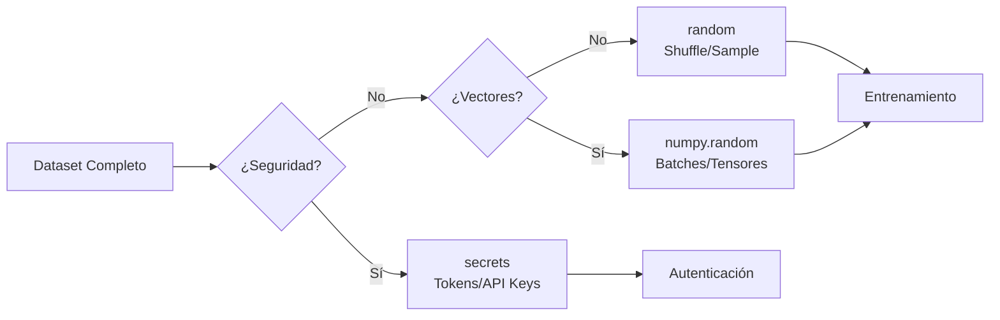

# 🧮 Math y Random

El cálculo numérico y la generación de aleatoriedad son pilares tanto del desarrollo backend como de la inteligencia artificial. En ML, la inicialización de pesos, el muestreo de batches, la simulación de Monte Carlo y el cálculo de métricas dependen directamente de funciones matemáticas precisas. En backend, la aleatoriedad se usa para generación de IDs, tokens de sesión, distribución de carga y A/B testing. Este módulo explora `math`, `random`, `secrets` y `statistics` con la profundidad necesaria para aplicarlos en entornos de producción.


## 1. El Módulo `math`: Precisión Flotante y Combinatoria

El módulo `math` provee acceso a las funciones matemáticas definidas en el estándar C. Trabaja exclusivamente con números de punto flotante (y enteros en funciones combinatorias). A diferencia de `numpy`, no opera sobre vectores o matrices, pero su latencia es casi nula para escalares.

### 1.1. Funciones de Redondeo y Truncamiento

Python posee `round()`, pero `math` ofrece alternativas con semántica más estricta:

- `math.floor(x)`: Devuelve el entero más grande menor o igual que `x` (hacia abajo).
- `math.ceil(x)`: Devuelve el entero más pequeño mayor o igual que `x` (hacia arriba).
- `math.trunc(x)`: Elimina la parte decimal, acercándose a cero.

```python
import math

print(math.floor(3.7))   # 3
print(math.ceil(3.2))    # 4
print(math.trunc(-3.7))  # -3 (diferente a floor(-3.7) que da -4)
```

⚠️ **Advertencia:** `math.floor` y `math.trunc` no son equivalentes para números negativos. `floor` siempre redondea hacia abajo, mientras que `trunc` redondea hacia cero. En sistemas de coordenadas o indexación de grids, usar la función incorrecta puede desplazar tus datos una unidad entera.


### 1.2. Constantes y Trigonometría

Las constantes `math.pi` y `math.e` tienen precisión de doble precisión (64 bits). Las funciones trigonométricas esperan radianes.

| Función | Descripción | Dominio | Rango |
|---------|-------------|---------|-------|
| `math.sin(x)` | Seno de x radianes | ℝ | [-1, 1] |
| `math.cos(x)` | Coseno de x radianes | ℝ | [-1, 1] |
| `math.tan(x)` | Tangente de x radianes | ℝ \ {π/2 + kπ} | ℝ |
| `math.radians(d)` | Convierte grados a radianes | ℝ | ℝ |
| `math.degrees(r)` | Convierte radianes a grados | ℝ | ℝ |

```python
import math

angulo_grados = 45
rad = math.radians(angulo_grados)
print(f"seno(45°) = {math.sin(rad):.6f}")  # 0.707107
print(f"pi = {math.pi}")
print(f"e = {math.e}")
```

Caso real: En sistemas de geolocalización backend, `math.radians` y `math.sin`/`math.cos` son la base de la fórmula de Haversine para calcular distancias entre coordenadas GPS sin necesidad de librerías externas.


### 1.3. Logaritmos, Exponenciales y Raíces

- `math.sqrt(x)`: Raíz cuadrada. Para `x < 0` lanza `ValueError`.
- `math.exp(x)`: e^x. Más preciso que `math.e ** x` para valores cercanos a cero.
- `math.log(x[, base])`: Logaritmo natural (base `e`) o en base especificada.
- `math.log2(x)`, `math.log10(x)`: Optimizadas para sus bases.

```python
import math

print(math.exp(1e-5) - 1)       # Más preciso que (math.e ** 1e-5) - 1
print(math.log(1024, 2))        # 10.0
print(math.log2(1024))          # 10.0
```

💡 **Tip:** Si estás implementando funciones de activación como Softmax o SiLU desde cero para entender su mecánica, usa `math.exp` en lugar de operadores de potencia para minimizar errores de precisión en números muy pequeños.


### 1.4. Combinatoria y Aritmética

| Función | Descripción | Complejidad |
|---------|-------------|-------------|
| `math.factorial(n)` | n! | O(n) |
| `math.comb(n, k)` | Combinaciones "n sobre k" | O(k) |
| `math.perm(n, k)` | Permutaciones "n sobre k" | O(k) |
| `math.gcd(a, b)` | Máximo común divisor | O(log(min(a,b))) |
| `math.isclose(a, b)` | Comparación con tolerancia relativa/absoluta | O(1) |

```python
import math

print(math.factorial(5))      # 120
print(math.comb(10, 3))       # 120
print(math.perm(10, 3))       # 720
print(math.gcd(48, 180))      # 12
print(math.isclose(0.1 + 0.2, 0.3))  # True (con tolerancia por defecto)
```

⚠️ **Advertencia:** `math.factorial` crece exponencialmente. Para `n > 170` en float, el resultado excede el límite de infinito (`inf`). Para enteros grandes, Python maneja aritmética de precisión arbitraria, pero el consumo de memoria será considerable.


## 2. El Módulo `random`: Pseudoaleatoriedad Controlada

`random` implementa un generador de números pseudoaleatorios (PRNG) basado en Mersenne Twister. No es criptográficamente seguro, pero es determinista y reproducible cuando se fija una semilla.

### 2.1. Semillas y Reproducibilidad

La reproducibilidad es un requisito no negociable en ML. Si no puedes reproducir la partición de tu dataset, tu experimento no es científicamente válido.

```python
import random

random.seed(42)
a = [random.random() for _ in range(3)]

random.seed(42)
b = [random.random() for _ in range(3)]

assert a == b  # Reproducibilidad garantizada
```

Caso real: Caso real: En un pipeline de entrenamiento de un modelo de clasificación de imágenes, fijar `random.seed` antes de `random.shuffle` en el dataset asegura que los experimentos con diferentes arquitecturas de red neuronal usen exactamente los mismos conjuntos de entrenamiento y validación, eliminando una fuente de varianza.


### 2.2. Distribuciones y Selección

| Función | Descripción | Uso Típico |
|---------|-------------|------------|
| `random.random()` | Float en [0.0, 1.0) | Probabilidades, normalización |
| `random.randint(a, b)` | Entero en [a, b] | Índices aleatorios inclusivos |
| `random.randrange(start, stop[, step])` | Entero en rango con paso | Muestreo estratificado |
| `random.uniform(a, b)` | Float en [a, b) | Coordenadas, rangos continuos |
| `random.choice(seq)` | Un elemento aleatorio | Selección de clase |
| `random.sample(seq, k)` | k elementos únicos | Subconjuntos de datos |
| `random.shuffle(seq)` | Mezcla in-place | Barajado de datasets |

```python
import random

dataset = list(range(1000))
random.seed(123)
random.shuffle(dataset)
train = dataset[:800]
val = dataset[800:900]
test = dataset[900:]

print(f"Muestra aleatoria: {random.sample(train, 5)}")
```

💡 **Tip:** Nunca uses `random.shuffle` sobre un iterador o generador. Requiere una secuencia mutable con soporte para `__getitem__` y `__len__`. Convierte a `list` primero si es necesario.


## 3. El Módulo `secrets`: Aleatoriedad Criptográfica

Para cualquier operación relacionada con seguridad (contraseñas, tokens, URLs temporales), `random` es inseguro porque su secuencia es predecible si se conoce la semilla. `secrets` utiliza el generador de entropía del sistema operativo (`os.urandom`).

| Función | Descripción |
|---------|-------------|
| `secrets.token_hex(nbytes)` | Cadena hexadecimal aleatoria |
| `secrets.token_urlsafe(nbytes)` | Cadena segura para URLs (Base64) |
| `secrets.choice(seq)` | Elección segura de un elemento |
| `secrets.randbelow(n)` | Entero en [0, n) de forma segura |

```python
import secrets

api_key = secrets.token_hex(32)
print(f"API Key: {api_key}")

session_token = secrets.token_urlsafe(32)
print(f"Session: {session_token}")
```

Caso real: Caso real: Un backend de autenticación OAuth2 genera `secrets.token_urlsafe(32)` para los `refresh_token`. Esto garantiza que un atacante no pueda predecir el siguiente token válido incluso si observa miles de tokens anteriores, algo imposible con `random`.


⚠️ **Advertencia:** `secrets` es más lento que `random` porque accede al pool de entropía del SO. No lo uses para simulaciones de Monte Carlo o data augmentation donde necesitas millones de números por segundo. Úsalo exclusivamente para seguridad.


## 4. El Módulo `statistics`: Estadística Descriptiva Básica

Antes de instalar `numpy` o `scipy` para calcular una media, considera `statistics`. Es perfecto para análisis exploratorios rápidos y reportes donde no justificas una dependencia externa.

| Función | Descripción | Complejidad Temporal |
|---------|-------------|----------------------|
| `mean(data)` | Media aritmética | O(n) |
| `median(data)` | Mediana (resistente a outliers) | O(n log n) |
| `mode(data)` | Valor más frecuente | O(n) |
| `stdev(data[, xbar])` | Desviación estándar muestral | O(n) |
| `variance(data[, xbar])` | Varianza muestral | O(n) |
| `quantiles(data, n=4)` | Cuantiles (por defecto, cuartiles) | O(n log n) |

```python
import statistics

metricas = [0.82, 0.85, 0.81, 0.88, 0.84, 0.90, 0.83]
print(f"Media: {statistics.mean(metricas):.3f}")
print(f"Mediana: {statistics.median(metricas):.3f}")
print(f"Desv. Estándar: {statistics.stdev(metricas):.3f}")
print(f"Cuartiles: {statistics.quantiles(metricas, n=4)}")
```

Caso real: Caso real: Un servicio de monitoreo backend recolecta latencias de respuesta de una API cada minuto. Usa `statistics.mean` y `statistics.stdev` para calcular un health-check simple: si la latencia actual excede `mean + 2*stdev`, se dispara una alerta de degradación de servicio.


## 5. Comparativa: `random` vs `secrets` vs `numpy.random`

| Característica | `random` | `secrets` | `numpy.random` |
|----------------|----------|-----------|----------------|
| Seguridad criptográfica | ❌ No | ✅ Sí | ❌ No |
| Velocidad | ⚡ Alta | 🐢 Moderada | 🚀 Muy alta (vectorizada) |
| Reproducibilidad | ✅ Seed | ❌ No aplica | ✅ Seed |
| Ideal para ML | ✅ Data splitting | ❌ No | ✅ Tensores, batches |
| Ideal para Backend | ✅ Testing, A/B | ✅ Tokens, Auth | ❌ Overkill |
| Dependencia externa | ❌ No | ❌ No | ✅ Sí |


## 6. Diagrama de Flujo: Aleatoriedad en ML




## 7. Simulación Integrada: Monte Carlo para Estimación de π

El método de Monte Carlo es fundamental en ML para inferencia bayesiana y optimización. Este ejemplo usa `math` y `random` para estimar π.

```python
import math
import random

def estimar_pi(n_muestras: int) -> float:
    """Estima π mediante simulación de Monte Carlo."""
    dentro = 0
    for _ in range(n_muestras):
        x, y = random.random(), random.random()
        if math.sqrt(x**2 + y**2) <= 1.0:
            dentro += 1
    return 4 * dentro / n_muestras

random.seed(42)
pi_est = estimar_pi(1_000_000)
print(f"Estimación de π: {pi_est:.6f}")
print(f"Error absoluto: {abs(math.pi - pi_est):.6f}")
print(f"¿Cercano? {math.isclose(math.pi, pi_est, rel_tol=1e-3)}")
```

💡 **Tip:** La convergencia de Monte Carlo es proporcional a `1/√n`. Duplicar la precisión requiere cuadruplicar las muestras. Para ML, métodos como MCMC (Markov Chain Monte Carlo) extienden esta idea para muestrear distribuciones de probabilidad complejas.


📦 **Código de Compresión**

Este script compacto integra `math`, `random`, `secrets` y `statistics` en una utilidad de análisis de simulación. Calcula estadísticas de una muestra aleatoria normal (usando Box-Muller con `math`), genera un token seguro y reporta métricas.

```python
import math
import random
import secrets
import statistics

def box_muller(mu: float = 0.0, sigma: float = 1.0) -> float:
    """Genera una variable normal estándar usando math y random."""
    u1, u2 = random.random(), random.random()
    z0 = math.sqrt(-2.0 * math.log(u1)) * math.cos(2.0 * math.pi * u2)
    return mu + z0 * sigma

random.seed(2024)
muestras = [box_muller(50, 10) for _ in range(1000)]

reporte = {
    "muestras": len(muestras),
    "media": statistics.mean(muestras),
    "mediana": statistics.median(muestras),
    "stdev": statistics.stdev(muestras),
    "token_seguro": secrets.token_hex(16),
    "pi_aprox": 4 * sum(1 for _ in range(10000) if math.hypot(random.random(), random.random()) <= 1) / 10000
}

for k, v in reporte.items():
    print(f"{k:<20}: {v}")
```
