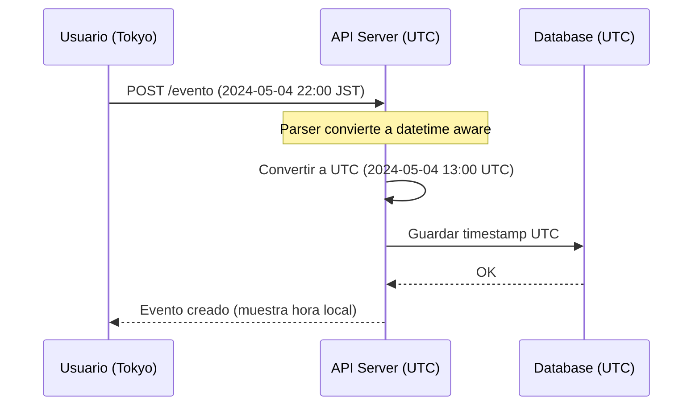
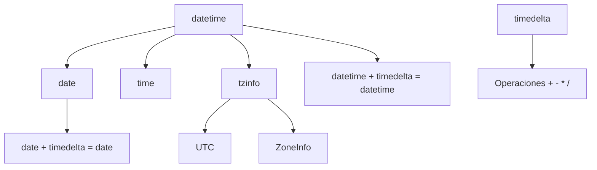

# 📅 Datetime y Calendar

El tiempo es la dimensión más crítica en sistemas distribuidos y en machine learning. En backend, manejar zonas horarias incorrectamente puede causar race conditions en bases de datos, expiraciones de JWT prematuras o inconsistencias en logs. En ML, las series temporales requieren timestamping preciso para evitar data leakage, y los pipelines de entrenamiento necesitan scheduling robusto. Este módulo explora `datetime`, `calendar`, `time` y las estrategias para trabajar con conciencia temporal en Python.


## 1. El Módulo `datetime`: Objetos de Tiempo

El módulo `datetime` define cinco clases principales. Comprender sus diferencias es esencial para evitar errores de tipo (por ejemplo, comparar un `date` con un `datetime`).

| Clase | Representa | Atributos Principales | Uso Típico |
|-------|------------|----------------------|------------|
| `date` | Fecha (año, mes, día) | year, month, day | Cumpleaños, fechas de vencimiento |
| `time` | Hora del día | hour, minute, second, microsecond | Horarios de apertura, alarmas |
| `datetime` | Fecha + Hora | Combina date + time | Timestamps de eventos |
| `timedelta` | Duración | days, seconds, microseconds | Cálculos de diferencias |
| `tzinfo` | Zona horaria | offset, dst, tzname | Normalización temporal |

```python
from datetime import date, time, datetime, timedelta

hoy = date.today()
print(f"Fecha: {hoy} (tipo: {type(hoy).__name__})")

ahora = datetime.now()
print(f"Datetime: {ahora} (tipo: {type(ahora).__name__})")

duracion = timedelta(days=5, hours=3)
print(f"En 5 días y 3 horas: {ahora + duracion}")
```

⚠️ **Advertencia:** `datetime.now()` sin argumentos devuelve un objeto **naive** (sin información de zona horaria). En sistemas distribuidos, un timestamp naive es una bomba de tiempo. Siempre que sea posible, trabaja con objetos **aware**.


## 2. Zonas Horarias: Naive vs Aware

Un objeto `datetime` es **naive** si no tiene `tzinfo`. Es **aware** si sí lo tiene. La regla de oro en backend es: *nunca mezcles naive con aware*.

### 2.1. Usando `timezone` y UTC

Python 3.2+ incluye `datetime.timezone`. Para UTC, se recomienda usar `datetime.timezone.utc`.

```python
from datetime import datetime, timezone

utc_now = datetime.now(timezone.utc)
print(f"UTC Aware: {utc_now}")
print(f"Offset: {utc_now.tzinfo}")

# Crear una zona horaria personalizada
from datetime import timedelta
gmt_minus_3 = timezone(timedelta(hours=-3))
buenos_aires = utc_now.astimezone(gmt_minus_3)
print(f"Buenos Aires: {buenos_aires}")
```

Caso real: Caso real: Un sistema de trading algorítmico recibe órdenes de múltiples bolsas (Nueva York, Londres, Tokio). Almacenar todos los timestamps en UTC y convertir a la zona horaria local del usuario solo en la capa de presentación evita errores de sincronización de un millón de dólares.


### 2.2. Mención a `pytz` y `zoneinfo`

Para zonas horarias complejas (horario de verano, cambios históricos), `datetime.timezone` es insuficiente. La biblioteca estándar de Python 3.9+ incluye `zoneinfo`, que usa la base de datos IANA (tz database).

```python
try:
    from zoneinfo import ZoneInfo
except ImportError:
    from backports.zoneinfo import ZoneInfo  # Para Python < 3.9

from datetime import datetime

ny_time = datetime.now(ZoneInfo("America/New_York"))
print(f"Nueva York: {ny_time}")
print(f"¿DST activo?: {ny_time.dst() is not None and ny_time.dst().seconds > 0}")
```

💡 **Tip:** Si tu proyecto corre en Python < 3.9 y necesitas zonas horarias, `pytz` era el estándar, pero tiene comportamientos no intuitivos con `localize` y `normalize`. Prefiere `dateutil.tz` o instala `backports.zoneinfo`.


## 3. Formateo y Parsing: `strftime` y `strptime`

La interoperabilidad entre sistemas requiere convertir objetos `datetime` a cadenas y viceversa. `strftime` (string format time) formatea; `strptime` (string parse time) analiza.

| Directiva | Significado | Ejemplo |
|-----------|-------------|---------|
| `%Y` | Año con siglo | 2024 |
| `%m` | Mes (01-12) | 05 |
| `%d` | Día del mes (01-31) | 04 |
| `%H` | Hora (24h, 00-23) | 14 |
| `%M` | Minuto (00-59) | 30 |
| `%S` | Segundo (00-59) | 00 |
| `%z` | Offset UTC | +0000 |
| `%Z` | Nombre de zona horaria | UTC |
| `%f` | Microsegundos | 000123 |

```python
from datetime import datetime

ahora = datetime.now()
iso_str = ahora.strftime("%Y-%m-%d %H:%M:%S")
print(f"Formateado: {iso_str}")

parsed = datetime.strptime("2024-12-25 08:00:00", "%Y-%m-%d %H:%M:%S")
print(f"Parseado: {parsed}")
```

⚠️ **Advertencia:** `strptime` no valida que la fecha sea real por defecto. Por ejemplo, `datetime.strptime("2024-02-30", "%Y-%m-%d")` lanzará `ValueError`, pero errores de formato silenciosos pueden ocurrir si omites directivas críticas como `%z` en sistemas distribuidos.


### 3.1. Parsing Inteligente con `dateutil.parser`

Para entradas de usuario o logs con formatos inconsistentes, `dateutil.parser.parse` es más flexible que `strptime`. Nota: `dateutil` no es stdlib pura, pero es dependencia de `pandas` y está disponible en casi todos los entornos de datos.

```python
from dateutil import parser

cadenas = ["2024/05/04", "May 4, 2024", "04-05-2024 14:30"]
for c in cadenas:
    print(f"'{c}' -> {parser.parse(c)}")
```

Caso real: Caso real: Un pipeline de ETL procesa logs de múltiples servidores backend donde cada uno usa un formato de fecha diferente. En lugar de mantener decenas de máscaras `strptime`, `dateutil.parser` normaliza todos los timestamps a objetos `datetime` en una sola pasada.


## 4. El Módulo `calendar`: Navegación del Calendario Gregoriano

`calendar` complementa `datetime` con operaciones de alto nivel sobre el calendario.

| Función | Descripción |
|---------|-------------|
| `calendar.month(year, month)` | Retorna un string con el calendario del mes |
| `calendar.calendar(year)` | Retorna el calendario completo del año |
| `calendar.isleap(year)` | ¿Es año bisiesto? |
| `calendar.monthrange(year, month)` | Tupla (día_semana_primer_día, num_días) |
| `calendar.weekday(year, month, day)` | Día de la semana (0=lunes) |

```python
import calendar

print(calendar.month(2024, 5))
print(f"¿2024 es bisiesto? {calendar.isleap(2024)}")
primer_dia, num_dias = calendar.monthrange(2024, 5)
print(f"Mayo 2024 empieza en {calendar.day_name[primer_dia]} y tiene {num_dias} días")
```

Caso real: Caso real: Un sistema de reportes backend genera automáticamente dashboards mensuales. Usa `calendar.monthrange` para saber cuántos días tiene el mes actual y `calendar.weekday` para alinear correctamente las columnas de la tabla de métricas semanales.


## 5. Comparaciones, Diferencias y Sleep

### 5.1. Operaciones con `timedelta`

`timedelta` soporta suma, resta, multiplicación por escalares y división. Es inmutable y hashable (puede usarse como clave de diccionario).

```python
from datetime import datetime, timedelta

t1 = datetime(2024, 5, 4, 12, 0)
t2 = datetime(2024, 5, 5, 14, 30)
diff = t2 - t1
print(f"Diferencia: {diff}")
print(f"En segundos: {diff.total_seconds()}")
```

### 5.2. El Módulo `time`: Pausas y Timestamps

- `time.sleep(seconds)`: Pausa la ejecución. Acepta floats para precisión de microsegundos.
- `time.time()`: Timestamp en segundos desde la época (Unix epoch). Es un float.
- `time.perf_counter()`: Contador de alto rendimiento para benchmarking.

```python
import time

inicio = time.perf_counter()
time.sleep(0.1)
fin = time.perf_counter()
print(f"Transcurrido: {fin - inicio:.6f} segundos")
```

💡 **Tip:** Nunca uses `time.time()` para medir duraciones de procesos. Depende del reloj del sistema, que puede ajustarse por NTP. Usa `time.perf_counter()` o `time.monotonic()` para benchmarks y timeouts.


## 6. Diagrama: Pipeline de Zonas Horarias




## 7. Diagrama: Jerarquía de Objetos de Tiempo




📦 **Código de Compresión**

Este utilitario convierte entre múltiples zonas horarias, calcula diferencias y genera un reporte en formato ISO. Es útil para normalizar logs en pipelines de ML o para el manejo de sesiones en backend.

```python
from datetime import datetime, timezone, timedelta
try:
    from zoneinfo import ZoneInfo
except ImportError:
    ZoneInfo = None

def convertir_zonas(fecha_str: str, fmt: str = "%Y-%m-%d %H:%M", zonas=None):
    """Convierte una fecha naive a múltiples zonas horarias."""
    zonas = zonas or ["UTC", "America/New_York", "Europe/Madrid", "Asia/Tokyo"]
    dt = datetime.strptime(fecha_str, fmt)
    dt = dt.replace(tzinfo=timezone.utc)  # Asumimos entrada en UTC

    resultado = {"origen": fecha_str, "conversiones": {}}
    for zona in zonas:
        if zona == "UTC":
            local = dt
        elif ZoneInfo:
            local = dt.astimezone(ZoneInfo(zona))
        else:
            continue
        resultado["conversiones"][zona] = local.isoformat()
    return resultado

ahora_utc = datetime.now(timezone.utc).strftime("%Y-%m-%d %H:%M")
reporte = convertir_zonas(ahora_utc)
for zona, iso in reporte["conversiones"].items():
    print(f"{zona:<20}: {iso}")

# Cálculo de TTL
expiracion = datetime.now(timezone.utc) + timedelta(hours=24)
print(f"\nJWT expira en: {expiracion.isoformat()}")
```
