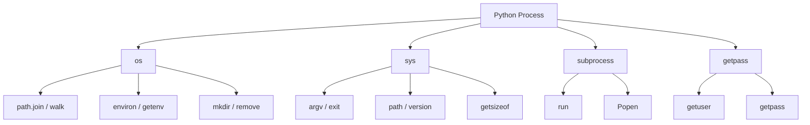
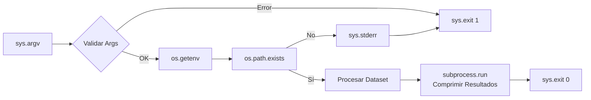

# ⚙️ Os y Sys

La interacción con el sistema operativo es inevitable en cualquier aplicación real. En backend, necesitas leer variables de entorno para configuraciones seguras, manipular rutas de archivos de forma portable y ejecutar procesos externos. En ML, los datasets residen en disco, los modelos se guardan en rutas dinámicas y los logs se escriben en sistemas de archivos. Los módulos `os` y `sys` son la interfaz de Python con el mundo exterior: el primero habla con el SO, el segundo con el intérprete.


## 1. El Módulo `os`: Interfaz del Sistema Operativo

### 1.1. Variables de Entorno

Las variables de entorno son el mecanismo estándar para inyectar configuración sin hardcodear secrets en el código. `os.environ` es un diccionario-like que contiene el entorno del proceso.

| Función | Descripción | Uso Seguro |
|---------|-------------|------------|
| `os.environ['KEY']` | Acceso directo, lanza KeyError si no existe | Solo si es obligatoria |
| `os.getenv('KEY')` | Devuelve None si no existe | Configuraciones opcionales |
| `os.getenv('KEY', default)` | Devuelve default si no existe | Valores por defecto seguros |

```python
import os

# Acceso seguro con default
db_host = os.getenv("DB_HOST", "localhost")
db_port = int(os.getenv("DB_PORT", "5432"))

# Acceso obligatorio (falla rápido si falta)
api_secret = os.environ["API_SECRET_KEY"]
print(f"Conectando a {db_host}:{db_port}")
```

⚠️ **Advertencia:** Nunca commitees archivos `.env` o scripts con `os.environ` impresos en logs. Un `print(os.environ)` accidental puede filtrar `AWS_SECRET_ACCESS_KEY`, `DATABASE_URL` y tokens privados a sistemas de logging centralizado.


### 1.2. Manipulación Portable de Rutas con `os.path`

Aunque `pathlib` (disponible desde Python 3.4) es más moderno y orientado a objetos, `os.path` sigue siendo omnipresente en bases de código legacy y scripts de despliegue.

| Función | Descripción | Ejemplo |
|---------|-------------|---------|
| `os.path.join(a, b)` | Une rutas con el separador correcto | `join('data', 'train.csv')` |
| `os.path.exists(path)` | ¿Existe la ruta? | True/False |
| `os.path.isfile(path)` | ¿Es un archivo? | True/False |
| `os.path.isdir(path)` | ¿Es un directorio? | True/False |
| `os.path.basename(path)` | Nombre del archivo/dir | `'train.csv'` |
| `os.path.dirname(path)` | Directorio contenedor | `'/home/user/data'` |
| `os.path.splitext(path)` | Separa (raíz, extensión) | `('file', '.txt')` |
| `os.path.abspath(path)` | Ruta absoluta | `/home/user/file.txt` |

```python
import os

ruta = os.path.join("datasets", "images", "train", "cat_001.jpg")
print(f"Base: {os.path.basename(ruta)}")
print(f"Dir: {os.path.dirname(ruta)}")
print(f"Ext: {os.path.splitext(ruta)[1]}")
print(f"Abs: {os.path.abspath(ruta)}")
```

Caso real: Caso real: Un pipeline de ML debe funcionar tanto en Windows de un investigador como en Linux de un servidor de producción. Usar `os.path.join` garantiza que las rutas a los datasets usen `\` o `/` según corresponda, evitando el clásico error de rutas rotas al migrar código.


### 1.3. Operaciones de Directorio y Archivo

| Función | Descripción |
|---------|-------------|
| `os.mkdir(path)` | Crea un directorio (error si existe o falta padre) |
| `os.makedirs(path, exist_ok=True)` | Crea directorios recursivamente |
| `os.remove(path)` | Elimina un archivo |
| `os.rename(src, dst)` | Renombra/mueve archivo o directorio |
| `os.listdir(path)` | Lista contenido de un directorio |
| `os.walk(path)` | Recorre árbol de directorios (generador) |
| `os.sep` | Separador de rutas del SO (`/` o `\\`) |

```python
import os

# Escanear dataset recursivamente
for root, dirs, files in os.walk("./datasets"):
    nivel = root.replace("./datasets", "").count(os.sep)
    indent = " " * 2 * nivel
    print(f"{indent}{os.path.basename(root)}/")
    subindent = " " * 2 * (nivel + 1)
    for f in files:
        print(f"{subindent}{f}")
```

💡 **Tip:** `os.walk` es un generador; no carga todo el árbol en memoria. Para datasets con millones de archivos (como en visión por computadora), esto evita un `MemoryError` que sí ocurriría con una lista masiva.


## 2. El Módulo `sys`: El Intérprete como Entorno

### 2.1. Argumentos y Entrada/Salida

| Atributo/Función | Descripción |
|------------------|-------------|
| `sys.argv` | Lista de argumentos de línea de comandos |
| `sys.stdin` | Flujo de entrada estándar |
| `sys.stdout` | Flujo de salida estándar |
| `sys.stderr` | Flujo de error estándar |
| `sys.exit(code)` | Termina el programa (0=éxito, 1=error) |

```python
import sys

if len(sys.argv) < 2:
    print("Uso: python script.py <ruta_del_dataset>", file=sys.stderr)
    sys.exit(1)

dataset_path = sys.argv[1]
print(f"Procesando: {dataset_path}", file=sys.stdout)
```

Caso real: Caso real: Un script de entrenamiento de ML ejecutado en un cluster de Kubernetes recibe la ruta del dataset y el número de épocas vía `sys.argv`. La orquestación del cluster inyecta estos parámetros dinámicamente en cada pod, permitiendo paralelizar experimentos con diferentes configuraciones.


### 2.2. Información del Entorno de Ejecución

| Atributo | Descripción | Uso |
|----------|-------------|-----|
| `sys.path` | Lista de rutas para importación de módulos | Añadir rutas a proyectos locales |
| `sys.version` | String de versión de Python | Verificar compatibilidad |
| `sys.platform` | Identificador del SO | `'win32'`, `'linux'`, `'darwin'` |
| `sys.getsizeof(obj)` | Tamaño en bytes de un objeto | Debugging de memoria |
| `sys.setrecursionlimit(n)` | Límite de recursión | Árboles profundos |
| `sys.byteorder` | `'little'` o `'big'` | Serialización binaria |
| `sys.builtin_module_names` | Tupla de módulos built-in | Introspección |

```python
import sys

print(f"Python: {sys.version}")
print(f"Plataforma: {sys.platform}")
print(f"Tamaño de lista vacía: {sys.getsizeof([])} bytes")
print(f"Recursión límite: {sys.getrecursionlimit()}")

# Añadir ruta local al path (útil en notebooks)
sys.path.append("./src")
```

⚠️ **Advertencia:** Modificar `sys.path` en tiempo de ejecución puede generar comportamientos impredecibles si existen módulos con nombres duplicados en diferentes rutas. Prefiere instalar tu proyecto en modo editable (`pip install -e .`) en lugar de mutar `sys.path` en producción.


## 3. Seguridad con `getpass`

Leer contraseñas o tokens por consola sin mostrar caracteres en pantalla es una práctica básica de seguridad.

```python
import getpass

usuario = getpass.getuser()  # Usuario del sistema operativo
password = getpass.getpass("Introduce tu API Key: ")
print(f"Autenticando como {usuario}...")
```

Caso real: Caso real: Un script de despliegue backend solicita la contraseña de la base de datos mediante `getpass.getpass` en lugar de `input()`, evitando que la contraseña quede visible en la pantalla durante una demostración en vivo o quede almacenada en el historial de la terminal.


## 4. Subprocesos con `subprocess`

Ejecutar comandos del sistema es necesario para orquestar herramientas externas (compiladores, utilidades de línea de comandos, scripts de shell).

| Función/Clase | Uso | Bloquea? |
|---------------|-----|----------|
| `subprocess.run(args, ...)` | Comando simple, captura output | Sí (por defecto) |
| `subprocess.call(args, ...)` | Ejecuta, retorna código de salida | Sí |
| `subprocess.Popen(args, ...)` | Control total del proceso | No (asíncrono) |

```python
import subprocess

# Ejecución simple con captura
result = subprocess.run(
    ["python", "--version"],
    capture_output=True,
    text=True,
    check=True
)
print(f"Versión: {result.stdout.strip()}")

# Comando con error controlado
try:
    subprocess.run(["ls", "no_existe"], check=True)
except subprocess.CalledProcessError as e:
    print(f"Error: {e}")
```

⚠️ **Advertencia:** Nunca uses `shell=True` con entradas de usuario no sanitizadas. `subprocess.run(f"rm -rf {user_input}", shell=True)` es una vulnerabilidad de inyección de comandos catastrófica. Pasa listas de argumentos en su lugar.


## 5. Diagrama: Jerarquía de Sistema Operativo




## 6. Diagrama: Flujo de un Script CLI




📦 **Código de Compresión**

Este script integra `os`, `sys`, `getpass` y `subprocess` en una utilidad de preparación de entorno. Verifica la existencia de un directorio de datos, lee configuración del entorno, autentica al usuario y ejecuta un comando de verificación del sistema.

```python
import os
import sys
import getpass
import subprocess

def preparar_entorno(dataset_dir: str = "./data") -> dict:
    """Prepara el entorno de ejecución verificando rutas y recursos."""
    reporte = {
        "usuario": getpass.getuser(),
        "python_version": sys.version.split()[0],
        "plataforma": sys.platform,
        "dataset_dir": os.path.abspath(dataset_dir),
        "dataset_existe": os.path.isdir(dataset_dir),
        "db_host": os.getenv("DB_HOST", "localhost"),
    }

    if not reporte["dataset_existe"]:
        print(f"⚠️ Creando directorio: {reporte['dataset_dir']}", file=sys.stderr)
        os.makedirs(reporte["dataset_dir"], exist_ok=True)

    # Verificar espacio en disco con subprocess (comando depende de SO)
    if sys.platform == "win32":
        cmd = ["wmic", "logicaldisk", "get", "size,freespace,caption"]
    else:
        cmd = ["df", "-h", reporte["dataset_dir"]]

    try:
        res = subprocess.run(cmd, capture_output=True, text=True, check=False)
        reporte["disco_info"] = res.stdout.strip().splitlines()[0:2]
    except Exception as e:
        reporte["disco_info"] = str(e)

    return reporte

if __name__ == "__main__":
    directorio = sys.argv[1] if len(sys.argv) > 1 else "./data"
    info = preparar_entorno(directorio)
    for k, v in info.items():
        print(f"{k:<20}: {v}")
```
