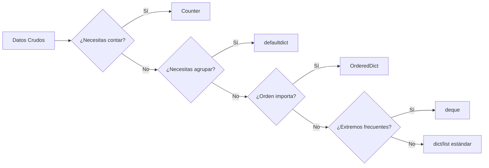

# 🗃️ Collections e Itertools

La eficiencia de un sistema de backend o un pipeline de ML no se mide solo por la complejidad algorítmica de sus modelos, sino por cómo maneja sus estructuras de datos intermedias. Seleccionar el contenedor adecuado puede reducir la complejidad temporal de O(n²) a O(n), y usar iteradores en lugar de listas puede reducir el consumo de memoria de gigabytes a megabytes. Los módulos `collections` e `itertools` son el cajón de herramientas avanzado de la stdlib para estas tareas.


## 1. El Módulo `collections`: Estructuras Especializadas

### 1.1. `Counter`: Conteo de Frecuencias Optimizado

`Counter` es un diccionario donde los valores son enteros representando conteos. Su constructor es O(n) y está implementado en C.

```python
from collections import Counter

dataset_labels = ["cat", "dog", "cat", "bird", "dog", "cat"]
frecuencias = Counter(dataset_labels)
print(frecuencias)                    # Counter({'cat': 3, 'dog': 2, 'bird': 1})
print(frecuencias.most_common(2))     # [('cat', 3), ('dog', 2)]
```

Caso real: Caso real: En un problema de clasificación de imágenes médicas, un dataset presenta 90% de imágenes sanas y 10% con patología. Usar `Counter` sobre las etiquetas revela instantáneamente el desbalanceo de clases, disparando la necesidad de técnicas como oversampling o class weights antes de entrenar.


### 1.2. `defaultdict`: Diccionarios con Fábrica de Defaults

Elimina la necesidad de verificar `if key in dict` antes de agregar elementos. La factory function se invoca solo cuando la clave no existe.

| Factory | Uso Típico |
|---------|------------|
| `list` | Agrupar elementos por categoría |
| `set`  | Eliminar duplicados por categoría |
| `int`  | Conteos simples (alternativa a Counter) |
| `dict` | Diccionarios anidados |

```python
from collections import defaultdict

# Agrupar transacciones por usuario
ventas = [
    ("alice", 100), ("bob", 50), ("alice", 200), ("bob", 75)
]
por_usuario = defaultdict(list)
for usuario, monto in ventas:
    por_usuario[usuario].append(monto)

print(dict(por_usuario))
# {'alice': [100, 200], 'bob': [50, 75]}
```

💡 **Tip:** Si necesitas un diccionario de diccionarios de listas, usa `defaultdict(lambda: defaultdict(list))`. Esto es extremadamente útil para construir índices invertidos de texto o agrupaciones multidimensionales de features.


### 1.3. `OrderedDict` y `deque`

- **`OrderedDict`**: Mantiene el orden de insercción. En Python 3.7+, los diccionarios estándar ya preservan orden, pero `OrderedDict` sigue siendo útil por métodos como `move_to_end` y `popitem(last=False)`.
- **`deque`**: Double-ended queue. Operaciones O(1) en ambos extremos, frente a O(n) de `list.pop(0)`.

```python
from collections import deque

# Ventana deslizante de tamaño fijo (común en series temporales)
ventana = deque(maxlen=3)
for val in [10, 20, 30, 40, 50]:
    ventana.append(val)
    print(list(ventana))
# [10, 20, 30]
# [20, 30, 40]
# [30, 40, 50]
```

⚠️ **Advertencia:** Aunque `deque` es O(1) en extremos, el acceso por índice en el medio es O(n). No la uses como reemplazo directo de `list` si necesitas acceso aleatorio frecuente (`ventana[5000]` será lento).


### 1.4. `namedtuple` y `ChainMap`

- **`namedtuple`**: Crea subclasses de tuple con campos nombrados. Inmutable, ligera y autodocumentada.
- **`ChainMap`**: Agrupa múltiples diccionarios en una sola vista sin copiar datos. Útil para scopes de configuración.

```python
from collections import namedtuple, ChainMap

# Registro de punto de datos
Punto = namedtuple("Punto", ["x", "y", "label"])
p = Punto(1.0, 2.0, "positivo")
print(p.x, p.label)  # Acceso por nombre

# Configuración con fallback
defaults = {"lr": 0.01, "epochs": 10}
user_cfg = {"lr": 0.001}
config = ChainMap(user_cfg, defaults)
print(config["lr"])      # 0.001 (del usuario)
print(config["epochs"])  # 10 (fallback)
```

Caso real: Caso real: Un framework de backend procesa headers HTTP, variables de entorno y archivos de configuración. Usa `ChainMap` para crear una vista unificada donde los headers tienen mayor prioridad que el archivo `.env`, que a su vez tiene mayor prioridad que los defaults del código.


## 2. El Módulo `itertools`: Álgebra de Iteradores

`itertools` funciona bajo una filosofía de "evaluación perezosa" (lazy evaluation). Devuelve iteradores, no listas, lo que permite trabajar con secuencias infinitas o combinaciones masivas sin agotar la RAM.

### 2.1. Iteradores Infinitos

| Función | Descripción |
|---------|-------------|
| `count(start, step)` | Contador infinito |
| `cycle(iterable)` | Repite el iterable indefinidamente |
| `repeat(elem[, n])` | Repite un elemento n veces (o infinito) |

```python
from itertools import count, cycle, repeat, islice

# Generar IDs secuenciales infinitos
for i in islice(count(start=1000, step=10), 5):
    print(i)  # 1000, 1010, 1020, 1030, 1040

# Ciclo de batches para entrenamiento
estaciones = ["primavera", "verano", "otoño", "invierno"]
for estacion in islice(cycle(estaciones), 6):
    print(estacion)
```


### 2.2. Iteradores de Combinatoria y Agrupación

| Función | Descripción | Complejidad |
|---------|-------------|-------------|
| `accumulate(iterable)` | Suma acumulativa (o función binaria) | O(n) |
| `chain(*iterables)` | Concatena iterables | O(1) por elemento |
| `compress(data, selectors)` | Filtra data según selectors booleanos | O(n) |
| `dropwhile(pred, iterable)` | Descarta elementos mientras pred es True | O(n) |
| `takewhile(pred, iterable)` | Toma elementos mientras pred es True | O(n) |
| `filterfalse(pred, iterable)` | Inverso de filter | O(n) |
| `groupby(iterable, key)` | Agrupa elementos consecutivos iguales | O(n) |
| `islice(iterable, start, stop, step)` | Slicing sin materializar | O(1) |
| `starmap(func, iterable)` | Aplica func a tuplas desempaquetadas | O(n) |
| `tee(iterable, n)` | Replica un iterador en n independientes | O(n) memoria |
| `permutations(iterable, r)` | Permutaciones de tamaño r | O(n!/(n-r)!) |
| `combinations(iterable, r)` | Combinaciones de tamaño r | O(n!/(r!(n-r)!)) |
| `product(*iterables, repeat)` | Producto cartesiano | O(n^m) |

```python
from itertools import combinations, permutations, product, groupby

# Grid Search simplificado para hiperparámetros
hiperparametros = {
    "lr": [0.1, 0.01, 0.001],
    "batch_size": [16, 32]
}
grid = product(hiperparametros["lr"], hiperparametros["batch_size"])
print(f"Total combinaciones: {sum(1 for _ in grid)}")  # 6

# Combinaciones de features
features = ["f1", "f2", "f3", "f4"]
for combo in combinations(features, 2):
    print(combo)
# ('f1', 'f2'), ('f1', 'f3'), ...
```

Caso real: Caso real: Un motor de recomendación backend necesita generar todos los pares de usuarios en una sala de chat para evaluar similitud. Usar `itertools.combinations(usuarios, 2)` evita la duplicación simétrica que ocurriría con dos bucles anidados, reduciendo el trabajo a la mitad.


## 3. Comparativa: Estructuras de `collections` vs Built-ins

| Estructura | Built-in Alternativo | Ventaja Clave | Desventaja |
|------------|----------------------|---------------|------------|
| `Counter` | `dict` manual | Métodos como `most_common()`, aritmética | Solo valores enteros |
| `defaultdict` | `dict` con `get()` | Factory automática, código más limpio | Requiere importación |
| `deque` | `list` | O(1) en ambos extremos | O(n) acceso medio |
| `OrderedDict` | `dict` (Py3.7+) | `move_to_end`, orden explícito | Mayor overhead de memoria |
| `namedtuple` | `tuple` | Acceso por nombre, inmutabilidad | No se pueden modificar campos |
| `ChainMap` | `{**d1, **d2}` (copia) | Vista sin copia, scopes dinámicos | Búsqueda más lenta en cadenas largas |


## 4. Diagrama: Flujo de Datos con Collections




## 5. Diagrama: Iteradores de Combinatoria

```mermaid
graph TD
    A[Set de n elementos] --> B{Operación}
    B -->|Orden importa, sin repetición| C[permutations<br/>n!/(n-r)!]
    B -->|Orden no importa, sin repetición| D[combinations<br/>n!/(r!(n-r)!))]
    B -->|Con repetición| E[product<br/>n^r]
    B -->|Secuencias infinitas| F[count / cycle / repeat]
```


📦 **Código de Compresión**

Este script integra `Counter`, `defaultdict`, `deque` e `itertools` en un analizador de frecuencias de palabras con ventana deslizante y generación de combinaciones de términos frecuentes.

```python
from collections import Counter, defaultdict, deque
from itertools import combinations, islice, chain

def analizar_texto(texto: str, n_gram: int = 2, top_n: int = 5):
    palabras = texto.lower().split()
    frecuencias = Counter(palabras)

    # Ventana deslizante de bigramas
    ventana = deque(maxlen=n_gram)
    bigramas = defaultdict(int)
    for palabra in palabras:
        ventana.append(palabra)
        if len(ventana) == n_gram:
            bigramas[tuple(ventana)] += 1

    # Top palabras y combinaciones de ellas
    top_palabras = [p for p, _ in frecuencias.most_common(top_n)]
    combos = list(combinations(top_palabras, 2))

    return {
        "total_palabras": len(palabras),
        "unicas": len(frecuencias),
        "top_frecuencias": frecuencias.most_common(top_n),
        "bigramas_top": Counter(bigramas).most_common(3),
        "combinaciones_top": combos
    }

texto = """
machine learning backend python machine learning
backend collections itertools backend python
python machine learning collections
"""

res = analizar_texto(texto)
for k, v in res.items():
    print(f"{k:<20}: {v}")
```
