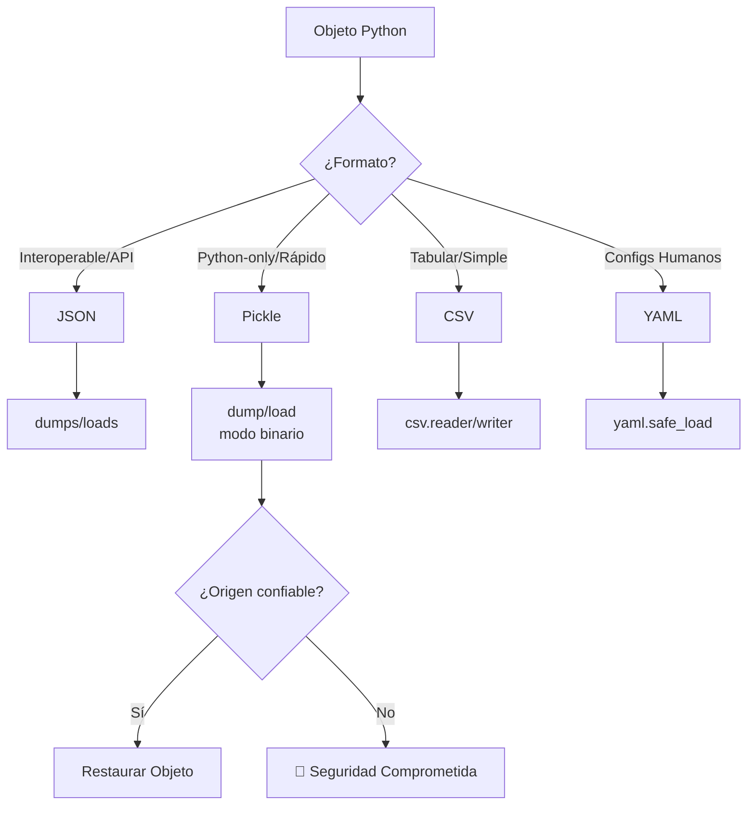

# 🗂️ Json y Pickle

La serialización es el acto de traducir estructuras de datos o estados de objetos a un formato que puede almacenarse o transmitirse y reconstruirse posteriormente. En backend, JSON es el lenguaje franco de las APIs REST y los sistemas de mensajería. En ML, la necesidad de guardar modelos, configuraciones y datasets intermedios exige comprender las fortalezas y debilidades de cada formato. Este módulo profundiza en `json`, `pickle`, `shelve` y compara su aplicabilidad frente a CSV y YAML.


## 1. El Módulo `json`: Serialización Textual Universal

JSON (JavaScript Object Notation) es un estándar RFC 8259. Python lo soporta nativamente mediante el módulo `json`. Su principal limitación es que solo soporta un subconjunto de tipos nativos.

### 1.1. Codificación y Decodificación Básica

| Función | Descripción | Tipo de entrada/salida |
|---------|-------------|------------------------|
| `json.dump(obj, fp)` | Serializa a un archivo-like | file pointer |
| `json.dumps(obj)` | Serializa a string | str |
| `json.load(fp)` | Deserializa desde archivo-like | file pointer |
| `json.loads(s)` | Deserializa desde string | str |

```python
import json

config = {
    "modelo": "resnet50",
    "epochs": 100,
    "batch_size": 32,
    "optimizer": {"tipo": "adam", "lr": 0.001}
}

# A string (útil para APIs)
json_str = json.dumps(config, indent=2)
print(json_str)

# Desde string
config_recuperada = json.loads(json_str)
assert config == config_recuperada
```

⚠️ **Advertencia:** `json.dumps` no preserva el orden de las claves por defecto en versiones antiguas de Python. Usa `sort_keys=True` para salidas deterministas (útil para hashing de configuraciones) o confía en el orden de inserción de Python 3.7+.


### 1.2. Formato y Legibilidad

Los parámetros `indent`, `separators` y `sort_keys` controlan la salida.

```python
import json

data = {"z": 1, "a": 2, "nested": {"b": 3, "a": 1}}

compacto = json.dumps(data, separators=(',', ':'))
legible = json.dumps(data, indent=2, sort_keys=True)

print(f"Compacto ({len(compacto)} chars): {compacto}")
print(f"Legible ({len(legible)} chars):\n{legible}")
```

💡 **Tip:** En producción backend, envía JSON compacto (`separators=(',', ':')`) para reducir el ancho de banda. En logs o archivos de configuración, usa `indent=2` para facilitar el `diff` en control de versiones.


## 2. Manejo de Tipos No Serializables

JSON nativamente solo soporta: `str`, `int`, `float`, `bool`, `None`, `list`, `dict`.

### 2.1. Custom Encoder con `default`

El parámetro `default` de `json.dumps` recibe una función que transforma objetos no serializables en algo que sí lo sea.

```python
import json
from datetime import datetime

def custom_encoder(obj):
    if isinstance(obj, datetime):
        return obj.isoformat()
    if isinstance(obj, set):
        return list(obj)
    raise TypeError(f"Objeto no serializable: {type(obj)}")

evento = {
    "nombre": "entrenamiento",
    "timestamp": datetime.now(),
    "tags": {"ml", "production"}
}

json_str = json.dumps(evento, default=custom_encoder, indent=2)
print(json_str)
```

Caso real: Caso real: Un sistema de logging estructurado en backend recibe eventos con campos `datetime` y `UUID`. Sin un `default` encoder personalizado, el servicio lanzaría `TypeError` al intentar serializar el payload para enviarlo a Elasticsearch o Kafka.


### 2.2. Custom Decoder con `object_hook`

`object_hook` permite interceptar cada dict parseado y transformarlo en un objeto de dominio.

```python
import json
from datetime import datetime

def custom_decoder(dct):
    if "timestamp" in dct:
        dct["timestamp"] = datetime.fromisoformat(dct["timestamp"])
    return dct

json_str = '{"evento": "train", "timestamp": "2024-05-04T14:30:00"}'
data = json.loads(json_str, object_hook=custom_decoder)
print(type(data["timestamp"]))  # <class 'datetime.datetime'>
```


## 3. El Módulo `pickle`: Serialización Binaria de Objetos Python

`pickle` puede serializar casi cualquier objeto Python: funciones, clases, instancias, grafos cíclicos. Sin embargo, su formato es específico de Python y potencialmente peligroso.

### 3.1. Uso Básico y Protocolos

```python
import pickle

class ModelConfig:
    def __init__(self, lr, epochs):
        self.lr = lr
        self.epochs = epochs
        self.history = []

config = ModelConfig(0.01, 100)
config.history.append((1, 0.5))

# Serializar (protocolo 5 es el más reciente y eficiente)
with open("config.pkl", "wb") as f:
    pickle.dump(config, f, protocol=pickle.HIGHEST_PROTOCOL)

# Deserializar
with open("config.pkl", "rb") as f:
    config_restaurada = pickle.load(f)

print(config_restaurada.lr)       # 0.01
print(config_restaurada.history)  # [(1, 0.5)]
```

⚠️ **Advertencia:** NUNCA deserialices (`pickle.load`) datos de fuentes no confiadas. Un archivo `.pkl` malicioso puede ejecutar código arbitrario durante el unpickling, comprometiendo todo el sistema. Esta es la regla de oro de `pickle`. En APIs públicas o archivos descargados de internet, usa `json` en su lugar.


### 3.2. Comparativa de Protocolos Pickle

| Protocolo | Python Mínimo | Características |
|-----------|---------------|-----------------|
| 0 | Cualquiera | Texto, legible, lento |
| 1 | Cualquiera | Binario, compatible |
| 2 | 2.3 | Mejor manejo de clases nuevas |
| 3 | 3.0 | Soporte para bytes |
| 4 | 3.4 | Objetos grandes, eficiencia |
| 5 | 3.8 | Out-of-band buffers (zero-copy) |


## 4. El Módulo `shelve`: Diccionarios Persistentes

`shelve` es una capa sobre `dbm` y `pickle` que expone un diccionario cuyos valores se almacenan en disco.

```python
import shelve

with shelve.open("cache.db") as db:
    db["modelo_v1"] = {"accuracy": 0.92, "params": 1_000_000}
    db["modelo_v2"] = {"accuracy": 0.95, "params": 5_000_000}

with shelve.open("cache.db") as db:
    print(db["modelo_v2"])
```

💡 **Tip:** Las claves de `shelve` deben ser strings. Los valores pueden ser cualquier objeto pickleable. Es ideal para caché local de resultados de entrenamiento entre ejecuciones de scripts.


## 5. Tabla Comparativa: JSON vs Pickle vs CSV vs YAML

| Característica | JSON | Pickle | CSV | YAML |
|----------------|------|--------|-----|------|
| Formato | Texto | Binario | Texto | Texto |
| Legible por humanos | ✅ Sí | ❌ No | ✅ Sí | ✅ Sí |
| Legible por otros lenguajes | ✅ Sí | ❌ No | ✅ Sí | ✅ Sí |
| Tipos complejos Python | ❌ Limitado | ✅ Completo | ❌ Muy limitado | ⚠️ Parcial |
| Seguridad (untrusted data) | ✅ Seguro | ❌ Peligroso | ✅ Seguro | ⚠️ Cuidado* |
| Velocidad de lectura | ⚡ Rápido | 🚀 Muy rápido | ⚡ Rápido | 🐢 Lento |
| Tamaño de salida | Medio | Compacto | Medio | Grande |
| Uso en APIs REST | ✅ Estándar | ❌ Nunca | ❌ No | ❌ No |
| Uso en ML (modelos) | ⚠️ Configs | ✅ Checkpoints | ❌ No | ⚠️ Configs |

*YAML puede ejecutar código si se usa el loader inseguro (`yaml.load` sin especificar `Loader`).


## 6. Diagrama: Flujo de Serialización




📦 **Código de Compresión**

Este script integra `json` y `pickle` en un sistema de checkpointing híbrido. Guarda metadatos en JSON (legibles y seguros) y el estado completo del objeto en Pickle (solo si el usuario lo solicita explícitamente).

```python
import json
import pickle
import os
from datetime import datetime

class CheckpointManager:
    def __init__(self, directorio: str = "./checkpoints"):
        self.dir = directorio
        os.makedirs(directorio, exist_ok=True)

    def guardar(self, nombre: str, estado: dict, usar_pickle: bool = False):
        ruta_base = os.path.join(self.dir, nombre)
        meta = {
            "nombre": nombre,
            "timestamp": datetime.now().isoformat(),
            "modo": "pickle" if usar_pickle else "json",
            "claves": list(estado.keys())
        }

        with open(f"{ruta_base}.meta.json", "w") as f:
            json.dump(meta, f, indent=2)

        if usar_pickle:
            with open(f"{ruta_base}.pkl", "wb") as f:
                pickle.dump(estado, f, protocol=5)
        else:
            with open(f"{ruta_base}.json", "w") as f:
                json.dump(estado, f, indent=2, default=str)

    def cargar_meta(self, nombre: str) -> dict:
        with open(os.path.join(self.dir, f"{nombre}.meta.json")) as f:
            return json.load(f)

# Uso
cp = CheckpointManager()
cp.guardar("experimento_01", {"lr": 0.01, "epochs": 10})
cp.guardar("experimento_02", {"modelo": object(), "pesos": [0.1, 0.2]}, usar_pickle=True)

print(cp.cargar_meta("experimento_01"))
print(cp.cargar_meta("experimento_02"))
```
