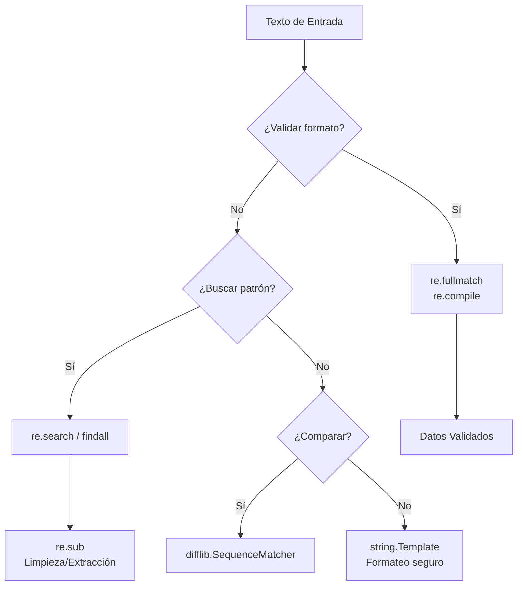
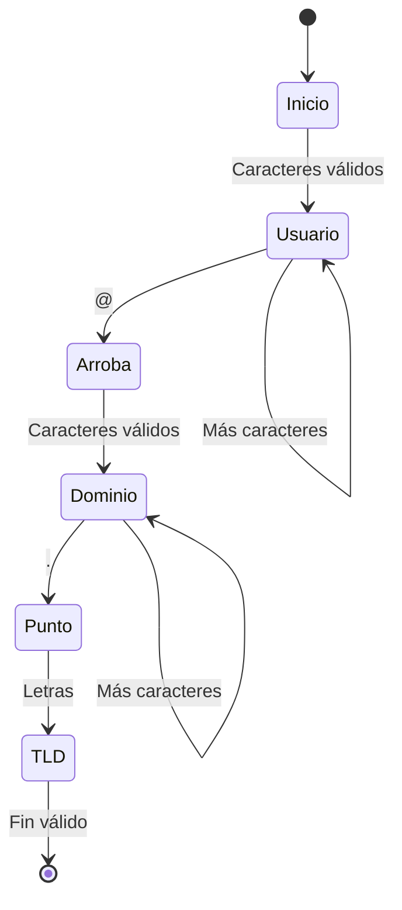

# 🔍 Re y String

El procesamiento de texto es una disciplina transversal. En backend, se requiere para validar entradas de usuario, parsear logs y sanitizar datos antes de persistirlos. En ML, es la etapa previa a cualquier modelo de NLP: tokenización, extracción de entidades y limpieza de corpus. El módulo `re` proporciona expresiones regulares con rendimiento cercano a C, mientras que `string` y `difflib` ofrecen utilidades de formateo y comparación que complementan el arsenal de un ingeniero.


## 1. El Módulo `re`: Expresiones Regulares en Profundidad

Las expresiones regulares son un lenguaje formal para describir patrones de texto. Python las implementa mediante un motor de backtracking PCRE-like. Dominarlas implica entender no solo la sintaxis, sino también la optimización.

### 1.1. Compilación para Rendimiento

Si un patrón se usa múltiples veces, `re.compile` es obligatorio. Crea un objeto de patrón reutilizable, evitando la recompilación en cada búsqueda.

```python
import re

# Compilar una vez, buscar muchas veces
patron_email = re.compile(r"^[\w.-]+@[\w.-]+\.\w+$")

emails = ["user@example.com", "bad-email", "admin@site.co.uk"]
for e in emails:
    if patron_email.match(e):
        print(f"✅ {e}")
    else:
        print(f"❌ {e}")
```

💡 **Tip:** `re.compile` también permite especificar flags como `re.IGNORECASE`, `re.MULTILINE` y `re.DOTALL` una sola vez, haciendo el código más limpio.


### 1.2. Match vs Search vs Findall vs Fullmatch

La elección del método de búsqueda determina tanto la corrección como el rendimiento.

| Método | ¿Dónde busca? | ¿Qué retorna? | Uso Correcto |
|--------|---------------|---------------|--------------|
| `match()` | Solo al inicio del string | Match o None | Validar prefijos |
| `search()` | En cualquier parte del string | Primer Match o None | Buscar primera ocurrencia |
| `findall()` | En cualquier parte | Lista de strings coincidentes | Extraer todos los matches |
| `finditer()` | En cualquier parte | Iterador de objetos Match | Matches con contexto |
| `fullmatch()` | Todo el string debe coincidir | Match o None | Validación estricta |

```python
import re

texto = "Error: 404 en https://example.com/page"

print(re.search(r"\d+", texto).group())        # 404
print(re.findall(r"\b\w{4}\b", texto))         # ['Error', '404', 'https', 'page']
print(re.match(r"Error", texto).group())        # Error
print(re.fullmatch(r"Error: \d+", texto))      # None (no cubre todo)
```

⚠️ **Advertencia:** `re.match` no busca en todo el string. Muchos desarrolladores nuevos en Python confunden `match` con `search`, lo que lleva a bugs donde patrones válidos en medio del texto no son detectados.


### 1.3. Grupos Nombrados y Backreferences

Los grupos capturan subexpresiones. Los grupos nombrados `(?P<name>...)` mejoran la legibilidad y el mantenimiento.

```python
import re

log = "2024-05-04 14:30:00 - ERROR - Conexión fallida"
patron = re.compile(
    r"(?P<fecha>\d{4}-\d{2}-\d{2})\s+"
    r"(?P<hora>\d{2}:\d{2}:\d{2})\s+-\s+"
    r"(?P<nivel>\w+)\s+-\s+"
    r"(?P<mensaje>.+)"
)

m = patron.match(log)
if m:
    print(m.group("nivel"))     # ERROR
    print(m.group("mensaje"))   # Conexión fallida
    print(m.groupdict())        # {'fecha': '2024-05-04', ...}
```

Las backreferences permiten referirse a grupos previos dentro del mismo patrón.

```python
# Detectar palabras dobles (e.g., "the the")
texto = "Este es es un error común."
print(re.search(r"\b(\w+)\s+\1\b", texto, re.IGNORECASE).group())  # es es
```

Caso real: Caso real: Un sistema de backend procesa millones de líneas de logs de un proxy inverso. Usar grupos nombrados en una expresión regular compilada permite extraer IP, método HTTP, status code y ruta en una sola pasada, generando un diccionario estructurado por línea sin necesidad de parsers complejos.


### 1.4. Sustitución Avanzada y `re.VERBOSE`

`re.sub` acepta una función como reemplazo, permitiendo lógica arbitraria por match.

```python
import re

def enmascarar_email(m):
    usuario = m.group("usuario")
    dominio = m.group("dominio")
    return f"{usuario[0]}***@{dominio}"

texto = "Contacto: admin@example.com o user@site.org"
patron = re.compile(r"(?P<usuario>\w+)@(?P<dominio>\w+\.\w+)")
resultado = patron.sub(enmascarar_email, texto)
print(resultado)  # Contacto: a***@example.com o u***@site.org
```

`re.VERBOSE` (o `re.X`) permite escribir regex multilínea con comentarios, crítico para mantenimiento.

```python
patron_fecha = re.compile(r"""
    (?P<dia>\d{2})      # Día (01-31)
    /                   # Separador
    (?P<mes>\d{2})      # Mes (01-12)
    /                   # Separador
    (?P<anio>\d{4})     # Año (ej: 2024)
""", re.VERBOSE)

print(patron_fecha.match("04/05/2024").groupdict())
```


## 2. El Módulo `string`: Constantes y Plantillas

### 2.1. Constantes Útiles

```python
import string

print(string.ascii_letters)   # abcdefghijklmnopqrstuvwxyzABCDEFGHIJKLMNOPQRSTUVWXYZ
print(string.digits)          # 0123456789
print(string.punctuation)     # !"#$%&'()*+,-./:;<=>?@[\]^_`{|}~
print(string.whitespace)      # \t\n\r\x0b\x0c
```

Caso real: Caso real: Un generador de contraseñas para usuarios de un backend combina `string.ascii_letters`, `string.digits` y `string.punctuation` con `secrets.choice` para crear strings aleatorios que cumplen políticas de complejidad sin hardcodear caracteres.


### 2.2. Templates Seguros

`string.Template` es una alternativa más segura que f-strings cuando la plantilla proviene del usuario, ya que no ejecuta código arbitrario.

```python
from string import Template

t = Template("Hola $nombre, tu código es $codigo")
resultado = t.substitute(nombre="Alice", codigo="XYZ123")
print(resultado)
```


## 3. El Módulo `difflib`: Comparación de Secuencias

`difflib` implementa el algoritmo de Ratcliff/Obershelp para encontrar similitudes entre secuencias.

| Función/Clase | Descripción |
|---------------|-------------|
| `SequenceMatcher` | Compara dos secuencias y calcula ratio de similitud |
| `get_close_matches(word, possibilities, n, cutoff)` | Encuentra las n mejores coincidencias |

```python
from difflib import SequenceMatcher, get_close_matches

s1 = "machine learning backend"
s2 = "machine learnig backend"

ratio = SequenceMatcher(None, s1, s2).ratio()
print(f"Similitud: {ratio:.2%}")

opciones = ["collections", "itertools", "functools", "math"]
print(get_close_matches("itertool", opciones, n=2, cutoff=0.6))
# ['itertools']
```

Caso real: Caso real: Un sistema de búsqueda de documentación técnica usa `get_close_matches` para sugerir el término correcto cuando un desarrollador escribe "itertool" en lugar de "itertools", mejorando la experiencia de usuario en la CLI de ayuda.


## 4. Diagrama: Flujo de Procesamiento de Texto




## 5. Diagrama: Autómata de Validación de Email




📦 **Código de Compresión**

Este script integra `re`, `string` y `difflib` en una utilidad de validación y limpieza de texto. Valida emails, normaliza puntuación y encuentra términos similares en un vocabulario.

```python
import re
import string
from difflib import get_close_matches

def validar_email(email: str) -> bool:
    patron = re.compile(r"^[\w.-]+@[\w.-]+\.\w+$")
    return bool(patron.fullmatch(email))

def limpiar_texto(texto: str) -> str:
    # Eliminar puntuación excepto espacios
    translator = str.maketrans('', '', string.punctuation)
    return texto.translate(translator).lower().strip()

def sugerir_termino(termino: str, vocabulario: list, cutoff: float = 0.7):
    matches = get_close_matches(termino, vocabulario, n=3, cutoff=cutoff)
    return matches

vocabulario = ["machine", "learning", "backend", "python", "collections", "itertools"]

emails = ["user@example.com", "invalido@com", "admin@site.org"]
for e in emails:
    print(f"{'✅' if validar_email(e) else '❌'} {e}")

print(f"\nLimpio: '{limpiar_texto('¡Hola, Mundo!!!')}')")
print(f"Sugerencias para 'lerning': {sugerir_termino('lerning', vocabulario)}")
```
