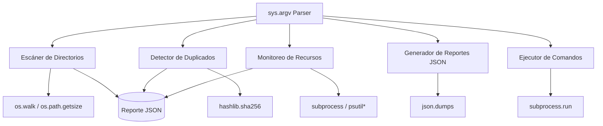

# 🛠️ Caso Práctico: Utilidades de Sistema

Este módulo culmina con un proyecto integrador que consolida los conocimientos de `os`, `sys`, `json`, `hashlib` (complemento natural de `os`), `subprocess` y `datetime` en una suite CLI de utilidades de sistema. El objetivo es construir una herramienta real que un ML Engineer o Backend Developer pueda usar para auditar datasets, limpiar duplicados y monitorear recursos.


## 1. Requisitos del Proyecto

La suite debe cumplir los siguientes requisitos funcionales y no funcionales:

| ID | Requisito | Tipo | Prioridad |
|----|-----------|------|-----------|
| R1 | Escanear un directorio y reportar tamaños de archivos | Funcional | Alta |
| R2 | Encontrar archivos duplicados por hash criptográfico | Funcional | Alta |
| R3 | Monitorear uso de disco y memoria del sistema | Funcional | Media |
| R4 | Generar reporte estructurado en JSON | Funcional | Alta |
| R5 | Ejecutar comandos del sistema de forma segura | Funcional | Media |
| R6 | Interfaz CLI con argumentos (`sys.argv`) | No funcional | Alta |
| R7 | Tiempo de ejecución medible por operación | No funcional | Media |
| R8 | Compatible con Windows y Linux | No funcional | Alta |

Caso real: Caso real: Un equipo de MLOps necesita limpiar periódicamente el servidor de entrenamiento, donde científicos de datos suben datasets sin control. La suite escanea `/data/datasets`, detecta duplicados que consumen terabytes, genera un reporte JSON para el auditor y comprime los archivos únicos antes del backup nocturno.


## 2. Arquitectura del Sistema

El diseño sigue un modelo modular con separación de responsabilidades. Cada funcionalidad es una función independiente que puede ser importada o ejecutada vía CLI.




## 3. Módulo 1: Escáner de Directorios

Este módulo recorre un árbol de directorios y calcula el tamaño total y por subdirectorio.

```python
import os
from datetime import datetime

def escanear_directorio(ruta: str):
    """Escanear recursivamente y reportar tamaños."""
    reporte = {
        "ruta": os.path.abspath(ruta),
        "timestamp": datetime.now().isoformat(),
        "archivos": [],
        "total_bytes": 0
    }

    if not os.path.isdir(ruta):
        raise ValueError(f"La ruta no existe o no es directorio: {ruta}")

    for root, _, files in os.walk(ruta):
        for f in files:
            ruta_completa = os.path.join(root, f)
            try:
                tamaño = os.path.getsize(ruta_completa)
                reporte["archivos"].append({
                    "ruta": ruta_completa,
                    "tamaño": tamaño,
                    "extensión": os.path.splitext(f)[1]
                })
                reporte["total_bytes"] += tamaño
            except OSError:
                continue  # Archivos bloqueados o enlaces rotos

    return reporte
```

💡 **Tip:** Usar `os.path.getsize` dentro de `os.walk` es eficiente porque no requiere cargar el archivo en memoria. Sin embargo, para sistemas de archivos de red (NFS), las llamadas sí pueden ser lentas debido a la latencia.


## 4. Módulo 2: Detector de Duplicados por Hash

Calcular el hash SHA-256 de cada archivo permite identificar duplicados con precisión absoluta (a diferencia de comparar nombres o tamaños, que pueden coincidir por casualidad).

| Estrategia | Precisión | Velocidad | Uso Recomendado |
|------------|-----------|-----------|-----------------|
| Comparar nombres | Baja | Muy rápida | Descarte inicial |
| Comparar tamaños | Media | Muy rápida | Pre-filtro |
| Hash parcial (primer 1KB) | Alta | Rápida | Archivos grandes |
| Hash completo (SHA-256) | Total | Lenta | Verificación final |

```python
import hashlib
import os
from collections import defaultdict

def calcular_hash(ruta: str, bloque: int = 8192) -> str:
    """Calcula SHA-256 de un archivo sin cargarlo completo en RAM."""
    sha = hashlib.sha256()
    with open(ruta, "rb") as f:
        while chunk := f.read(bloque):
            sha.update(chunk)
    return sha.hexdigest()

def encontrar_duplicados(ruta: str):
    """Encuentra archivos duplicados agrupados por hash."""
    hashes = defaultdict(list)

    for root, _, files in os.walk(ruta):
        for f in files:
            ruta_completa = os.path.join(root, f)
            try:
                h = calcular_hash(ruta_completa)
                hashes[h].append(ruta_completa)
            except OSError:
                continue

    # Filtrar solo los que tienen duplicados
    return {h: paths for h, paths in hashes.items() if len(paths) > 1}
```

⚠️ **Advertencia:** Calcular el hash completo de millones de archivos grandes puede saturar el disco. En un entorno de producción, implementa una fase de pre-filtro por tamaño: solo calcula el hash de archivos que compartan el mismo `os.path.getsize`.


## 5. Módulo 3: Monitoreo de Recursos

Usamos `subprocess` para obtener información del sistema sin depender de librerías de terceros como `psutil`.

```python
import subprocess
import sys

def uso_disco(ruta: str = ".") -> dict:
    """Reporta uso de disco. Compatible con Linux y Windows."""
    if sys.platform == "win32":
        cmd = ["wmic", "logicaldisk", "get", "size,freespace,caption", "/format:csv"]
    else:
        cmd = ["df", "-h", ruta]

    res = subprocess.run(cmd, capture_output=True, text=True)
    return {
        "comando": " ".join(cmd),
        "salida": res.stdout.strip().splitlines()[:5],  # Primeras líneas
        "codigo": res.returncode
    }

def uso_memoria() -> dict:
    """Reporta uso de memoria (Linux-only nativo; Windows requiere PowerShell)."""
    if sys.platform == "linux":
        res = subprocess.run(["free", "-m"], capture_output=True, text=True)
        return {"salida": res.stdout.strip().splitlines()}
    return {"salida": ["Memoria: consulta no implementada para este SO"]}
```

Caso real: Caso real: Un script de monitoreo ejecutado cada hora por cron en un servidor de ML guarda la salida de `uso_disco` en un log JSON. Cuando el espacio libre cae bajo un umbral, dispara una alerta a Slack vía webhook, evitando que el disco se llene durante un entrenamiento de modelo de gran escala.


## 6. Módulo 4: Generador de Reporte JSON

Consolida todos los módulos en un único documento estructurado.

```python
import json
from datetime import datetime

def generar_reporte(ruta: str, salida: str = "reporte_sistema.json") -> str:
    """Genera un reporte completo del sistema en JSON."""
    reporte = {
        "meta": {
            "generado_en": datetime.now().isoformat(),
            "version_script": "1.0.0",
            "directorio_analizado": os.path.abspath(ruta)
        },
        "escaneo": escanear_directorio(ruta),
        "duplicados": encontrar_duplicados(ruta),
        "sistema": {
            "disco": uso_disco(ruta),
            "memoria": uso_memoria()
        }
    }

    with open(salida, "w", encoding="utf-8") as f:
        json.dump(reporte, f, indent=2, ensure_ascii=False)

    return salida
```


## 7. Módulo 5: Ejecutor de Comandos del Sistema

Wrapper seguro alrededor de `subprocess.run`.

```python
import subprocess

def ejecutar_comando(comando: list[str], timeout: int = 30) -> dict:
    """Ejecuta un comando de forma segura sin shell=True."""
    try:
        res = subprocess.run(
            comando,
            capture_output=True,
            text=True,
            timeout=timeout,
            check=False
        )
        return {
            "comando": comando,
            "returncode": res.returncode,
            "stdout": res.stdout.strip(),
            "stderr": res.stderr.strip(),
            "exitoso": res.returncode == 0
        }
    except subprocess.TimeoutExpired:
        return {"comando": comando, "error": "Timeout", "exitoso": False}
    except FileNotFoundError:
        return {"comando": comando, "error": "Comando no encontrado", "exitoso": False}
```

⚠️ **Advertencia:** Aunque evitamos `shell=True`, asegúrate de que `comando` sea una lista y no una string concatenada. Nunca pases input de usuario directamente a esta función sin validar previamente que los elementos pertenecen a una lista blanca de comandos permitidos.


## 8. Métricas de Rendimiento

| Métrica | Objetivo | Cómo Medirla |
|---------|----------|--------------|
| Tiempo de escaneo | < 1 min para 10,000 archivos | `time.perf_counter()` |
| Precisión de duplicados | 100% (sin falsos positivos) | Validación manual muestral |
| Memoria máxima | < 100 MB para 1M archivos | `sys.getsizeof` del dict de hashes |
| Portabilidad | 100% Windows/Linux | CI/CD en ambas plataformas |


## 9. 🎯 Proyecto Completo: `sysutils.py`

A continuación se presenta el código completo y autocontenido de la suite. Puedes guardarlo como `sysutils.py` y ejecutarlo desde la terminal.

```python
#!/usr/bin/env python3
"""
SysUtils - Suite de Utilidades de Sistema
Autor: Curso Python Completo
Requisitos: Python 3.8+
"""

import os
import sys
import json
import hashlib
import time
import subprocess
from datetime import datetime
from collections import defaultdict


class SysUtils:
    def __init__(self, directorio: str):
        self.directorio = os.path.abspath(directorio)
        self.resultados = {}

    def escanear(self) -> dict:
        inicio = time.perf_counter()
        reporte = {
            "ruta": self.directorio,
            "archivos": [],
            "total_bytes": 0
        }
        for root, _, files in os.walk(self.directorio):
            for f in files:
                ruta = os.path.join(root, f)
                try:
                    tamaño = os.path.getsize(ruta)
                    reporte["archivos"].append({
                        "ruta": ruta,
                        "tamaño": tamaño,
                        "ext": os.path.splitext(f)[1]
                    })
                    reporte["total_bytes"] += tamaño
                except OSError:
                    continue
        reporte["tiempo_seg"] = round(time.perf_counter() - inicio, 3)
        self.resultados["escaneo"] = reporte
        return reporte

    def duplicados(self) -> dict:
        inicio = time.perf_counter()
        hashes = defaultdict(list)
        for root, _, files in os.walk(self.directorio):
            for f in files:
                ruta = os.path.join(root, f)
                try:
                    h = self._hash_archivo(ruta)
                    hashes[h].append(ruta)
                except OSError:
                    continue
        dups = {h: p for h, p in hashes.items() if len(p) > 1}
        self.resultados["duplicados"] = {
            "grupos": len(dups),
            "archivos_duplicados": sum(len(v) for v in dups.values()),
            "detalle": dups,
            "tiempo_seg": round(time.perf_counter() - inicio, 3)
        }
        return self.resultados["duplicados"]

    @staticmethod
    def _hash_archivo(ruta: str) -> str:
        sha = hashlib.sha256()
        with open(ruta, "rb") as f:
            while chunk := f.read(8192):
                sha.update(chunk)
        return sha.hexdigest()

    def recursos(self) -> dict:
        info = {"disco": None, "memoria": None}
        if sys.platform == "win32":
            cmd_disco = ["wmic", "logicaldisk", "get", "caption,freespace,size", "/format:csv"]
        else:
            cmd_disco = ["df", "-h", self.directorio]
        try:
            r = subprocess.run(cmd_disco, capture_output=True, text=True, check=False)
            info["disco"] = r.stdout.strip().splitlines()[:10]
        except Exception as e:
            info["disco"] = str(e)

        if sys.platform == "linux":
            try:
                r = subprocess.run(["free", "-m"], capture_output=True, text=True, check=False)
                info["memoria"] = r.stdout.strip().splitlines()
            except Exception as e:
                info["memoria"] = str(e)
        else:
            info["memoria"] = ["Memoria no implementada para este SO"]

        self.resultados["recursos"] = info
        return info

    def exportar_json(self, salida: str = "reporte_sysutils.json"):
        reporte = {
            "meta": {
                "timestamp": datetime.now().isoformat(),
                "version": "1.0.0",
                "python": sys.version,
                "plataforma": sys.platform
            },
            "resultados": self.resultados
        }
        with open(salida, "w", encoding="utf-8") as f:
            json.dump(reporte, f, indent=2, ensure_ascii=False)
        print(f"📄 Reporte guardado en: {os.path.abspath(salida)}")


def main():
    if len(sys.argv) < 2:
        print("Uso: python sysutils.py <directorio_a_escanear>")
        sys.exit(1)

    directorio = sys.argv[1]
    if not os.path.isdir(directorio):
        print(f"❌ Error: {directorio} no es un directorio válido.")
        sys.exit(1)

    print(f"🔍 Iniciando escaneo de: {directorio}")
    utils = SysUtils(directorio)

    print("📂 Escaneando archivos...")
    escaneo = utils.escanear()
    print(f"   Archivos: {len(escaneo['archivos'])}, Total: {escaneo['total_bytes']} bytes")

    print("🔎 Buscando duplicados...")
    dups = utils.duplicados()
    print(f"   Grupos duplicados: {dups['grupos']}, Archivos afectados: {dups['archivos_duplicados']}")

    print("💻 Recolectando recursos del sistema...")
    utils.recursos()

    utils.exportar_json()
    print("✅ Proceso completado.")


if __name__ == "__main__":
    main()
```


## 10. Cómo Ejecutar y Extender

```bash
# Ejecución básica
python sysutils.py ./datasets

# Verificación del reporte
cat reporte_sysutils.json | python -m json.tool
```

Extensiones sugeridas para práctica adicional:
- Integrar [[04 - Collections e Itertools]] para usar `Counter` sobre las extensiones de archivo.
- Añadir [[01 - Math y Random]] para calcular estadísticas de tamaño (media, mediana).
- Implementar filtrado por fecha usando [[02 - Datetime y Calendar]] para ignorar archivos antiguos.
- Exportar también a CSV como práctica de manejo de formatos alternativos.


📦 **Código de Compresión**

El código de compresión para esta nota es el proyecto completo `sysutils.py` ya presentado en la sección 9. Ejecútalo directamente para obtener un reporte completo de cualquier directorio de tu sistema.
