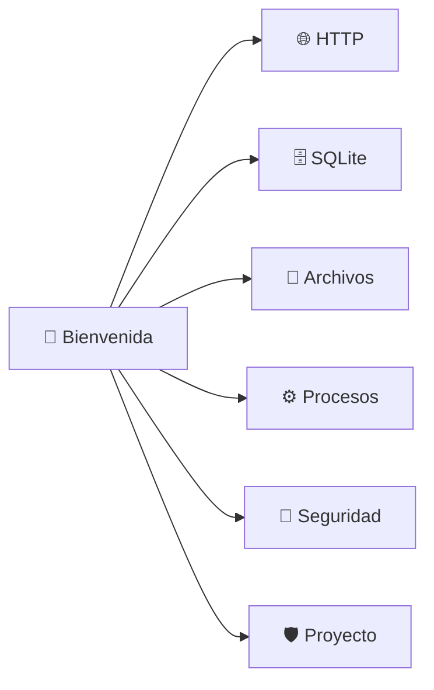
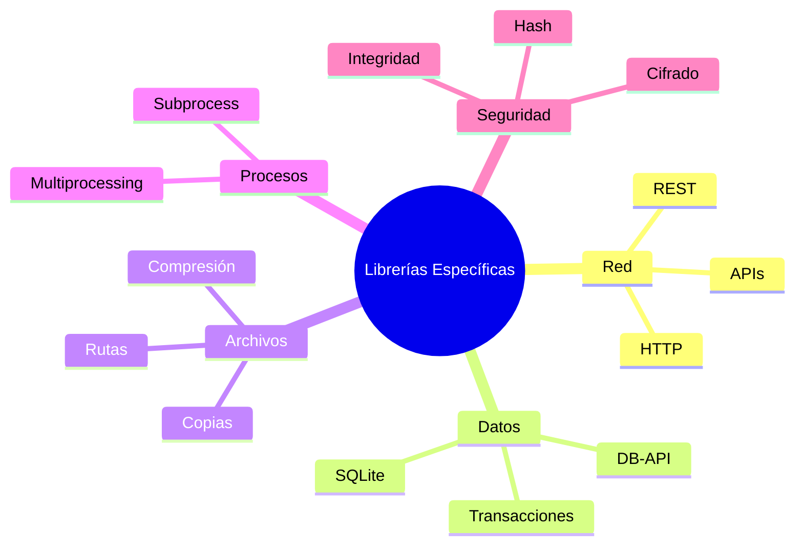

# 🚀 Bienvenida a Librerías Específicas

En el ecosistema de ML/AI Engineering y Backend, no basta con dominar algoritmos y frameworks de deep learning. Es imprescindible saber cómo Python interactúa con el mundo exterior: consumir APIs para obtener datasets, persistir resultados en bases de datos, manipular archivos de modelos, ejecutar procesos externos y garantizar la seguridad de los artefactos generados.

Este módulo profundiza en librerías específicas de la stdlib y de terceros que constituyen la infraestructura de cualquier solución productiva.


## 1. Propósito de este módulo

El objetivo es dominar herramientas de propósito específico que permiten:

1. Comunicación HTTP robusta con [[01 - Requests y Http Client]].
2. Persistencia local con bases de datos embebidas en [[02 - Sqlite3 y DB API]].
3. Gestión avanzada de archivos y rutas en [[03 - Pathlib y shutil]].
4. Ejecución de procesos y paralelización en [[04 - Subprocess y Multiprocessing]].
5. Seguridad e integridad de datos en [[05 - Cryptography y Hashlib]].
6. Integración de todo lo anterior en un proyecto real en [[06 - Caso Practico - Herramienta de Backup Seguro]].



## 2. Glosario

| Término | Definición |
|---|---|
| **requests** | Librería de terceros para realizar peticiones HTTP de forma sencilla. |
| **HTTP** | Protocolo de transferencia de hipertexto; base de la comunicación web. |
| **REST** | Estilo arquitectónico para diseñar servicios web basados en recursos y verbos HTTP. |
| **sqlite** | Motor de base de datos relacional embebido, serverless y de dominio público. |
| **pathlib** | Módulo stdlib que ofrece clases orientadas a objetos para manipular rutas. |
| **shutil** | Módulo stdlib con operaciones de alto nivel sobre archivos y colecciones. |
| **subprocess** | Módulo stdlib para ejecutar comandos del sistema operativo desde Python. |
| **multiprocessing** | Módulo stdlib para la creación de procesos y paralelización real (bypass GIL). |
| **cryptography** | Librería de terceros para primitivas criptográficas y cifrado de alto nivel. |
| **hashlib** | Módulo stdlib que implementa algoritmos de hash seguros (SHA, BLAKE2, etc.). |
| **hash** | Función unidireccional que genera un resumen de longitud fija a partir de datos. |
| **encriptación** | Proceso de transformar datos legibles en un formato ilegible para proteger su confidencialidad. |

## 3. Estructura del curso

El flujo didáctico está diseñado para ir de lo fundamental a lo integrador:

| # | Nota | Enfoque |
|---|---|---|
| 00 | [[00 - Bienvenida]] | Contexto, glosario y objetivos. |
| 01 | [[01 - Requests y Http Client]] | Comunicación de red y APIs REST. |
| 02 | [[02 - Sqlite3 y DB API]] | Persistencia estructurada y transaccional. |
| 03 | [[03 - Pathlib y shutil]] | Abstracción del sistema de archivos. |
| 04 | [[04 - Subprocess y Multiprocessing]] | Concurrencia y ejecución de procesos. |
| 05 | [[05 - Cryptography y Hashlib]] | Seguridad, hashing y cifrado. |
| 06 | [[06 - Caso Practico - Herramienta de Backup Seguro]] | Proyecto integrador con métricas. |

## 4. Objetivos de aprendizaje

Al finalizar este módulo serás capaz de:

1. Diseñar clientes HTTP reutilizables con manejo de autenticación y errores.
2. Modelar esquemas relacionales completos en SQLite con transacciones ACID.
3. Construir utilidades multiplataforma para organizar, copiar y archivar archivos.
4. Paralelizar tareas CPU-bound usando pools de procesos y mecanismos de sincronización.
5. Verificar la integridad de datasets y cifrar artefactos sensibles antes de su almacenamiento.
6. Desarrollar una herramienta CLI de backup seguro que integre compresión, hashing y cifrado.

Caso real: Un equipo de MLOps necesita una pipeline automatizada que descargue datos desde una API REST, los almacene en SQLite local, procese logs en paralelo, genere hashes de verificación para los modelos entrenados y finalmente archive todo en un backup cifrado antes del despliegue.

⚠️ **Advertencia:** Muchas de estas herramientas interactúan directamente con el sistema operativo, la red y los datos sensibles. Siempre valida entradas, maneja excepciones y nunca expongas credenciales en repositorios públicos.

💡 **Tip:** Mantén un entorno virtual por proyecto. Librerías como `requests`, `cryptography` y posibles drivers de base de datos deben versionarse de forma aislada para evitar conflictos.



## 5. Aplicaciones en ML/AI Engineering y Backend

En ML/AI Engineering, estas librerías se utilizan para:

- Ingesta de datos desde APIs de terceros (OpenAI, Hugging Face, Kaggle).
- Almacenamiento de metadatos de experimentos (hiperparámetros, métricas, artefactos).
- Manipulación de grandes volúmenes de archivos de modelos (`.pt`, `.pkl`, `.onnx`).
- Ejecución de pipelines de entrenamiento distribuidos o con GPU.
- Protección de modelos propietarios mediante cifrado y firmas de integridad.

En Backend, son esenciales para:

- Comunicación entre microservicios (REST/gRPC).
- Bases de datos embebidas para configuraciones o cachés locales.
- Gestión de archivos estáticos, logs y backups.
- Ejecución de workers y tareas en segundo plano.
- Cumplimiento de normativas de seguridad y privacidad.

📦 **Código de compresión**

```python
import zipfile
import pathlib

def comprimir_modulo(origen: pathlib.Path, destino: pathlib.Path):
    with zipfile.ZipFile(destino, 'w', zipfile.ZIP_DEFLATED) as zf:
        for archivo in origen.rglob('*.md'):
            zf.write(archivo, archivo.relative_to(origen))
    print(f"✅ Módulo comprimido en: {destino}")

if __name__ == '__main__':
    raiz = pathlib.Path(__file__).parent
    comprimir_modulo(raiz, raiz / '05_librerias_especificas.zip')
```
