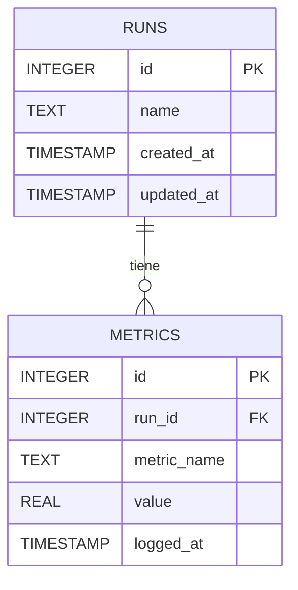

# 🗄️ SQLite3 y DB API

La persistencia estructurada es un pilar tanto en backends ligeros como en pipelines de ML que necesitan trazabilidad. SQLite, al ser serverless y embebido, es la elección predilecta para prototipos, tests y aplicaciones de escritorio que requieren SQL sin la sobrecarga de un motor cliente-servidor.


## 1. DB-API 2.0 en profundidad

La especificación PEP 249 define una interfaz uniforme para bases de datos en Python. Los objetos centrales son:

- **Connection:** Representa la conexión a la base de datos.
- **Cursor:** Objeto para ejecutar sentencias SQL y recuperar resultados.
- **commit() / rollback():** Control transaccional explícito.
- **close():** Liberación de recursos.

```python
import sqlite3

with sqlite3.connect('experiments.db') as conn:
    cursor = conn.cursor()
    cursor.execute('CREATE TABLE IF NOT EXISTS runs (id INTEGER PRIMARY KEY, name TEXT)')
    conn.commit()
```

## 2. Tipos, constraints y esquemas avanzados

SQLite utiliza afinidad de tipos: `INTEGER`, `REAL`, `TEXT`, `BLOB`, `NUMERIC`.

```sql
CREATE TABLE IF NOT EXISTS metrics (
    id INTEGER PRIMARY KEY AUTOINCREMENT,
    run_id INTEGER NOT NULL,
    metric_name TEXT NOT NULL CHECK(length(metric_name) > 0),
    value REAL NOT NULL,
    logged_at TIMESTAMP DEFAULT CURRENT_TIMESTAMP,
    FOREIGN KEY (run_id) REFERENCES runs(id) ON DELETE CASCADE
);
```

Caso real: Un framework de ML local almacena hiperparámetros y métricas de cada epoch en tablas relacionales con constraints CHECK para evitar valores negativos en métricas de pérdida.

## 3. Vistas y Triggers

Las **vistas** encapsulan consultas complejas. Los **triggers** automatizan acciones ante eventos DML.

```sql
CREATE VIEW v_run_summary AS
SELECT r.id, r.name, COUNT(m.id) as total_metrics
FROM runs r
LEFT JOIN metrics m ON r.id = m.run_id
GROUP BY r.id;

CREATE TRIGGER trg_after_metric_insert
AFTER INSERT ON metrics
BEGIN
    UPDATE runs SET updated_at = CURRENT_TIMESTAMP WHERE id = NEW.run_id;
END;
```

## 4. Transacciones ACID y WAL mode

SQLite garantiza Atomicidad, Consistencia, Aislamiento y Durabilidad. Por defecto usa el journal en modo DELETE. El modo **WAL (Write-Ahead Logging)** permite lecturas concurrentes mientras se escribe.

```python
with sqlite3.connect('experiments.db') as conn:
    conn.execute('PRAGMA journal_mode=WAL;')
    conn.execute('BEGIN TRANSACTION;')
    try:
        conn.execute('INSERT INTO runs (name) VALUES (?)', ('exp_001',))
        conn.execute('INSERT INTO metrics (run_id, metric_name, value) VALUES (?, ?, ?)',
                     (1, 'accuracy', 0.95))
        conn.commit()
    except Exception:
        conn.rollback()
        raise
```

## 5. sqlite3.Row, adaptadores y convertidores

`sqlite3.Row` permite acceso por nombre de columna.

```python
conn.row_factory = sqlite3.Row
row = conn.execute('SELECT * FROM runs WHERE id = 1').fetchone()
print(row['name'])  # exp_001
```

Los **adapters** convierten tipos Python a SQL; los **converters** hacen lo inverso.

```python
import json

def adapt_dict(d):
    return json.dumps(d)

def convert_dict(s):
    return json.loads(s)

sqlite3.register_adapter(dict, adapt_dict)
sqlite3.register_converter('JSON', convert_dict)
```

## 6. Ejecutar scripts SQL desde archivo

```python
with open('schema.sql', 'r', encoding='utf-8') as f:
    script = f.read()
with sqlite3.connect('experiments.db') as conn:
    conn.executescript(script)
```

## 7. Backup online con iterdump

`iterdump()` genera un script SQL con toda la base de datos, ideal para backups incrementales o migraciones.

```python
with sqlite3.connect('experiments.db') as conn:
    with open('backup.sql', 'w', encoding='utf-8') as f:
        for line in conn.iterdump():
            f.write(f'{line}\n')
```

## 8. Comparativa SQLite vs PostgreSQL vs MySQL

| Característica | SQLite | PostgreSQL | MySQL |
|---|---|---|---|
| Arquitectura | Embebida, serverless | Cliente-servidor | Cliente-servidor |
| Concurrencia escritura | 1 escritor (WAL mejora lecturas) | MVCC, alta | MVCC, alta |
| Tipos avanzados | Limitado (afinidad) | Extensivo (arrays, JSONB) | Moderado |
| Escalabilidad | Local / edge | Enterprise / cloud | Web / cloud |
| Configuración | Cero | Moderada | Moderada |
| Uso ideal en ML/AI | Metadatos local, edge | Data warehouse, MLOps | Web apps, LAMP |

⚠️ **Advertencia:** SQLite bloquea a nivel de archivo. No lo uses como backend principal para aplicaciones web de alta concurrencia de escritura.

💡 **Tip:** Usa `PRAGMA foreign_keys = ON;` al inicio de cada conexión para garantizar la integridad referencial, ya que está desactivado por defecto en SQLite por compatibilidad histórica.

Caso real: Un sistema IoT recolecta lecturas de sensores en Raspberry Pi. SQLite con WAL mode permite que el proceso de escritura del sensor y el dashboard de lectura operen simultáneamente sin corrupción de datos.



📦 **Código de compresión**

```python
import sqlite3
import gzip
import pathlib

def backup_comprimido(db_path: pathlib.Path, salida: pathlib.Path):
    with sqlite3.connect(db_path) as conn:
        dump = '\n'.join(conn.iterdump())
    salida.write_bytes(gzip.compress(dump.encode('utf-8')))
    print(f"🗜️ Backup comprimido: {salida}")

if __name__ == '__main__':
    backup_comprimido(pathlib.Path('experiments.db'), pathlib.Path('backup.sql.gz'))
```
