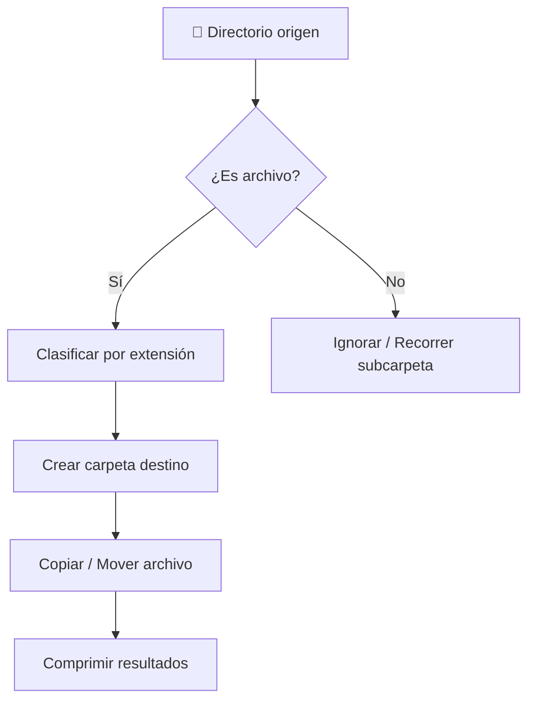

# 📁 Pathlib y shutil

Todo pipeline de datos, backend o sistema de despliegue interactúa con el sistema de archivos. Manipular rutas de forma segura y multiplataforma, así como realizar operaciones de alto nivel sobre archivos y directorios, son competencias esenciales para un ingeniero de Python.


## 1. El paradigma orientado a objetos de pathlib

`pathlib` unifica la manipulación de rutas bajo la clase `Path`, eliminando la necesidad de concatenar strings con barras invertidas o slashes.

```python
from pathlib import Path

ruta = Path.home() / 'proyectos' / 'ml-pipeline' / 'data.csv'
print(ruta.name)       # data.csv
print(ruta.stem)       # data
print(ruta.suffix)     # .csv
print(ruta.parent)     # /home/user/proyectos/ml-pipeline
```

## 2. Navegación y búsqueda

```python
directorio = Path('datasets')

# Iterar contenido
for item in directorio.iterdir():
    print(item)

# Búsqueda con patrones glob
for archivo in directorio.glob('*.csv'):
    print(archivo)

# Búsqueda recursiva
for archivo in directorio.rglob('**/*.json'):
    print(archivo)
```

## 3. Manipulación de archivos y directorios

```python
nueva_carpeta = Path('resultados/experimentos')
nueva_carpeta.mkdir(parents=True, exist_ok=True)

archivo = nueva_carpeta / 'metricas.txt'
archivo.touch()

# Metadatos
print(archivo.exists())
print(archivo.stat().st_size)

# Renombrar y eliminar
archivo.rename(nueva_carpeta / 'metricas_v2.txt')
# archivo.unlink()  # Elimina
```

## 4. Lectura y escritura simplificada

`pathlib` abstrae la apertura de archivos para textos y bytes.

```python
config = Path('config.yaml')
config.write_text('learning_rate: 0.01\nepochs: 100', encoding='utf-8')

contenido = config.read_text(encoding='utf-8')
print(contenido)
```

## 5. shutil: operaciones de alto nivel

`shutil` complementa `pathlib` con operaciones sobre colecciones de archivos.

```python
import shutil

# Copiar preservando metadatos
shutil.copy2('origen.txt', 'destino.txt')

# Copiar árbol completo
shutil.copytree('datasets', 'backup/datasets')

# Eliminar árbol completo
shutil.rmtree('temp')

# Mover
shutil.move('vieja_ubicacion', 'nueva_ubicacion')
```

## 6. Archivado y compresión con shutil

```python
import shutil

# Crear ZIP
shutil.make_archive('backup_datasets', 'zip', 'datasets')

# Espacio en disco
total, used, free = shutil.disk_usage('/')
print(f"Libre: {free // (2**30)} GB")
```

## 7. Comparativa os.path vs pathlib

| Característica | os.path | pathlib |
|---|---|---|
| Paradigma | Funcional, strings | Orientado a objetos |
| Concatenación | `os.path.join(a, b)` | `a / b` |
| Legibilidad | Media | Alta |
| Multiplataforma | Sí | Sí (más intuitivo) |
| Métodos integrados | Limitados | `read_text`, `write_text`, `glob`, etc. |
| Recomendación | Legacy | Código nuevo |

⚠️ **Advertencia:** `shutil.rmtree()` es irreversible. Verifica siempre la ruta antes de ejecutarla, preferiblemente resolviendo paths absolutos con `.resolve()`.

💡 **Tip:** Usa `pathlib.Path` con anotaciones de tipo (`from pathlib import Path`) en las firmas de tus funciones; mejora la legibilidad y el autocompletado del IDE.

Caso real: Un pipeline de entrenamiento genera cientos de checkpoints `.pth`. Un script con `pathlib` y `shutil` organiza automáticamente los mejores modelos en una carpeta `production/` y archiva los antiguos en `archive/`, liberando espacio cuando `shutil.disk_usage` indica menos del 10 % libre.



📦 **Código de compresión**

```python
import shutil
import pathlib
from datetime import datetime

def organizar_y_comprimir(origen: pathlib.Path, destino: pathlib.Path):
    fecha = datetime.now().strftime('%Y%m%d')
    base = destino / f"organizado_{fecha}"
    base.mkdir(parents=True, exist_ok=True)

    for archivo in origen.iterdir():
        if archivo.is_file():
            carpeta = base / archivo.suffix.lstrip('.')
            carpeta.mkdir(exist_ok=True)
            shutil.copy2(archivo, carpeta / archivo.name)

    zip_path = shutil.make_archive(str(base), 'zip', str(base))
    print(f"📦 Archivo generado: {zip_path}")

if __name__ == '__main__':
    organizar_y_comprimir(pathlib.Path('descargas'), pathlib.Path('backups'))
```
