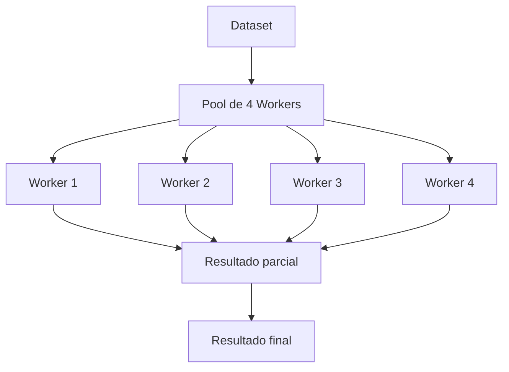

# ⚙️ Subprocess y Multiprocessing

Los pipelines de ML y los backends de alto rendimiento frecuentemente requieren ejecutar comandos externos (entrenadores en C++, utilidades de sistema) o paralelizar tareas intensivas en CPU. Python ofrece `subprocess` para la integración con el SO y `multiprocessing` para escapar del GIL y distribuir carga de trabajo.


## 1. subprocess.run: el API moderno

`subprocess.run` es la interfaz recomendada para la mayoría de los casos.

```python
import subprocess

resultado = subprocess.run(
    ['python', '--version'],
    capture_output=True,
    text=True,
    check=True
)
print(resultado.stdout)
```

## 2. subprocess.Popen: control avanzado

Para comunicación bidireccional o streams de datos, `Popen` ofrece control granular.

```python
proceso = subprocess.Popen(
    ['grep', 'error'],
    stdin=subprocess.PIPE,
    stdout=subprocess.PIPE,
    stderr=subprocess.PIPE,
    text=True
)
stdout, stderr = proceso.communicate(input='log1 error\nlog2 ok\n')
print(stdout)
```

## 3. Timeouts y señales

```python
try:
    resultado = subprocess.run(['sleep', '10'], timeout=5, check=True)
except subprocess.TimeoutExpired:
    print("El proceso excedió el tiempo límite")
```

## 4. multiprocessing.Process

Crear procesos independientes permite ejecutar código Python en paralelo real.

```python
from multiprocessing import Process
import os

def entrenar_modelo(param):
    print(f"Proceso {os.getpid()} entrenando con {param}")

if __name__ == '__main__':
    p = Process(target=entrenar_modelo, args=('lr=0.01',))
    p.start()
    p.join()
```

## 5. multiprocessing.Pool

`Pool` abstrae la creación y reutilización de workers.

```python
from multiprocessing import Pool

def cuadrado(n):
    return n ** 2

if __name__ == '__main__':
    with Pool(processes=4) as pool:
        resultados = pool.map(cuadrado, range(10))
        print(resultados)
```

`apply_async` permite enviar tareas de forma no bloqueante y recoger resultados con callbacks.

## 6. Comunicación entre procesos

### Queue

```python
from multiprocessing import Process, Queue

def productor(q):
    q.put('dato')

if __name__ == '__main__':
    q = Queue()
    p = Process(target=productor, args=(q,))
    p.start()
    print(q.get())
    p.join()
```

### Pipe

```python
from multiprocessing import Pipe

padre, hijo = Pipe()
hijo.send('mensaje')
print(padre.recv())
```

### Lock

```python
from multiprocessing import Lock, Process

def tarea_segura(lock, id):
    with lock:
        print(f"Proceso {id} en sección crítica")

if __name__ == '__main__':
    lock = Lock()
    for i in range(3):
        Process(target=tarea_segura, args=(lock, i)).start()
```

## 7. Manager y memoria compartida

`Manager` permite compartir objetos complejos (listas, diccionarios) entre procesos.

```python
from multiprocessing import Manager, Process

def agregar(d, key, value):
    d[key] = value

if __name__ == '__main__':
    with Manager() as manager:
        d = manager.dict()
        p = Process(target=agregar, args=(d, 'metrica', 0.95))
        p.start()
        p.join()
        print(dict(d))
```

## 8. Comparativa: multiprocessing vs threading vs asyncio

| Característica | threading | multiprocessing | asyncio |
|---|---|---|---|
| Paralelismo real | No (GIL) | Sí | No (GIL) |
| Uso ideal | I/O-bound | CPU-bound | I/O-bound masivo |
| Memoria compartida | Sí (mismo proceso) | No (copia) | Sí (mismo proceso) |
| Complejidad | Baja | Media | Alta |
| Overhead | Bajo | Alto (fork/spawn) | Muy bajo |

⚠️ **Advertencia:** En Windows, siempre protege la entrada de procesos con `if __name__ == '__main__':`. De lo contrario, los procesos hijos reimportarán el módulo y causarán recursión infinita.

💡 **Tip:** Prefiere `Pool.imap_unordered()` cuando el orden de los resultados no importe; permite comenzar a procesar resultados tan pronto como un worker termina, mejorando la latencia percibida.

Caso real: Un sistema de backend genera reportes PDF a partir de miles de registros. Usar `multiprocessing.Pool` divide el dataset en chunks y genera los reportes en paralelo, reduciendo el tiempo total de generación de 30 minutos a 5 minutos en una máquina de 8 núcleos.

Caso real: Un pipeline de preprocesamiento de imágenes para un modelo de visión computacional aplica transformaciones Pillow a millones de imágenes. `multiprocessing` distribuye las imágenes entre núcleos, saturando el CPU al 100 %.



📦 **Código de compresión**

```python
import multiprocessing
import zipfile
import pathlib

def comprimir_subconjunto(args):
    rango, origen, destino = args
    subzip = destino / f"lote_{rango[0]}.zip"
    with zipfile.ZipFile(subzip, 'w') as zf:
        for idx in range(rango[0], rango[1]):
            f = origen / f"file_{idx}.txt"
            if f.exists():
                zf.write(f, f.name)
    return str(subzip)

if __name__ == '__main__':
    origen = pathlib.Path('datos')
    destino = pathlib.Path('archivos')
    destino.mkdir(exist_ok=True)
    lotes = [ (i, i+10) for i in range(0, 100, 10) ]
    with multiprocessing.Pool(4) as pool:
        resultados = pool.map(comprimir_subconjunto, [ (l, origen, destino) for l in lotes ])
    print("Comprimidos:", resultados)
```
