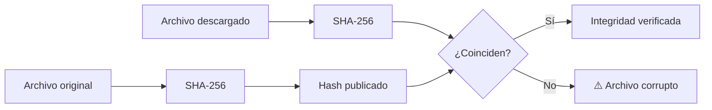

# 🔐 Cryptography y Hashlib

La seguridad en ML/AI Engineering y Backend abarca desde la verificación de integridad de datasets hasta el cifrado de modelos propietarios antes de su distribución. Python ofrece `hashlib` para resúmenes criptográficos y `cryptography` para primitivas de alto nivel, complementadas por `secrets` para generación de material criptográfico.


## 1. Fundamentos de hashlib

`hashlib` proporciona interfaces seguras para algoritmos de hashing como MD5, SHA-256, SHA-512 y BLAKE2.

```python
import hashlib

data = b'pipeline_v1.0'
hash_obj = hashlib.sha256()
hash_obj.update(data)
print(hash_obj.hexdigest())
```

Para archivos grandes, se recomienda leer por chunks:

```python
def hash_archivo(ruta, algoritmo='sha256'):
    h = hashlib.new(algoritmo)
    with open(ruta, 'rb') as f:
        while chunk := f.read(8192):
            h.update(chunk)
    return h.hexdigest()
```

## 2. Comparativa de algoritmos de hash

| Algoritmo | Tamaño (bits) | Seguridad | Velocidad | Uso recomendado |
|---|---|---|---|---|
| MD5 | 128 | ❌ Rota (colisiones) | Muy rápida | Solo checksums de integridad no crítica |
| SHA-1 | 160 | ❌ Rota | Rápida | Legacy; migrar a SHA-256 |
| SHA-256 | 256 | ✅ Segura | Rápida | Integridad de archivos, certificados |
| SHA-512 | 512 | ✅ Segura | Más lenta que SHA-256 | Entornos de 64 bits |
| BLAKE2b | 512 | ✅ Segura | Muy rápida | Reemplazo moderno de MD5/SHA |

## 3. HMAC para integridad y autenticidad

HMAC combina una función hash con una clave secreta para verificar tanto la integridad como el origen del mensaje.

```python
import hmac

clave = b'secret_key'
mensaje = b'actualizacion_modelo'
firma = hmac.new(clave, mensaje, hashlib.sha256).hexdigest()
print(firma)
```

## 4. secrets para tokens seguros

El módulo `secrets` genera números aleatorios criptográficamente fuertes.

```python
import secrets

token = secrets.token_urlsafe(32)
print(token)
```

## 5. Criptografía simétrica con Fernet

`cryptography.fernet.Fernet` ofrece cifrado simétrico autenticado (AES-128 en modo CBC con HMAC-SHA256).

```python
from cryptography.fernet import Fernet

clave = Fernet.generate_key()
fernet = Fernet(clave)

texto = b'modelo_entrenado_v9'
cifrado = fernet.encrypt(texto)
descifrado = fernet.decrypt(cifrado)

assert texto == descifrado
```

Caso real: Una startup de IA almacena modelos fine-tuned en un bucket S3. Antes de la subida, cifran el archivo `.pt` con Fernet y almacenan la clave en AWS KMS. Solo los servidores de inferencia autorizados pueden descifrarlo.

## 6. Criptografía asimétrica (mención)

Para escenarios de firma digital o intercambio de claves, RSA es el estándar. La librería `cryptography` permite generar pares de claves, firmar datos y verificar firmas. No obstante, para backups masivos, el cifrado simétrico (Fernet) sigue siendo más eficiente.

## 7. Password hashing: bcrypt y argon2

Nunca almacenes contraseñas con hash simple. Usa algoritmos diseñados para resistir fuerza bruta:

- **bcrypt:** Adaptativo, coste computacional configurable.
- **argon2:** Ganador del Password Hashing Competition, resistente a GPU/ASIC.

```python
# pip install bcrypt
import bcrypt

password = b'super_secret'
salt = bcrypt.gensalt(rounds=12)
hashed = bcrypt.hashpw(password, salt)
print(bcrypt.checkpw(password, hashed))
```

⚠️ **Advertencia:** MD5 y SHA-1 están rotos criptográficamente. No los uses para verificar archivos descargados de fuentes no confiables ni para aplicaciones de seguridad. Prefiere SHA-256 o BLAKE2b.

💡 **Tip:** Guarda siempre los hashes o claves en variables de entorno o gestores de secretos. Nunca las incluyas directamente en el repositorio, ni siquiera en repositorios privados.

Caso real: Un repositorio de datasets públicos publica junto a cada archivo un archivo `.sha256`. Los ingenieros de ML ejecutan un script de verificación antes de entrenar para asegurarse de que el dataset no ha sido manipulado (ataque de supply chain).



📦 **Código de compresión**

```python
import hashlib
import zipfile
import pathlib

def verificar_y_comprimir(archivos: list[pathlib.Path], salida: pathlib.Path):
    hashes = {}
    with zipfile.ZipFile(salida, 'w', zipfile.ZIP_DEFLATED) as zf:
        for archivo in archivos:
            sha = hashlib.sha256()
            with open(archivo, 'rb') as f:
                while chunk := f.read(8192):
                    sha.update(chunk)
            hashes[archivo.name] = sha.hexdigest()
            zf.write(archivo, archivo.name)
        zf.writestr('hashes.json', __import__('json').dumps(hashes, indent=2))
    print(f"📦 Backup verificado y comprimido: {salida}")

if __name__ == '__main__':
    archivos = list(pathlib.Path('modelos').glob('*.pt'))
    verificar_y_comprimir(archivos, pathlib.Path('modelos_backup.zip'))
```
