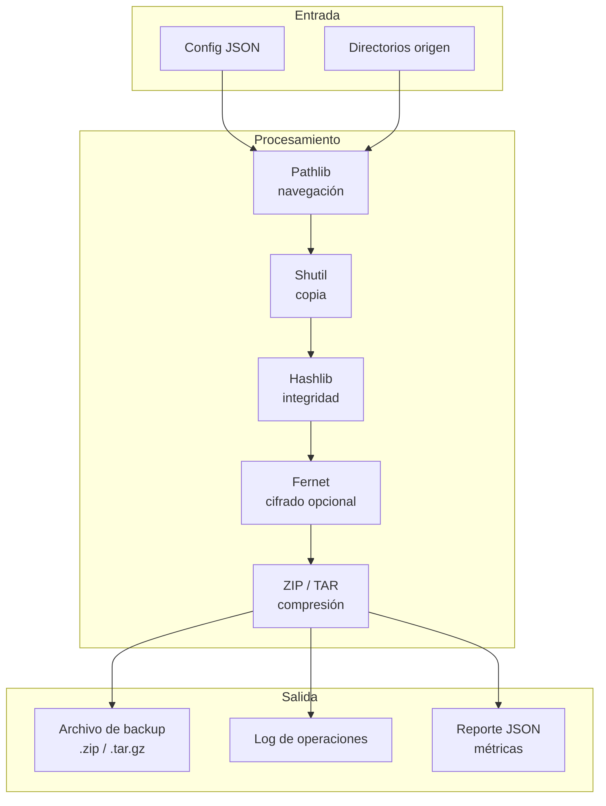
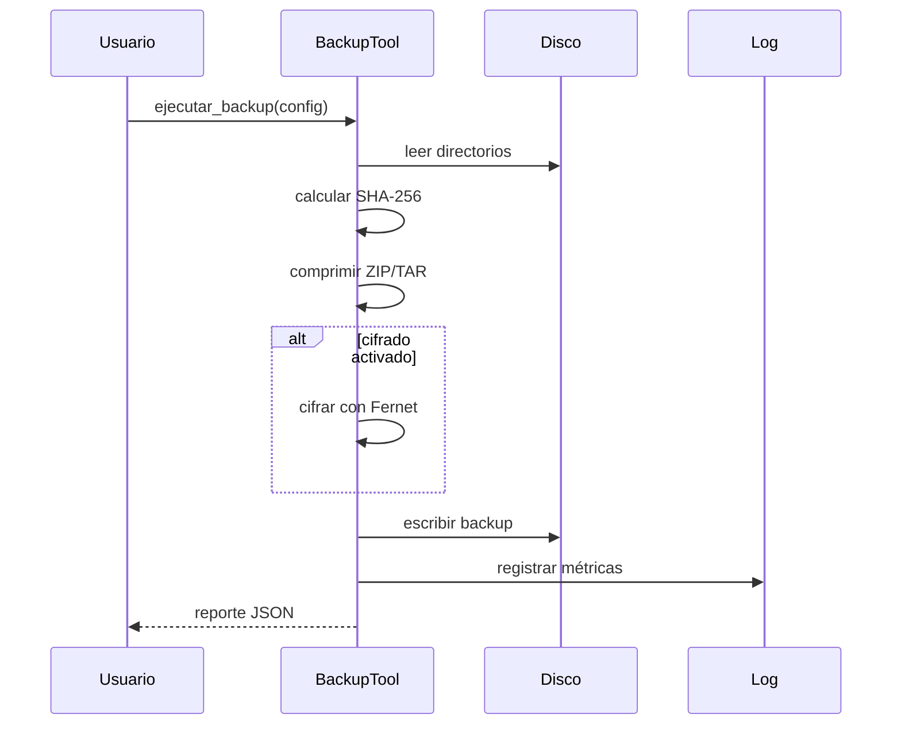

# 🛡️ Caso Práctico: Herramienta de Backup Seguro

Este proyecto integra los conocimientos de [[03 - Pathlib y shutil]], [[04 - Subprocess y Multiprocessing]], [[05 - Cryptography y Hashlib]] y [[02 - Sqlite3 y DB API]] para construir una utilidad CLI de backup robusta, pensada para entornos de ML/AI Engineering y Backend donde la integridad y confidencialidad de los artefactos son críticas.


## 1. Requisitos funcionales

La herramienta debe cumplir con los siguientes requisitos:

1. Seleccionar directorios de origen mediante configuración.
2. Copiar y comprimir contenidos en formato ZIP o TAR.
3. Generar hashes SHA-256 de cada archivo para verificación posterior.
4. Ofrecer cifrado opcional con Fernet (`cryptography`).
5. Registrar logs detallados de cada operación.
6. Permitir planificación básica de ejecuciones (scheduling).
7. Verificar la integridad durante la restauración.

## 2. Arquitectura del sistema



## 3. Módulo de selección de directorios

Usamos `pathlib` para resolver rutas absolutas y validar existencia.

```python
from pathlib import Path

def validar_origenes(rutas: list[str]) -> list[Path]:
    validas = []
    for r in rutas:
        p = Path(r).resolve()
        if p.exists() and p.is_dir():
            validas.append(p)
        else:
            print(f"⚠️ Directorio omitido: {p}")
    return validas
```

## 4. Módulo de compresión

Soportamos ZIP (universal) y TAR.GZ (mejor ratio en archivos grandes).

| Formato | Velocidad | Ratio | Compatibilidad |
|---|---|---|---|
| ZIP | Rápida | Buena | Universal |
| TAR | Ninguna (solo agrupa) | 1:1 | Unix/Linux |
| TAR.GZ | Lenta | Muy buena | Unix/Linux |

```python
import shutil
from pathlib import Path

def comprimir(origen: Path, destino: Path, formato: str = 'zip'):
    archivo = shutil.make_archive(str(destino), formato, str(origen))
    return Path(archivo)
```

## 5. Módulo de hashing e integridad

Cada archivo se hashea antes de la compresión para incluir un manifest de integridad.

```python
import hashlib
import json
from pathlib import Path

def generar_manifest(origen: Path) -> dict:
    manifest = {}
    for archivo in origen.rglob('*'):
        if archivo.is_file():
            sha = hashlib.sha256()
            with open(archivo, 'rb') as f:
                for chunk in iter(lambda: f.read(8192), b''):
                    sha.update(chunk)
            manifest[str(archivo.relative_to(origen))] = sha.hexdigest()
    return manifest
```

## 6. Módulo de encriptación opcional

Si el usuario proporciona una clave Fernet, el backup se cifra.

```python
from cryptography.fernet import Fernet

def cifrar_archivo(ruta: Path, clave: bytes) -> Path:
    f = Fernet(clave)
    datos = ruta.read_bytes()
    cifrado = f.encrypt(datos)
    salida = ruta.with_suffix(ruta.suffix + '.enc')
    salida.write_bytes(cifrado)
    return salida
```

## 7. Logging de operaciones

Registramos timestamps, archivos procesados, hashes y errores.

```python
import logging
from datetime import datetime

def configurar_logger(log_path: Path):
    logging.basicConfig(
        filename=log_path / f"backup_{datetime.now():%Y%m%d_%H%M%S}.log",
        level=logging.INFO,
        format='%(asctime)s [%(levelname)s] %(message)s'
    )
    return logging.getLogger('backup')
```

## 8. Scheduling básico

Planificamos la próxima ejecución usando `datetime` y `time.sleep` (versión simplificada).

```python
from datetime import datetime, timedelta
import time

def esperar_hasta(ejecucion: datetime):
    while datetime.now() < ejecucion:
        time.sleep(1)
    print("⏰ Iniciando backup programado...")
```

## 9. Verificación de restore

Durante la restauración, se recalculan los hashes y se comparan con el manifest.

```python
def verificar_restore(backup_dir: Path, manifest: dict) -> bool:
    for ruta_relativa, hash_esperado in manifest.items():
        archivo = backup_dir / ruta_relativa
        if not archivo.exists():
            print(f"❌ Falta: {ruta_relativa}")
            return False
        hash_actual = hashlib.sha256(archivo.read_bytes()).hexdigest()
        if hash_actual != hash_esperado:
            print(f"⚠️ Hash diferente: {ruta_relativa}")
            return False
    print("✅ Restauración verificada")
    return True
```

## 10. Métricas del proceso

Al finalizar, generamos un reporte JSON con:

- Tiempo total de ejecución.
- Número de archivos procesados.
- Tasa de compresión (`1 - tamaño_comprimido / tamaño_original`).
- Resultado de verificación de integridad.

```python
import time, json

class Metricas:
    def __init__(self):
        self.inicio = time.time()
        self.archivos = 0
        self.tamano_original = 0
        self.tamano_comprimido = 0

    def resumen(self):
        duracion = time.time() - self.inicio
        ratio = 1 - (self.tamano_comprimido / self.tamano_original) if self.tamano_original else 0
        return {
            'duracion_seg': round(duracion, 2),
            'archivos': self.archivos,
            'tasa_compresion': round(ratio, 4),
            'integridad': 'OK'
        }
```

⚠️ **Advertencia:** Almacena la clave Fernet en un gestor de secretos (HashiCorp Vault, AWS KMS, etc.). Nunca incluyas la clave en el mismo directorio que el backup cifrado.

💡 **Tip:** Implementa rotación de backups eliminando archivos `.zip` o `.tar.gz` anteriores a una fecha límite para evitar el crecimiento ilimitado del disco.

Caso real: Un equipo de MLOps realiza backup diario de los artefactos de entrenamiento (modelos, configs, logs). La herramienta comprime los directorios, genera un manifest SHA-256 y cifra el archivo resultante antes de moverlo a un NAS. Semanalmente, un job de restore verifica la integridad de los backups más recientes.

Caso real: Un backend SaaS utiliza una versión ligera de esta herramienta para exportar y archivar bases de datos SQLite de clientes, garantizando que cada exportación pueda verificarse y restaurarse sin corrupción.



🎯 **Proyecto documentado**

### Estructura de carpetas

```
backup_seguro/
├── backup_tool/
│   ├── __init__.py
│   ├── selector.py
│   ├── compressor.py
│   ├── hasher.py
│   ├── crypto.py
│   ├── logger.py
│   ├── scheduler.py
│   └── verifier.py
├── config.json
├── main.py
└── requirements.txt
```

### Instalación

```bash
pip install cryptography
```

### Uso

```bash
python main.py --config config.json --schedule 02:00
```

### Ejemplo de config.json

```json
{
    "origenes": ["./modelos", "./datasets"],
    "destino": "./backups",
    "formato": "zip",
    "cifrado": true,
    "clave_env": "BACKUP_KEY",
    "retencion_dias": 30
}
```

📦 **Código de compresión**

```python
import zipfile
import tarfile
import pathlib

def comprimir_backup(origen: pathlib.Path, destino: pathlib.Path, fmt: str = 'zip'):
    if fmt == 'zip':
        with zipfile.ZipFile(destino, 'w', zipfile.ZIP_DEFLATED) as zf:
            for f in origen.rglob('*'):
                if f.is_file():
                    zf.write(f, f.relative_to(origen))
    else:
        with tarfile.open(destino, 'w:gz') as tf:
            tf.add(origen, arcname=origen.name)
    print(f"📦 Backup generado: {destino}")

if __name__ == '__main__':
    comprimir_backup(pathlib.Path('datos'), pathlib.Path('backup.zip'), 'zip')
```
