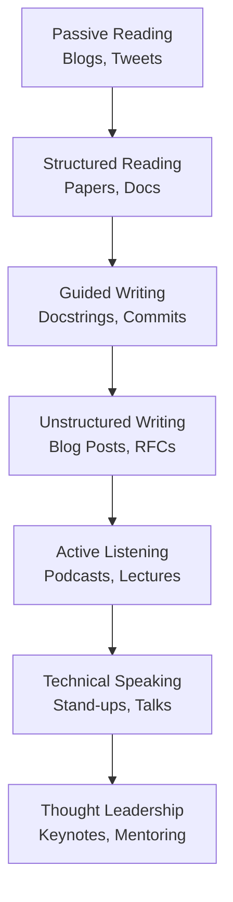
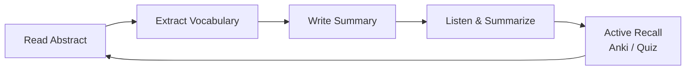

# 🇬🇧 Technical English

## Introduction

English is the lingua franca of [[Software Engineering]] and [[Machine Learning]]. From reading the latest [[Transformers]] paper on arXiv to debating system design in a [[Slack]] channel, your ability to process and produce technical English directly limits the surface area of knowledge you can access.

For non-native speakers, this can feel like a bottleneck. However, fluency in *technical* English is a much narrower domain than general English. By focusing on domain-specific vocabulary, structured reading, and deliberate practice, you can reach professional proficiency faster than you think. This course treats Technical English as a skill to be engineered — not a talent you are born with.

## 1. Reading Papers

Academic papers in [[ML]] and [[AI]] follow a rigid structure that you can exploit for speed:

- **Abstract**: The promise. Read this first to decide if the paper is worth your time.
- **Introduction**: The problem definition and contribution statement.
- **Method / Architecture**: The "how." Look for equations and diagrams first.
- **Experiments**: The proof. Check datasets, baselines, and metrics.
- **Conclusion**: The takeaways and future work.

Real case: **Yann LeCun** and **Andrew Ng** both began their journeys as non-native English speakers. LeCun, a French national, published foundational work on convolutional networks in English while still a student in Paris. Ng, born in the UK and raised in Hong Kong and Singapore, used deliberate paper reading and replication to build the vocabulary that now supports his teaching and research empire. Their success was not about perfect grammar; it was about extracting meaning from dense technical text efficiently.

⚠️ **Warning:** Do not read papers linearly like novels. Start with the abstract and conclusion, then jump to figures and tables. Reading front-to-back is a common trap that wastes hours.

💡 **Tip:** Keep a running glossary of 50 terms per subfield. Terms like "ablation study," "inductive bias," and "latent space" appear constantly. A glossary reduces lookup friction dramatically.

## 2. Writing for Engineers

Good technical writing is invisible. The reader should understand the *what*, *why*, and *how* without re-reading.

| Format | Goal | Tone | Example |
|--------|------|------|---------|
| README | Onboard a user | Direct, tutorial-like | "Install with `pip install -r requirements.txt`" |
| Docstring | Explain an API | Neutral, precise | "Returns a tensor of shape `(batch, seq, dim)`." |
| Commit message | Tell a story of change | Imperative, concise | "Add dropout to attention layer" |
| Issue description | Define a bug or feature | Reproducible, scoped | Steps + expected vs. actual behavior |
| RFC / Design Doc | Align a team | Analytical, comparative | Problem, alternatives, decision criteria |

Formula for vocabulary growth:

$$
\text{Vocabulary\_Size} \approx 3000 + (\text{Papers\_Read} \times 50)
$$

This is illustrative, but it captures the idea that each paper introduces roughly 30–70 new terms, of which about 50 stick after active recall. A researcher who reads 100 papers will have a working vocabulary of ~8,000 technical terms — enough to read, write, and review at a professional level.

## 3. Listening and Speaking Resources

Speaking fluently under pressure is a different muscle from reading. The best way to train it is immersion in technical *audio*.

**Speaking contexts:**

- **Conference talks**: 18–25 minutes of structured narrative. Practice with a timer.
- **Stand-ups**: 60–90 second updates. Use the "Yesterday, Today, Blockers" format.
- **Technical interviews**: Explain while you code. Use phrases like "The trade-off here is..." or "A naive approach would be..."

| Skill | Resource | Type | Why It Helps |
|-------|----------|------|--------------|
| Reading | arXiv + Readwise | Paper aggregator | Daily exposure to dense prose |
| Writing | GitHub Docs style guide | Reference | Standardizes clarity |
| Speaking | Toastmasters or Discord ML groups | Practice venue | Low-stakes live feedback |
| Listening | Lex Fridman / TWIML AI Podcast | Long-form interview | Natural technical cadence |
| Listening | Stanford CS229 / CS224N | Academic lecture | Formal technical register |

⚠️ **Warning:** Passive listening is entertainment, not practice. To improve, pause and summarize out loud what you just heard. If you cannot explain it, you did not understand it.

## 4. Building a Learning System

Fluency is a function of consistency, not intensity. Build a system:

1. **Morning**: Read one paper abstract and add 3 terms to your glossary.
2. **Midday**: Write one commit message or docstring in English, even if your team speaks another language.
3. **Evening**: Listen to 20 minutes of a technical podcast. Summarize the main argument in one paragraph.





Image: The Feynman Technique applied to language learning — if you can explain a paper to a rubber duck in English, you own the concept.


---

## 📦 Compression Code

A Python script to extract unknown vocabulary from a PDF paper and suggest flashcards:

```python
import re
from collections import Counter

def extract_candidate_terms(text: str, known: set[str]) -> list[tuple[str, int]]:
    """
    Extracts candidate technical terms from a paper text.
    Returns terms not in 'known' sorted by frequency.
    """
    # Heuristic: Capitalized phrases or hyphenated technical words
    pattern = re.compile(r'\b(?:[A-Z][a-z]+(?:\s+[A-Z][a-z]+)*|[a-z]+-[a-z]+)\b')
    candidates = pattern.findall(text)
    unknown = [w for w in candidates if w.lower() not in known]
    return Counter(unknown).most_common(20)

# Usage:
# text = open("paper.txt").read()
# new_terms = extract_candidate_terms(text, known={"the", "and", "model", "data"})
# for term, count in new_terms:
#     print(f"- {term} ({count})")
```

## 🎯 Documented Project

### Description

Build a personal "Technical English Companion" — a local web app or Obsidian vault that tracks papers read, vocabulary learned, and speaking practice sessions.

### Functional Requirements

1. Import a paper (PDF or text) and automatically extract candidate vocabulary.
2. Allow the user to mark terms as "known," "learning," or "mastered."
3. Schedule daily review sessions using a spaced repetition algorithm.
4. Log listening practice sessions with podcast/lecture metadata and a 1-paragraph summary.
5. Export weekly progress reports showing vocabulary growth and papers completed.

### Main Components

- PDF text extraction module (`PyPDF2` or `pdfplumber`)
- Vocabulary state manager (JSON or SQLite)
- Spaced repetition scheduler (SM-2 algorithm)
- CLI or Obsidian plugin frontend
- Progress reporter (Markdown export)

### Success Metrics

- Extract 20+ candidate terms per paper with >70% relevance
- Retain 80% of marked "learning" terms after one week of review
- Complete 5 listening summaries per week
- Generate a weekly report in under 1 second

### References

- [How to Read a Paper](https://web.stanford.edu/class/cs224n/readings/HowtoReadPaper.pdf) — S. Keshav
- [English for Academic Study](https://www.amazon.com/English-Academic-Study-Extended-Writing/dp/1782600701) — Colin Campbell
- [Anki Spaced Repetition](https://apps.ankiweb.net/)
- Stanford CS229 and CS224N course websites
