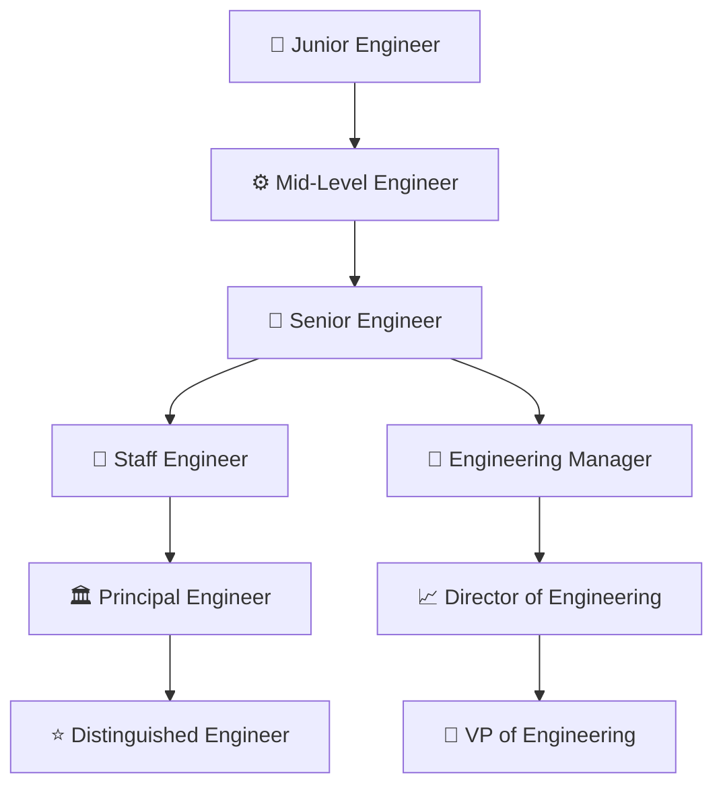
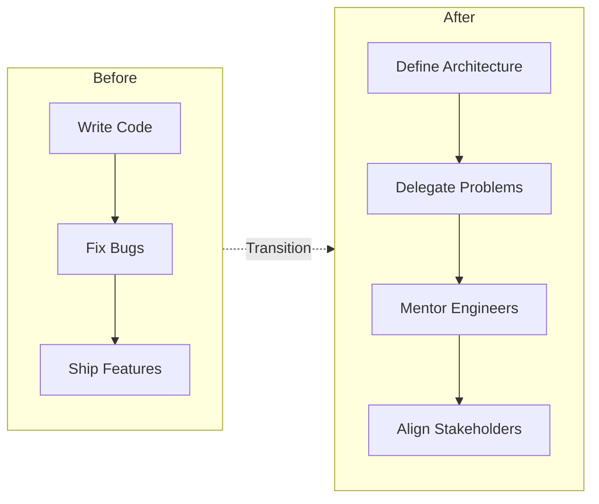

# 👑 Technical Leadership

## Introduction

Leadership is not a job title; it is a behavior. In [[Software Engineering]] and [[ML]], the transition from individual contributor (IC) to leader is often invisible until it is inevitable. You do not wake up one day as a Staff Engineer. You wake up with more people asking for your opinion, more RFCs routing through your desk, and more ambiguity demanding your judgment.

Technical leadership is the art of amplifying your impact through others while maintaining deep technical credibility. It requires a new toolkit: delegation, mentoring, architecture decisions, and influence without authority. This course maps the journey and gives you the frameworks to navigate it deliberately.

## 1. The Career Ladder

Engineering ladders vary by company, but the archetypes are consistent:



At each step, the nature of the work changes more than the difficulty.

Real case: **Google** famously documented its engineering ladder in "Software Engineering at Google." The book shows that a Senior Engineer is expected to solve ambiguous problems end-to-end, while a Staff Engineer is expected to solve problems that span multiple teams — often without direct authority. **Netflix** compresses this into its "freedom and responsibility" culture: high performers are given massive scope (freedom) and are expected to lead through context, not control (responsibility).

⚠️ **Warning:** Do not try to "promote" by doing more of the same work faster. A Senior Engineer who writes 3x more code than a Mid is not a Staff Engineer. They are just a fast Mid. Leadership requires a qualitative shift in scope and leverage.

💡 **Tip:** Ask your manager to show you the rubric for the level above yours. Most companies have a detailed expectations document. Study it like an exam syllabus.

## 2. Skills by Level

| Level | Coding | System Design | Communication | Business Impact |
|-------|--------|---------------|---------------|-----------------|
| Junior | Feature implementation | Understands basic patterns | Asks clear questions | Completes assigned tasks |
| Mid | Owns modules | Designs medium-complexity systems | Documents own work | Ships features reliably |
| Senior | Debugs complex bugs across systems | Designs cross-team architectures | Drives consensus in meetings | Influences team roadmap |
| Staff | Reviews critical paths | Sets technical direction for org | Communicates to executives | Aligns org goals with company strategy |
| Principal+ | Rarely blocks, unblocks others | Industry-level architecture | Public thought leadership | Creates new business lines |

## 3. From IC to Tech Lead

The first formal leadership step is usually Tech Lead: an IC who owns technical outcomes for a team.

Key transitions:

- **From writing code to reviewing architecture**: Your job is no longer to produce lines but to ensure the right lines are produced.
- **From solving to delegating**: Give problems, not tasks. "Reduce latency by 20%" is better than "Add caching here."
- **From knowing to mentoring**: The best Tech Leads grow their team so that any single person can leave without disaster.



## 4. Influence Without Authority

Staff-plus engineers rarely have direct reports. Their power comes from leverage.

- **Documentation**: A well-written design doc scales your opinion to 100 readers.
- **RFCs**: Request for Comments processes force structured debate. Winning an RFC is winning influence.
- **Brown bags / Tech talks**: Teaching scales your knowledge across the org.
- **Glue work**: Onboarding, incident response, and process improvements are invisible until they stop happening. Then everyone notices.

Formula for impact:

$$
\text{Impact} = \text{Scope} \times \text{Leverage} \times \text{Time}
$$

- **Scope**: How many people or systems are affected?
- **Leverage**: How much output do you get per unit of input? (tools, docs, automation)
- **Time**: How durable is the solution? A hotfix has low time value; a platform has high time value.

⚠️ **Warning:** Glue work is essential but often unpromotable. If 100% of your time is spent on onboarding and meetings, you are becoming an unofficial manager without the career benefits. Balance glue work with visible technical depth.

Image: The Dreyfus model illustrates how expertise develops from rigid rule-following to intuitive, context-aware mastery — a useful lens for career progression.


---

## 📦 Compression Code

A one-page self-assessment rubric for aspiring Tech Leads:

```markdown
## Self-Assessment: Am I Operating at the Next Level?

### Scope
- [ ] I solve problems that span more than one team.
- [ ] My decisions affect architecture for >6 months.

### Leverage
- [ ] I have written or championed a design doc adopted by another team.
- [ ] I have automated or documented a process that saved >5 hours/week.

### People
- [ ] I have mentored someone who was later promoted.
- [ ] I can delegate a problem and trust the outcome without micromanaging.

### Communication
- [ ] I can explain a technical trade-off to a non-technical executive in <2 minutes.
- [ ] I have presented at a team-wide or public forum.

**Score**: 0-2 = Solid IC. 3-4 = Emerging Lead. 5-6 = Operating at Staff level.
```

## 🎯 Documented Project

### Description

Design a "Leadership Growth Tracker" — a personal dashboard (Obsidian, Notion, or Streamlit app) that maps your weekly activities to the career ladder rubric and highlights gaps.

### Functional Requirements

1. Import or define a company's engineering ladder rubric (JSON or Markdown table).
2. Log weekly activities tagged by skill area: Coding, System Design, Communication, Mentoring, Glue Work.
3. Auto-score each week against the rubric for your target level.
4. Visualize trends over time with a radar chart.
5. Generate a quarterly "growth report" with gap analysis and recommended actions.

### Main Components

- `rubric.json`: Standardized ladder definition (Junior to Distinguished)
- `activity_logger.py`: CLI to tag and timestamp activities
- `scoring_engine.py`: Maps activities to rubric criteria
- `dashboard.py`: Streamlit or Plotly radar chart visualization
- `report_generator.py`: Markdown export for quarterly reviews

### Success Metrics

- Activity logging takes <30 seconds per entry
- Dashboard updates in real-time
- Quarterly report accurately identifies the top 2 skill gaps
- Rubric covers at least 5 levels and 4 skill dimensions

### References

- [Software Engineering at Google](https://abseil.io/resources/swe-book) — Titus Winters et al.
- [The Staff Engineer's Path](https://www.oreilly.com/library/view/the-staff-engineers/9781098118723/) — Tanya Reilly
- [No Rules Rules](https://www.netflix.com/tudum/articles/no-rules-rules-book) — Reed Hastings & Erin Meyer
- [Engineering Ladders](https://www.engineeringladders.com/) — Open-source ladder templates
