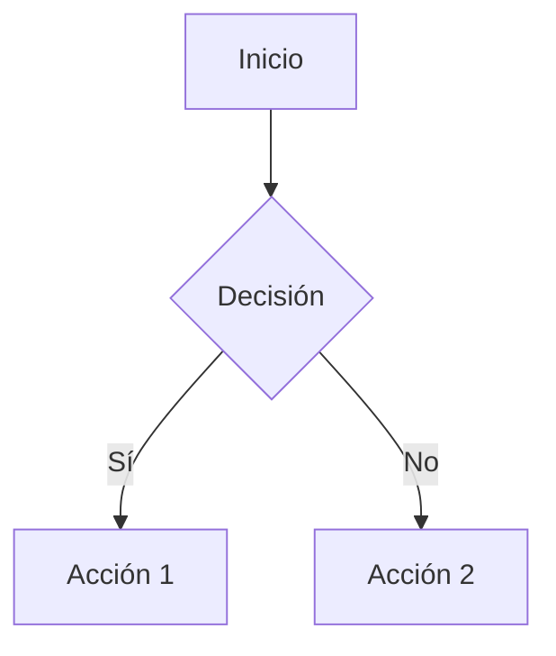

# 03 - Markdown en Obsidian

Obsidian es un editor de Markdown potente que añade funcionalidades propias. Estas no funcionan en todos los renderizadores, pero son increíblemente útiles dentro de tu vault.

---

## 1. Wikilinks (Enlaces internos)

Conecta notas entre sí. Es la base del sistema de conocimiento de Obsidian.

```markdown
[[Nombre de la nota]]
[[Nombre de la nota|Texto a mostrar]]
[[Nombre de la nota#Encabezado]]
```

**Ejemplo:**
```markdown
Vuelve a leer [[01 - Sintaxis Basica]] para repasar.
Lee más sobre [[01 - Sintaxis Basica#Listas|las listas]].
```

---

## 2. Callouts (Bloques de aviso)

Resalta información con cajas coloridas.

```markdown
> [!info]
> Información útil para el lector.

> [!warning]
> Ten cuidado con este paso.

> [!tip]
> Un consejo práctico.

> [!danger]
> Peligro, no hagas esto.
```

**Tipos disponibles:** `note`, `info`, `todo`, `tip`, `success`, `question`, `warning`, `failure`, `danger`, `bug`, `example`, `quote`.

---

## 3. Bloques Mermaid (Diagramas)

Crea diagramas directamente en texto.

````markdown

````

**Otros tipos:** `flowchart`, `sequenceDiagram`, `classDiagram`, `stateDiagram`, `erDiagram`, `gantt`.

---

## 4. Matemáticas (LaTeX)

Escribe fórmulas matemáticas.

```markdown
Fórmula en línea: $E = mc^2$

Fórmula en bloque:
$$
\int_{a}^{b} f(x) \, dx = F(b) - F(a)
$$
```

---

## 5. Etiquetas (Tags)

Organiza notas con etiquetas.

```markdown
#concepto #proyecto-activo #curso/markdown
```

Haz clic en una etiqueta para ver todas las notas que la contienen.

---

## 6. Enlaces a bloques

Enlaza a un párrafo específico dentro de una nota.

```markdown
[[Nombre de nota#^bloque-id]]
```

Para crear el ID, añade ` ^mi-id` al final de un párrafo.

---

## 7. Incrustar notas

Muestra el contenido de otra nota dentro de la actual.

```markdown
![[Otra nota]]
![[Otra nota#Encabezado]]
```

---

## 📋 Resumen de sintaxis exclusiva de Obsidian

| Función | Sintaxis |
|---------|----------|
| Enlace interno | `[[Nota]]` |
| Enlace con alias | `[[Nota\|Texto]]` |
| Enlace a encabezado | `[[Nota#Título]]` |
| Callout | `> [!tipo]` |
| Diagrama | ` ```mermaid` |
| Matemáticas | `$fórmula$` o `$$fórmula$$` |
| Etiqueta | `#etiqueta` |
| Incrustar nota | `![[Nota]]` |
