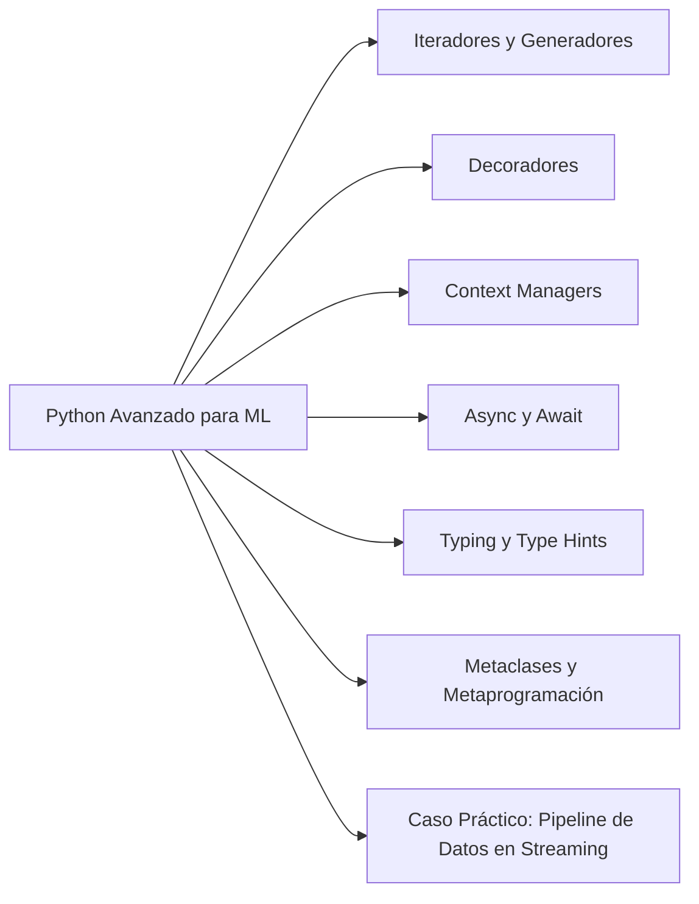

# 🐍 Bienvenida a Python Avanzado para ML

Este curso te lleva de "sé Python" a "domino Python como un ingeniero de ML senior". No repetiremos lo básico; nos enfocamos en las herramientas del lenguaje que usan los frameworks como PyTorch, FastAPI y LangChain bajo el capó.

---

## 🗂️ Módulos del curso

1. [[01 - Iteradores y Generadores|Iteradores y Generadores]]
2. [[02 - Decoradores|Decoradores]]
3. [[03 - Context Managers|Context Managers]]
4. [[04 - Async y Await|Async y Await]]
5. [[05 - Typing y Type Hints|Typing y Type Hints]]
6. [[06 - Metaclases y Metaprogramacion|Metaclases y Metaprogramación]]
7. [[07 - Caso Practico - Pipeline de Datos en Streaming|Caso Práctico: Pipeline de Datos en Streaming]]

---

## 🤔 ¿Por qué Python avanzado para ML?

Los frameworks de ML no son magia. Son Python puro usando:

- **Generadores** para cargar datasets que no caben en RAM.
- **Decoradores** para registrar experimentos, medir tiempos, cachear resultados.
- **Context Managers** para gestionar recursos GPU, conexiones a bases de datos.
- **Async/Await** para servir modelos en APIs sin bloquear.
- **Type Hints** para que tu código sea mantenible en equipos grandes.
- **Metaclases** para crear APIs elegantes (como `nn.Module` de PyTorch).

---

## 📋 Glosario rápido

| Término | Significado |
|---------|-------------|
| **Iterator** | Objeto que produce valores uno a uno bajo demanda |
| **Generator** | Función que pausa y reanuda su ejecución (`yield`) |
| **Decorator** | Función que modifica otra función sin cambiar su código |
| **Context Manager** | Patrón para manejar recursos con `with` |
| **Coroutine** | Función async que puede suspenderse en puntos de `await` |
| **Metaclass** | Clase que crea clases; controla la construcción de tipos |
