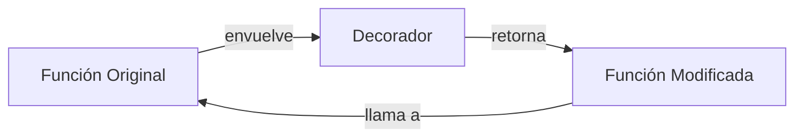
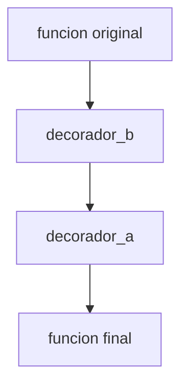

# 02 - Decoradores

Los decoradores permiten modificar o extender el comportamiento de funciones sin tocar su código. Son fundamentales en ML para logging, caching, validación de parámetros y medición de métricas.

---

## 1. Concepto fundamental

Un decorador es una función que recibe una función como argumento y devuelve otra función.

```python
def mi_decorador(funcion_original):
    def funcion_modificada(*args, **kwargs):
        print("Antes de ejecutar")
        resultado = funcion_original(*args, **kwargs)
        print("Después de ejecutar")
        return resultado
    return funcion_modificada

@mi_decorador
def saludar(nombre):
    print(f"Hola, {nombre}")

saludar("Ana")
# Antes de ejecutar
# Hola, Ana
# Después de ejecutar
```

**Sintaxis `@`:** `saludar = mi_decorador(saludar)`



### El modelo de cierre (Closure)

Los decoradores funcionan gracias a los **closures**. Un closure es una función que recuerda el entorno léxico donde fue creada, incluso cuando se ejecuta fuera de ese alcance.

```python
def fabrica_multiplicador(factor):
    def multiplicador(x):
        return x * factor  # `factor` viene del closure
    return multiplicador

doble = fabrica_multiplicador(2)
triple = fabrica_multiplicador(3)

print(doble(5))   # 10
print(triple(5))  # 15
```

En un decorador, el closure captura la función original (`funcion_original`) para poder llamarla dentro del wrapper.

### Reglas de alcance: `nonlocal` y `global`

Cuando un decorador necesita modificar variables del closure, usa `nonlocal`:

```python
def contador_llamadas(func):
    cuenta = 0
    def wrapper(*args, **kwargs):
        nonlocal cuenta  # Indica que no es local, es del closure
        cuenta += 1
        print(f"Llamada #{cuenta}")
        return func(*args, **kwargs)
    return wrapper
```

> ⚠️ Sin `nonlocal`, Python crea una variable local `cuenta` en `wrapper` y falla al intentar incrementarla.

---

## 2. Decoradores con argumentos

Para que un decorador acepte parámetros de configuración, necesitas una función de fábrica.

```python
def repetir(veces):
    """Fábrica de decoradores."""
    def decorador(funcion):
        def wrapper(*args, **kwargs):
            for _ in range(veces):
                resultado = funcion(*args, **kwargs)
            return resultado
        return wrapper
    return decorador

@repetir(veces=3)
def entrenar_epoch():
    print("Epoch completada")

entrenar_epoch()
# Epoch completada
# Epoch completada
# Epoch completada
```

---

## 3. Preservar metadatos con `functools.wraps`

Sin `wraps`, el decorador oculta el nombre y docstring de la función original.

```python
from functools import wraps

def mi_decorador(func):
    @wraps(func)  # Preserva nombre, docstring, etc.
    def wrapper(*args, **kwargs):
        return func(*args, **kwargs)
    return wrapper

@mi_decorador
def entrenar():
    """Entrena el modelo por una época."""
    pass

print(entrenar.__name__)  # entrenar
print(entrenar.__doc__)   # Entrena el modelo por una época.
```

> ⚠️ Siempre usa `@wraps` en decoradores de producción.

---

## 4. Decoradores de clase

Un decorador puede modificar una clase completa, agregando métodos o atributos.

```python
def registrable(cls):
    """Agrega un registro de instancias a la clase."""
    cls._registro = []
    original_init = cls.__init__

    def nuevo_init(self, *args, **kwargs):
        original_init(self, *args, **kwargs)
        cls._registro.append(self)

    cls.__init__ = nuevo_init
    cls.listar_registro = classmethod(lambda cls: cls._registro)
    return cls

@registrable
class Modelo:
    def __init__(self, nombre):
        self.nombre = nombre

m1 = Modelo("ResNet")
m2 = Modelo("VGG")
print(Modelo.listar_registro())  # [<__main__.Modelo>, <__main__.Modelo>]
```

---

## 5. Decoradores en ML: casos reales

### Medir tiempo de ejecución

```python
import time
from functools import wraps

def timer(func):
    @wraps(func)
    def wrapper(*args, **kwargs):
        inicio = time.perf_counter()
        resultado = func(*args, **kwargs)
        fin = time.perf_counter()
        print(f"{func.__name__} tomó {fin - inicio:.4f} segundos")
        return resultado
    return wrapper

@timer
def preprocesar_datos(datos):
    time.sleep(0.1)  # Simulación
    return datos * 2

preprocesar_datos([1, 2, 3])
# preprocesar_datos tomó 0.1012 segundos
```

### Cacheo con LRU

```python
from functools import lru_cache

@lru_cache(maxsize=128)
def embedding_cache(texto):
    """Simula cálculo costoso de embeddings."""
    print(f"Calculando embedding para: {texto}")
    return f"vector_de_{texto}"

print(embedding_cache("hola"))  # Calculando...
print(embedding_cache("hola"))  # Cache hit, sin cálculo
```

### Validación de tipos (runtime type checking)

```python
from functools import wraps

def validar_tipos(**tipos):
    def decorador(func):
        @wraps(func)
        def wrapper(*args, **kwargs):
            # Simplificado: solo kwargs para el ejemplo
            for nombre, tipo_esperado in tipos.items():
                if nombre in kwargs and not isinstance(kwargs[nombre], tipo_esperado):
                    raise TypeError(f"{nombre} debe ser {tipo_esperado}")
            return func(*args, **kwargs)
        return wrapper
    return decorador

@validar_tipos(tasa_aprendizaje=float)
def configurar_optimizador(tasa_aprendizaje):
    print(f"LR configurado: {tasa_aprendizaje}")

configurar_optimizador(tasa_aprendizaje=0.001)  # OK
# configurar_optimizador(tasa_aprendizaje="alta")  # TypeError
```

---

## 6. Stacking de decoradores

Los decoradores se aplican de abajo hacia arriba.



```python
@decorador_a
@decorador_b
def funcion():
    pass

# Equivalente a: funcion = decorador_a(decorador_b(funcion))
```

---

## 📦 Código de compresión: Sistema de experimentos ML

```python
"""
Sistema de tracking de experimentos usando decoradores.
Similar a MLflow pero minimalista, usando solo Python.
"""
from functools import wraps
import time
import json
from datetime import datetime

class ExperimentTracker:
    def __init__(self):
        self.experimentos = []

    def track(self, nombre_experimento):
        """Decorador para trackear ejecuciones."""
        def decorador(func):
            @wraps(func)
            def wrapper(*args, **kwargs):
                inicio = time.perf_counter()
                resultado = func(*args, **kwargs)
                fin = time.perf_counter()

                registro = {
                    "experimento": nombre_experimento,
                    "funcion": func.__name__,
                    "inicio": datetime.now().isoformat(),
                    "duracion_seg": round(fin - inicio, 4),
                    "parametros": kwargs,
                    "metricas": resultado if isinstance(resultado, dict) else {}
                }
                self.experimentos.append(registro)
                print(f"[TRACKED] {nombre_experimento}: {registro['duracion_seg']}s")
                return resultado
            return wrapper
        return decorador

    def exportar(self, ruta="experimentos.json"):
        with open(ruta, "w") as f:
            json.dump(self.experimentos, f, indent=2)

# --- Uso en ML ---
tracker = ExperimentTracker()

@tracker.track(nombre_experimento="entrenamiento_v1")
def entrenar_modelo(epochs, learning_rate):
    time.sleep(0.05)  # Simulación
    return {"accuracy": 0.92, "loss": 0.15}

@tracker.track(nombre_experimento="evaluacion_v1")
def evaluar_modelo(test_split):
    time.sleep(0.02)
    return {"f1_score": 0.89}

# Ejecutar
entrenar_modelo(epochs=10, learning_rate=0.001)
evaluar_modelo(test_split=0.2)

# Exportar resultados
tracker.exportar()
# Genera experimentos.json con historial completo
```

---

## 🎯 Proyecto documentado: Decoradores para un Framework de Agentes AI

### Descripción
Diseña un conjunto de decoradores para un framework de agentes AI que permitan: registrar el flujo de pensamiento (chain-of-thought), medir latencia de cada herramienta invocada, reintentar en caso de error, y validar que las salidas cumplan un esquema JSON.

### Requisitos funcionales
1. `@agent(nombre, descripcion)`: registra la función como un agente con metadatos.
2. `@tool(nombre)`: marca funciones como herramientas invocables por el agente; mide latencia.
3. `@retry(max_attempts=3, backoff=2)`: reintenta la ejecución en caso de excepción con espera exponencial.
4. `@validate_output(schema)`: valida que el resultado sea un dict que cumpla el esquema JSON.
5. `@trace`: registra entradas, salidas y excepciones en un logger estructurado.

### Ejemplo de uso esperado
```python
@agent(nombre="BuscadorWeb", descripcion="Busca información en internet")
@trace
class BuscadorAgent:
    @tool("google_search")
    @retry(max_attempts=3)
    @validate_output({"results": list, "total": int})
    def buscar(self, query):
        ...
```

### Métricas de éxito
- Los decoradores deben ser componibles (stacking) sin interferencias.
- Overhead de latencia menor a 1ms por decorador.
- Esquema de validación con mensajes de error claros.

### Referencias
- Patrón "decorator pattern" en Python (GOF)
- LangChain `@tool` decorator implementation
- Tenacity library (retry patterns)
