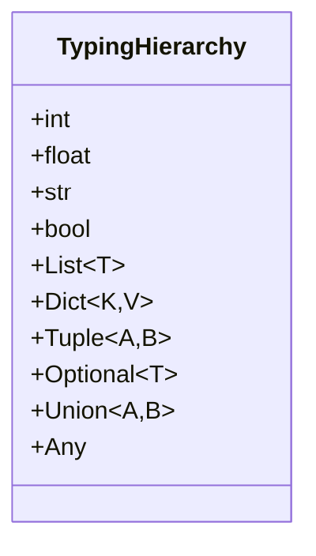
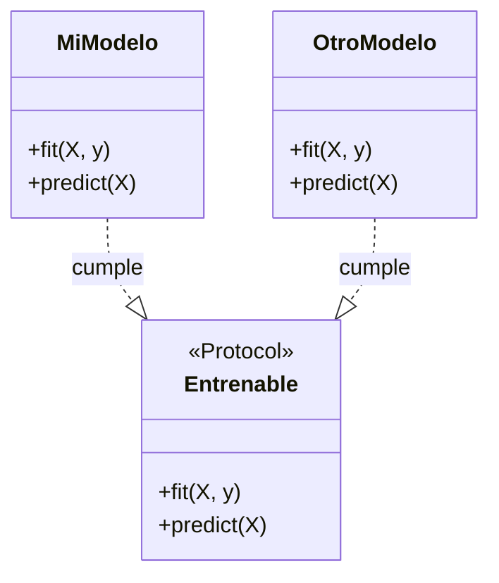

# 05 - Typing y Type Hints

Python es dinámico, pero en proyectos de ML grandes (PyTorch, Transformers, LangChain), los type hints reducen errores, mejoran la autocompletación y documentan el código automáticamente.

---

## 1. Type hints básicos

```python
from typing import List, Dict, Tuple, Optional, Union

def entrenar(
    datos: List[Dict[str, float]],
    epocas: int,
    tasa_aprendizaje: float = 0.001
) -> Tuple[float, float]:
    """Entrena un modelo y retorna (loss, accuracy)."""
    loss = 0.5
    accuracy = 0.9
    return loss, accuracy

# Union: acepta múltiples tipos
def cargar_modelo(ruta: Union[str, bytes]) -> Optional[object]:
    if ruta is None:
        return None
    return object()
```



| Hint | Significado |
|------|-------------|
| `int`, `float`, `str`, `bool` | Tipos primitivos |
| `List[T]` | Lista de elementos tipo T |
| `Dict[K, V]` | Diccionario con claves K y valores V |
| `Tuple[A, B]` | Tupla de tamaño fijo con tipos A, B |
| `Optional[T]` | T o None (equivalente a `Union[T, None]`) |
| `Union[A, B]` | A o B |
| `Any` | Cualquier tipo |

---

## 2. Generics y TypeVars

Para funciones que trabajan con cualquier tipo, pero mantienen consistencia.

```python
from typing import TypeVar, Generic, List

T = TypeVar('T')

def primero(lista: List[T]) -> T:
    """Retorna el primer elemento, cualquiera sea el tipo."""
    return lista[0]

print(primero([1, 2, 3]))       # int
print(primero(["a", "b"]))      # str
```

### Clases genéricas

```python
class Batch(Generic[T]):
    """Un batch de datos de tipo T."""
    def __init__(self, items: List[T]) -> None:
        self.items = items

    def get(self, index: int) -> T:
        return self.items[index]

batch_ints = Batch([1, 2, 3])
batch_strs = Batch(["a", "b"])
```

---

## 3. Protocolos (duck typing estructural)



Un `Protocol` define una interfaz sin herencia explícita. Si un objeto implementa los métodos, "cumple" el protocolo.

```python
from typing import Protocol

class Entrenable(Protocol):
    """Cualquier cosa que pueda entrenarse."""
    def fit(self, X: List[float], y: List[float]) -> None: ...
    def predict(self, X: List[float]) -> List[float]: ...

class MiModelo:
    def fit(self, X, y):
        pass
    def predict(self, X):
        return [0.0]

# MiModelo cumple con Entrenable sin heredar explícitamente
def ejecutar_entrenamiento(modelo: Entrenable) -> None:
    modelo.fit([1.0], [2.0])

ejecutar_entrenamiento(MiModelo())  # OK
```

> 💡 **Caso real:** PyTorch usa protocols para definir interfaces de `nn.Module`, optimizers, y schedulers.

### Nominal vs Structural Subtyping

Python tradicionalmente usa **subtipado nominal**: una clase es subtipo de otra solo si hereda explícitamente de ella. Los `Protocol` introducen **subtipado estructural** (duck typing formalizado): un objeto es válido si implementa los métodos requeridos, sin importar su herencia.

```python
from typing import Protocol

class Volador(Protocol):
    def volar(self) -> str: ...

class Pato:
    def volar(self) -> str:
        return "El pato vuela"

class Avion:
    def volar(self) -> str:
        return "El avión vuela"

def hacer_volar(objeto: Volador) -> None:
    print(objeto.volar())

hacer_volar(Pato())   # OK
hacer_volar(Avion())  # OK
# hacer_volar("string")  # mypy error: str no tiene método volar()
```

> 💡 **Ventaja:** Puedes hacer que clases de librerías de terceros "cumplan" un protocolo sin modificar su código.

### Varianza: Covarianza, Contravarianza e Invarianza

Cuando usas `TypeVar`, controlas cómo los subtipos se relacionan:

```python
from typing import TypeVar, Generic, List

# Invariante (por defecto): solo acepta exactamente T
T = TypeVar('T')

# Covariante: acepta T o subtipos de T
T_co = TypeVar('T_co', covariant=True)

# Contravariante: acepta T o supertipos de T
T_contra = TypeVar('T_contra', contravariant=True)

class Productor(Generic[T_co]):
    def producir(self) -> T_co: ...

class Consumidor(Generic[T_contra]):
    def consumir(self, item: T_contra) -> None: ...
```

**Reglas prácticas:**
- **Covariante**: tipos que "producen" valores (`List[+T]`, `Callable[[], +T]`).
- **Contravariante**: tipos que "consumen" valores (`Callable[[-T], None]`).
- **Invariante**: tipos que producen Y consumen (`List[T]` permite lectura y escritura).

> 💡 **Caso real:** `typing.Iterable[T]` es covariante porque solo produce valores. `typing.List[T]` es invariante porque permite lectura y escritura.

---

## 4. `@overload` — sobrecarga de funciones

Cuando una función tiene comportamiento diferente según los tipos de entrada.

```python
from typing import overload, List, Union

@overload
def procesar(dato: int) -> str: ...

@overload
def procesar(dato: List[int]) -> List[str]: ...

def procesar(dato: Union[int, List[int]]) -> Union[str, List[str]]:
    if isinstance(dato, int):
        return str(dato * 2)
    return [str(x * 2) for x in dato]

procesar(5)        # str
procesar([1, 2])   # List[str]
```

---

## 5. `TypedDict` y `NamedTuple`

### TypedDict: diccionarios con claves obligatorias

```python
from typing import TypedDict

class ConfigEntrenamiento(TypedDict):
    epochs: int
    batch_size: int
    learning_rate: float
    optimizer: str

config: ConfigEntrenamiento = {
    "epochs": 10,
    "batch_size": 32,
    "learning_rate": 0.001,
    "optimizer": "adam"
}
```

### NamedTuple: tuplas inmutables con nombres

```python
from typing import NamedTuple

class Metricas(NamedTuple):
    loss: float
    accuracy: float
    f1: float

m = Metricas(loss=0.2, accuracy=0.9, f1=0.88)
print(m.accuracy)  # 0.9
```

---

## 6. `Callable` y callbacks

```python
from typing import Callable

def entrenar_con_callback(
    callback: Callable[[int, float], None],
    epochs: int = 10
) -> None:
    """Entrena llamando al callback cada epoch."""
    for epoch in range(epochs):
        loss = 1.0 / (epoch + 1)
        callback(epoch, loss)

# Uso
entrenar_con_callback(lambda e, l: print(f"Epoch {e}: loss={l:.4f}"))
```

---

## 7. Verificación con `mypy`

`mypy` es un verificador estático de tipos. Corre antes de ejecutar el código.

```bash
pip install mypy
mypy mi_script.py
```

Ejemplo de error detectado:
```python
def sumar(a: int, b: int) -> int:
    return a + b

sumar("1", "2")  # mypy error: Argument 1 to "sumar" has incompatible type "str"
```

---

## 📦 Código de compresión: Configuración tipada de un Pipeline ML

```python
"""
Sistema de configuración tipada para pipelines de ML.
Previene errores en tiempo de desarrollo, no en producción.
"""
from typing import TypedDict, Literal, Optional, List
from dataclasses import dataclass

# --- Tipos enumerados ---
Optimizador = Literal["adam", "sgd", "adamw", "rmsprop"]
Scheduler = Literal["cosine", "step", "plateau", "none"]

# --- Configuración con TypedDict ---
class ConfigData(TypedDict):
    ruta: str
    batch_size: int
    shuffle: bool
    num_workers: int

class ConfigModelo(TypedDict):
    nombre: str
    num_clases: int
    dropout: float
    pretrained: bool

class ConfigEntrenamiento(TypedDict):
    epochs: int
    learning_rate: float
    optimizer: Optimizador
    scheduler: Scheduler
    weight_decay: float
    gradient_clipping: Optional[float]

class ConfigPipeline(TypedDict):
    nombre: str
    seed: int
    data: ConfigData
    modelo: ConfigModelo
    entrenamiento: ConfigEntrenamiento

# --- Uso con validación ---
def cargar_config(raw: dict) -> ConfigPipeline:
    # En producción: usar pydantic para validación automática
    config: ConfigPipeline = {
        "nombre": raw.get("nombre", "experimento"),
        "seed": raw.get("seed", 42),
        "data": raw["data"],
        "modelo": raw["modelo"],
        "entrenamiento": raw["entrenamiento"]
    }
    return config

# --- Dataclass alternativa (más potente) ---
@dataclass
class EntrenamientoConfig:
    epochs: int = 10
    learning_rate: float = 0.001
    optimizer: Optimizador = "adam"
    scheduler: Scheduler = "cosine"

    def __post_init__(self):
        if self.learning_rate <= 0:
            raise ValueError("learning_rate debe ser positivo")

# Ejemplo
config = EntrenamientoConfig(epochs=20)
print(config)  # EntrenamientoConfig(epochs=20, ...)
```

---

## 🎯 Proyecto documentado: Schema de Datos para un Feature Store

### Descripción
Diseña un sistema de schemas tipados para un feature store que defina features con tipos, restricciones, versiones y linaje. Debe usar `TypedDict`, `Protocol`, y `dataclasses` para garantizar que los datos que entran a los modelos cumplan el contrato esperado.

### Requisitos funcionales
1. `FeatureSchema`: define nombre, tipo (`int`, `float`, `str`, `timestamp`), restricciones (`min`, `max`, `regex`), y si permite nulos.
2. `FeatureSet`: agrupa múltiples `FeatureSchema` en una entidad (ej. `Usuario`, `Producto`).
3. `FeatureStoreClient`: protocolo que define `get_features(entity_id, feature_set) -> TypedDict`.
4. Validación runtime: al obtener features, verificar tipos y restricciones; lanzar `FeatureValidationError` si falla.
5. Versionado: cada `FeatureSet` tiene versión; al cargar un modelo, validar que el feature set coincida.

### Ejemplo de uso esperado
```python
user_schema = FeatureSet(
    name="user_v2",
    features=[
        FeatureSchema("edad", int, min=0, max=120, nullable=False),
        FeatureSchema("ingreso_mensual", float, min=0, nullable=True),
    ]
)

client = FeatureStoreClient()
datos = client.get_features("user_123", user_schema)
# datos: {"edad": 30, "ingreso_mensual": 2500.0}
```

### Métricas de éxito
- Validación de 1000 features en menos de 10ms.
- Mensajes de error que indican exactamente qué feature falló y por qué.
- Compatibilidad con `pandas.DataFrame` para batch validation.

### Referencias
- Feast (Feature Store)
- Pydantic (data validation)
- Great Expectations (data quality)
