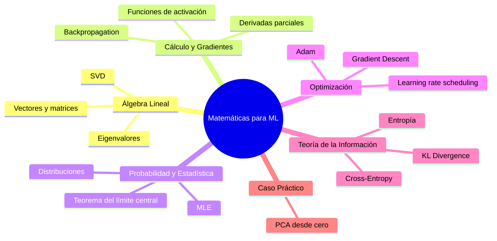

# 📐 Bienvenida a Matemáticas para ML/AI

Las matemáticas son el lenguaje subyacente del machine learning. No necesitas ser matemático para entrenar modelos, pero para **diseñar** modelos, **entender** papers de investigación y **depurar** por qué tu red no converge, necesitas dominar estos fundamentos.

---

## 🗂️ Módulos del curso

1. [[01 - Algebra Lineal|Álgebra Lineal]]
2. [[02 - Calculo y Gradientes|Cálculo y Gradientes]]
3. [[03 - Probabilidad y Estadistica|Probabilidad y Estadística]]
4. [[04 - Optimizacion|Optimización]]
5. [[05 - Teoria de la Informacion|Teoría de la Información]]
6. [[06 - Caso Practico - Implementando PCA desde Cero|Caso Práctico: Implementando PCA desde Cero]]

---

## 🤔 ¿Por qué matemáticas para ML?

| Concepto matemático | Dónde aparece en ML |
|---------------------|---------------------|
| **Álgebra lineal** | Datos = matrices, embeddings = vectores, CNN = convoluciones |
| **Cálculo** | Backpropagation = regla de la cadena, gradient descent = derivadas |
| **Probabilidad** | Modelos generativos, uncertainty quantification, Naive Bayes |
| **Optimización** | Entrenar un modelo = minimizar una función de pérdida |
| **Teoría de información** | Entropía cruzada, KL divergence, compresión de modelos |

> 💡 **Dato:** La mayoría de los errores en ML (vanishing gradients, exploding gradients, mal convergence) se entienden y solucionan con matemáticas, no con más código.

---

## 📋 Glosario rápido

| Término | Significado |
|---------|-------------|
| **Vector** | Lista ordenada de números (punto en el espacio) |
| **Matriz** | Tabla rectangular de números (transformación lineal) |
| **Gradiente** | Vector de derivadas parciales (dirección de mayor crecimiento) |
| **PDF** | Probability Density Function (función de densidad de probabilidad) |
| **MLE** | Maximum Likelihood Estimation (estimación por máxima verosimilitud) |
| **Entropía** | Medida de incertidumbre o información promedio |
