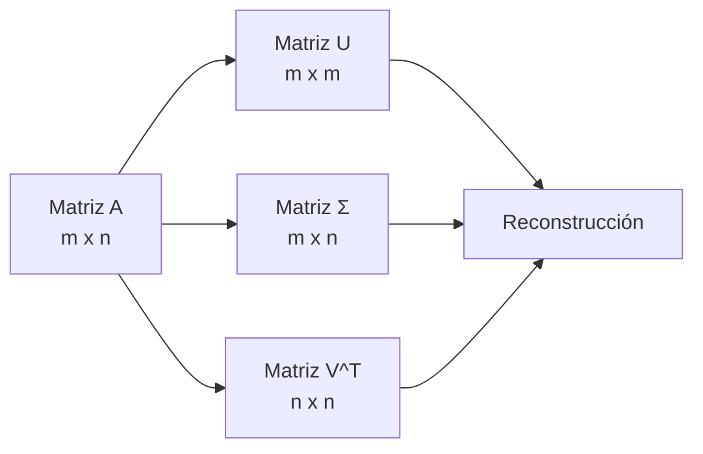

# 01 - Álgebra Lineal

El álgebra lineal es el lenguaje de los datos en ML. Una imagen es una matriz, un batch de datos es un tensor, y un embedding es un vector. Todo se reduce a operaciones lineales.

---

## 1. Vectores y espacios vectoriales

### ¿Qué es un vector?

Un vector es un objeto matemático que tiene **magnitud** y **dirección**. En ML, los vectores representan datos: una palabra es un vector de embeddings, una imagen se aplana a un vector, un usuario es un vector de features.


```python
import numpy as np

# Vector en R^3
v = np.array([3, 4, 5])
print(f"Dimension: {v.shape}")  # (3,)
print(f"Magnitud (norma L2): {np.linalg.norm(v):.2f}")  # 7.07
```

### Espacio vectorial

Un espacio vectorial es un conjunto de vectores donde están definidas dos operaciones:
- **Suma vectorial:** `u + v` → otro vector del espacio.
- **Multiplicación escalar:** `α · v` → otro vector del espacio.

**Propiedades clave:**
- Conmutatividad: `u + v = v + u`.
- Asociatividad: `(u + v) + w = u + (v + w)`.
- Elemento neutro: existe `0` tal que `v + 0 = v`.
- Inverso aditivo: para cada `v` existe `-v` tal que `v + (-v) = 0`.

> 💡 **Caso real:** El espacio de embeddings de Word2Vec es un espacio vectorial de 300 dimensiones. Las operaciones vectoriales tienen significado semántico: `king - man + woman ≈ queen`.

---

## 2. Operaciones vectoriales fundamentales

### Producto punto (dot product)

El producto punto mide la **similitud direccional** entre dos vectores.

$$u \cdot v = \sum_{i=1}^{n} u_i v_i = \|u\| \|v\| \cos(\theta)$$

```python
u = np.array([1, 2, 3])
v = np.array([4, 5, 6])

dot = np.dot(u, v)
print(f"Producto punto: {dot}")  # 32

# Interpretación: si dot > 0, apuntan en direcciones similares
# Si dot < 0, apuntan en direcciones opuestas
# Si dot = 0, son ortogonales (perpendiculares)
```

> 💡 **Caso real:** En attention mechanisms, el producto punto calcula la "alineación" entre query y key. Valores altos indican mayor atención.

### Producto cruz (cross product)

En 3D, el producto cruz produce un vector perpendicular a ambos. En ML moderno se usa menos, pero aparece en gráficos 3D y visión por computadora.

### Normas (magnitudes)

| Norma | Fórmula | Uso en ML |
|-------|---------|-----------|
| L1 (Manhattan) | $\sum \|x_i\|$ | Regularización Lasso, sparsity |
| L2 (Euclidiana) | $\sqrt{\sum x_i^2}$ | Regularización Ridge, distancias |
| L∞ (Máximo) | $\max(\|x_i\|)$ | Robustez ante outliers |

```python
x = np.array([3, -4, 0])
print(f"L1: {np.linalg.norm(x, ord=1):.2f}")   # 7.00
print(f"L2: {np.linalg.norm(x, ord=2):.2f}")   # 5.00
print(f"Linf: {np.linalg.norm(x, ord=np.inf):.2f}")  # 4.00
```

---

## 3. Matrices y transformaciones lineales

### ¿Qué es una matriz?

Una matriz es una **transformación lineal**. Cuando multiplicas una matriz `A` por un vector `x`, obtienes un nuevo vector `Ax` que puede estar escalado, rotado, proyectado o reflejado.

```python
# Matriz de rotación 2D (45 grados)
theta = np.pi / 4
R = np.array([
    [np.cos(theta), -np.sin(theta)],
    [np.sin(theta), np.cos(theta)]
])

x = np.array([1, 0])
x_rotado = R @ x
print(f"Original: {x}")
print(f"Rotado 45°: {x_rotado}")  # [0.707, 0.707]
```

### Propiedades de las matrices

- **Identidad (`I`)**: `A · I = A`.
- **Inversa (`A⁻¹`)**: `A · A⁻¹ = I`. Solo existe si `det(A) ≠ 0`.
- **Transpuesta (`Aᵀ`)`: Filas ↔ columnas.
- **Traza (`tr(A)`)**: Suma de la diagonal. `tr(AB) = tr(BA)`.

```python
A = np.array([[1, 2], [3, 4]])
print(f"Determinante: {np.linalg.det(A):.2f}")   # -2.00
print(f"Traza: {np.trace(A)}")                    # 5
print(f"Inversa:\n{np.linalg.inv(A)}")
```

> ⚠️ **No todas las matrices tienen inversa.** Las matrices singulares (`det = 0`) representan transformaciones que "aplastan" el espacio (pierden información).

---

## 4. Eigenvalores y eigenvectors

### Definición

Un **eigenvector** `v` de una matriz `A` es un vector que, al aplicarle la transformación, solo cambia de magnitud, no de dirección:

$$A v = \lambda v$$

Donde `λ` (eigenvalue) es el factor de escalamiento.

```python
A = np.array([[4, 2], [1, 3]])
eigenvalues, eigenvectors = np.linalg.eig(A)

print(f"Eigenvalues: {eigenvalues}")       # [5. 2.]
print(f"Eigenvectors:\n{eigenvectors}")

# Verificación: A @ v == lambda * v
v = eigenvectors[:, 0]
print(f"A @ v: {A @ v}")
print(f"lambda * v: {eigenvalues[0] * v}")
```

### Interpretación en ML

| Concepto | Significado |
|----------|-------------|
| **Eigenvalue grande** | Dirección de máxima varianza en los datos |
| **Eigenvalue pequeño** | Dirección de mínima varianza (posible ruido) |
| **PCA** | Proyectar datos sobre los eigenvectors de mayor eigenvalue |

> 💡 **Caso real:** En análisis de componentes principales (PCA), los eigenvectors de la matriz de covarianza son las "direcciones principales" de los datos. Los eigenvalues indican cuánta varianza explica cada dirección.

---

## 5. Descomposición de matrices

### SVD (Singular Value Decomposition)

Toda matriz `A` (incluso rectangular) se puede descomponer como:

$$A = U \Sigma V^T$$

- `U`: matriz ortogonal (eigenvectors de `A·Aᵀ`).
- `Σ`: matriz diagonal con valores singulares (raíces cuadradas de eigenvalues).
- `Vᵀ`: matriz ortogonal transpuesta (eigenvectors de `Aᵀ·A`).



```python
A = np.array([[1, 2, 3], [4, 5, 6]])
U, S, Vt = np.linalg.svd(A, full_matrices=False)

print(f"U shape: {U.shape}")      # (2, 2)
print(f"Valores singulares: {S}")  # [9.51, 0.77]
print(f"Vt shape: {Vt.shape}")    # (2, 3)

# Reconstrucción
A_reconstruida = U @ np.diag(S) @ Vt
print(f"Reconstrucción correcta: {np.allclose(A, A_reconstruida)}")
```

> 💡 **Caso real:** SVD se usa en compresión de imágenes, sistemas de recomendación (filtrado colaborativo), y reducción de dimensionalidad.

### Descomposición LU y Cholesky

- **LU**: `A = L·U` donde `L` es triangular inferior y `U` triangular superior. Útil para resolver sistemas lineales eficientemente.
- **Cholesky**: `A = L·Lᵀ` para matrices simétricas positivo-definidas. Usada en Gaussian Processes y optimización.

---

## 📦 Código de compresión: Implementación de PCA con numpy

```python
"""
PCA (Principal Component Analysis) implementado desde cero.
Demuestra eigenvalores, proyección y reconstrucción.
"""
import numpy as np

class PCA:
    def __init__(self, n_componentes):
        self.n_componentes = n_componentes
        self.media = None
        self.componentes = None  # Eigenvectors
        self.valores = None      # Eigenvalues

    def fit(self, X):
        # 1. Centrar datos
        self.media = np.mean(X, axis=0)
        X_centrado = X - self.media

        # 2. Matriz de covarianza
        cov = np.cov(X_centrado, rowvar=False)

        # 3. Eigenvalores y eigenvectors
        eigenvalues, eigenvectors = np.linalg.eig(cov)

        # 4. Ordenar por eigenvalue descendente
        idx = eigenvalues.argsort()[::-1]
        self.valores = eigenvalues[idx]
        self.componentes = eigenvectors[:, idx]

        # 5. Seleccionar top k
        self.componentes = self.componentes[:, :self.n_componentes]
        return self

    def transform(self, X):
        X_centrado = X - self.media
        return X_centrado @ self.componentes

    def reconstruct(self, X_proyectado):
        return (X_proyectado @ self.componentes.T) + self.media

# --- Uso ---
from sklearn.datasets import load_iris
iris = load_iris()
X = iris.data

pca = PCA(n_componentes=2)
X_pca = pca.fit(X).transform(X)

print(f"Original: {X.shape}")        # (150, 4)
print(f"Proyectado: {X_pca.shape}")  # (150, 2)
print(f"Varianza explicada por componente:")
print(f"  PC1: {pca.valores[0] / pca.valores.sum():.2%}")
print(f"  PC2: {pca.valores[1] / pca.valores.sum():.2%}")
```

---

## 🎯 Proyecto documentado: Sistema de Recomendación con SVD

### Descripción
Diseña un sistema de filtrado colaborativo que use SVD para descomponer una matriz usuario-item (ratings de películas) en factores latentes. Predice ratings faltantes reconstruyendo la matriz con un subconjunto de valores singulares.

### Requisitos funcionales
- Construir matriz usuario-item a partir de datos de ratings.
- Aplicar SVD: `R = U · Σ · Vᵀ`.
- Reducir dimensionalidad manteniendo los `k` valores singulares más grandes.
- Reconstruir la matriz aproximada: `R̂ = Uₖ · Σₖ · Vₖᵀ`.
- Predecir ratings faltantes como los valores de `R̂` en posiciones vacías.
- Evaluar con RMSE sobre un conjunto de test.

### Métricas de éxito
- RMSE < 1.0 sobre dataset MovieLens 100k.
- Tiempo de entrenamiento < 5 segundos en CPU.
- Capacidad de explicar por qué se recomienda un ítem (factores latentes).

### Referencias
- Netflix Prize y factorización de matrices
- Surprise library (scikit-surprise)
- Latent Semantic Analysis (LSA) para NLP
